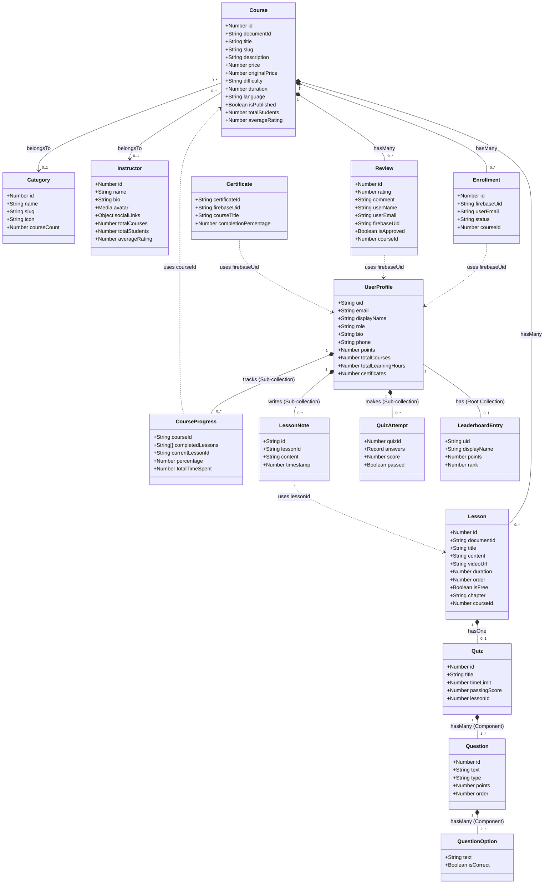

# Sơ đồ lớp (Class Diagram) - Elearning Platform (Source Code)

Tài liệu này mô tả chi tiết sơ đồ lớp của hệ thống Elearning Platform, được cập nhật chính xác 100% dựa trên thực tế Source Code của dự án (thư mục `src/types/`).
Hệ thống sử dụng kiến trúc kết hợp giữa **Strapi CMS (Cơ sở dữ liệu quan hệ - SQL)** và **Firebase (NoSQL)**.

---

## 1. Strapi CMS Models (Cơ sở dữ liệu quan hệ)

> **HƯỚNG DẪN QUAN TRỌNG KHI TẠO STRAPI CONTENT TYPE:**
> *   Những trường có dấu `*` ở trước là những trường **BẠN PHẢI TỰ THÊM BẰNG TAY** trên giao diện Content-Type Builder.
> *   Những trường KHÔNG CÓ dấu `*` (nằm ở mục Các trường hệ thống) là những trường **STRAPI TỰ ĐỘNG TẠO**, bạn tuyệt đối **KHÔNG** tạo tay để tránh lỗi "This name cannot be used...".

### 1.1 Course *(Loại: Collection Type)*
*   **Các trường hệ thống (KHÔNG tự thêm):** `id`, `documentId`, `publishedAt` (có khi bật Draft/Publish), `createdAt`, `updatedAt`.
*   **Các trường CẦN THÊM (Add new field):**
    *   `* title` — (Type: **Text** | Format: Short text) x
    *   `* slug` — (Type: **UID** | Attached field: title) x
    *   `* description` — (Type: **Rich Text** hoặc **Blocks**) x
    *   `* shortDescription` — (Type: **Text** | Format: Long text) x
    *   `* thumbnail` — (Type: **Media** | Type: Single media) x
    *   `* price` — (Type: **Number** | Format: Decimal) x
    *   `* originalPrice` — (Type: **Number** | Format: Decimal) x
    *   `* difficulty` — (Type: **Enumeration** | Values: beginner, intermediate, advanced) x
    *   `* duration` — (Type: **Number** | Format: Integer - đại diện cho phút)
    *   `* language` — (Type: **Text** | Format: Short text) x
    *   `* isPublished` — (Type: **Boolean**) x
    *   `* totalStudents` — (Type: **Number** | Format: Integer) x
    *   `* averageRating` — (Type: **Number** | Format: Decimal) x
    *   `* totalReviews` — (Type: **Number** | Format: Integer) x
*   **Relationships (Tạo qua Type: Relation):**
    *   `* category` — Giao diện Strapi: **Course** (Field name: `category`) --- Chọn icon: *Category has many Courses* --- **Category** (Field name: `courses`)
    *   `* instructor` — Giao diện Strapi: **Course** (Field name: `instructor`) --- Chọn icon: *Instructor has many Courses* --- **Instructor** (Field name: `courses`)
    *   `* lessons` — Giao diện Strapi: **Course** (Field name: `lessons`) --- Chọn icon: *Course has many Lessons* --- **Lesson** (Field name: `course`)
    *   `* reviews` — Giao diện Strapi: **Course** (Field name: `reviews`) --- Chọn icon: *Course has many Reviews* --- **Review** (Field name: `course`)
    *   `* enrollments` — Giao diện Strapi: **Course** (Field name: `enrollments`) --- Chọn icon: *Course has many Enrollments* --- **Enrollment** (Field name: `course`)

### 1.2 Lesson *(Loại: Collection Type)*
*   **Các trường hệ thống (KHÔNG tự thêm):** `id`, `documentId`, `createdAt`, `updatedAt`.
*   **Các trường CẦN THÊM:**
    *   `* title` — (Type: **Text** | Format: Short text)
    *   `* slug` — (Type: **UID** | Attached field: title)
    *   `* content` — (Type: **Rich Text** hoặc **Blocks**)
    *   `* videoUrl` — (Type: **Text** | Format: Short text - điền link URL)
    *   `* duration` — (Type: **Number** | Format: Integer)
    *   `* order` — (Type: **Number** | Format: Integer)
    *   `* isFree` — (Type: **Boolean**)
    *   `* chapter` — (Type: **Text** | Format: Short text)
*   **Relationships (Tạo qua Type: Relation):**
    *   `* course` — Giao diện Strapi: **Lesson** (Field name: `course`) --- Chọn icon: *Course has many Lessons* --- **Course** (Field name: `lessons`)
    *   `* quiz` — Giao diện Strapi: **Lesson** (Field name: `quiz`) --- Chọn icon: *Lesson has and belongs to one Quiz* --- **Quiz** (Field name: `lesson`)

### 1.3 Category *(Loại: Collection Type)*
*   **Các trường hệ thống (KHÔNG tự thêm):** `id`, `documentId`, `createdAt`, `updatedAt`.
*   **Các trường CẦN THÊM:**
    *   `* name` — (Type: **Text** | Format: Short text)
    *   `* slug` — (Type: **UID** | Attached field: name)
    *   `* description` — (Type: **Text** | Format: Long text)
    *   `* icon` — (Type: **Text** | Format: Short text)
    *   `* color` — (Type: **Text** | Format: Short text)
    *   `* courseCount` — (Type: **Number** | Format: Integer)
*   **Relationships (Tạo qua Type: Relation):**
    *   `* courses` — Giao diện Strapi: **Category** (Field name: `courses`) --- Chọn icon: *Category has many Courses* --- **Course** (Field name: `category`)

### 1.4 Instructor *(Loại: Collection Type)*
*   **Các trường hệ thống (KHÔNG tự thêm):** `id`, `documentId`, `createdAt`, `updatedAt`.
*   **Các trường CẦN THÊM:**
    *   `* name` — (Type: **Text** | Format: Short text)
    *   `* slug` — (Type: **UID** | Attached field: name)
    *   `* bio` — (Type: **Rich Text**)
    *   `* avatar` — (Type: **Media** | Type: Single media)
    *   `* title` — (Type: **Text** | Format: Short text - Chức danh)
    *   `* expertise` — (Type: **JSON** - Lưu array các kỹ năng)
    *   `* socialLinks` — (Type: **JSON** - Lưu object các link web)
    *   `* totalCourses` — (Type: **Number** | Format: Integer)
    *   `* totalStudents` — (Type: **Number** | Format: Integer)
    *   `* averageRating` — (Type: **Number** | Format: Decimal)
*   **Relationships (Tạo qua Type: Relation):**
    *   `* courses` — Giao diện Strapi: **Instructor** (Field name: `courses`) --- Chọn icon: *Instructor has many Courses* --- **Course** (Field name: `instructor`)

### 1.5 Review *(Loại: Collection Type)*
*   **Các trường hệ thống (KHÔNG tự thêm):** `id`, `documentId`, `createdAt`, `updatedAt`.
*   **Các trường CẦN THÊM:**
    *   `* rating` — (Type: **Number** | Format: Integer)
    *   `* comment` — (Type: **Text** | Format: Long text)
    *   `* userName` — (Type: **Text** | Format: Short text)
    *   `* userEmail` — (Type: **Email**)
    *   `* userAvatar` — (Type: **Text** | Format: Short text - Lưu URL avatar text)
    *   `* firebaseUid` — (Type: **Text** | Format: Short text)
    *   `* isApproved` — (Type: **Boolean**)
*   **Relationships (Tạo qua Type: Relation):**
    *   `* course` — Giao diện Strapi: **Review** (Field name: `course`) --- Chọn icon: *Course has many Reviews* --- **Course** (Field name: `reviews`)

### 1.6 Quiz *(Loại: Collection Type hoặc Component)*
*(Lưu ý: Bạn có thể tạo bảng này dưới dạng Collection Type để dùng lại)*
*   **Các trường hệ thống (KHÔNG tự thêm):** `id`, `documentId`, `createdAt`, `updatedAt`.
*   **Các trường CẦN THÊM:**
    *   `* title` — (Type: **Text** | Format: Short text)
    *   `* description` — (Type: **Text** | Format: Long text)
    *   `* timeLimit` — (Type: **Number** | Format: Integer)
    *   `* passingScore` — (Type: **Number** | Format: Integer)
*   **Relationships (Nếu là Collection Type):**
    *   `* lesson` — Giao diện Strapi: **Quiz** (Field name: `lesson`) --- Chọn icon: *Lesson has and belongs to one Quiz* --- **Lesson** (Field name: `quiz`)
*   **Components lồng nhau (Tạo qua Type: Component):**
    *   `* questions` — (Giao diện: Chọn **Component** -> Use an existing component -> Chọn component `Question` -> Tích vào **Repeatable component**).

### 1.7 Question *(Loại: Component)*
*   **Các trường CẦN THÊM (tạo trong mục Component Builder):**
    *   `* text` — (Type: **Text** | Format: Short text)
    *   `* type` — (Type: **Enumeration** | Values: single_choice, multiple_choice)
    *   `* points` — (Type: **Number** | Format: Integer)
    *   `* order` — (Type: **Number** | Format: Integer)
*   **Components lồng nhau (Tạo qua Type: Component):**
    *   `* options` — (Giao diện: Chọn **Component** -> Use an existing component -> Chọn component `QuestionOption` -> Tích vào **Repeatable component**).

### 1.8 QuestionOption *(Loại: Component)*
*   **Các trường CẦN THÊM:**
    *   `* text` — (Type: **Text** | Format: Short text)
    *   `* isCorrect` — (Type: **Boolean**)

### 1.9 Enrollment *(Loại: Collection Type)*
*   **Các trường hệ thống (KHÔNG tự thêm):** `id`, `documentId`, `createdAt`, `updatedAt`.
*   **Các trường CẦN THÊM:**
    *   `* firebaseUid` — (Type: **Text** | Format: Short text)
    *   `* userName` — (Type: **Text** | Format: Short text)
    *   `* userEmail` — (Type: **Email**)
    *   `* enrolledAt` — (Type: **Date** | Format: datetime)
    *   `* status` — (Type: **Enumeration** | Values: active, completed, cancelled)
*   **Relationships (Tạo qua Type: Relation):**
    *   `* course` — Giao diện Strapi: **Enrollment** (Field name: `course`) --- Chọn icon: *Course has many Enrollments* --- **Course** (Field name: `enrollments`)

### 1.10 Certificate *(Loại: Collection Type)*
*   **Các trường hệ thống (KHÔNG tự thêm):** `id`, `documentId`, `createdAt`, `updatedAt`.
*   **Các trường CẦN THÊM:**
    *   `* certificateId` — (Type: **UID** hoặc **Text** Short text)
    *   `* firebaseUid` — (Type: **Text** | Format: Short text)
    *   `* userName` — (Type: **Text** | Format: Short text)
    *   `* courseTitle` — (Type: **Text** | Format: Short text)
    *   `* courseThumbnail` — (Type: **Text** | Format: Short text URL)
    *   `* instructorName` — (Type: **Text** | Format: Short text)
    *   `* issuedAt` — (Type: **Date** | Format: datetime)
    *   `* completionPercentage` — (Type: **Number** | Format: Integer)
    *   `* downloadUrl` — (Type: **Text** | Format: Short text)

---

## 2. Firebase Models (NoSQL)

> **Lưu ý với Firebase:** Firebase không có giao diện "tạo bảng (builder)" cứng nhắc như Strapi. Bạn không cần "tạo trước" Schema. Các field này chỉ là mô tả **kiểu dữ liệu (Data Type)** mà client-side app (Next.js) sẽ ném lên Firestore thông qua code. Do đó toàn bộ các trường này được tạo từ code, không cần tạo tay trên giao diện.

**User (UserProfile)** *(Type: Firebase Root Collection - Path: `users/{uid}`)*
*   uid: string
*   email: string
*   displayName: string
*   avatarUrl: string | null
*   bio: string
*   phone: string
*   role: 'student' | 'admin' | 'instructor' (string)
*   points: number (number)
*   totalCourses: number (number)
*   completedCourses: number (number)
*   totalLearningHours: number (number)
*   certificates: number (number)
*   joinedAt: string (ISO Timestamp string)
*   emailVerified: boolean (boolean)

**CourseProgress** *(Type: Firebase Sub-collection - Path: `users/{uid}/progress/{courseId}`)*
*   courseId: string
*   completedLessons: string[] (Array of strings)
*   currentLessonId: string
*   percentage: number (number)
*   lastAccessedAt: number (timestamp/number)
*   totalTimeSpent: number (number - seconds)

**LessonNote** *(Type: Firebase Sub-collection - Path: `users/{uid}/notes/{lessonId}`)*
*   id: string 
*   lessonId: string
*   content: string
*   timestamp: number (video timestamp)
*   createdAt: number (timestamp)
*   updatedAt: number (timestamp)

**QuizAttempt** *(Type: Firebase Sub-collection - Path: `users/{uid}/quizAttempts/{quizId}`)*
*   quizId: number
*   answers: Record<number, number[]> (Map/Object)
*   score: number
*   totalPoints: number
*   percentage: number
*   passed: boolean
*   startedAt: string (timestamp string)
*   completedAt: string (timestamp string)
*   timeSpent: number

**LeaderboardEntry** *(Type: Firebase Root Collection - Path: `leaderboard/{uid}`)*
*   uid: string 
*   displayName: string
*   avatarUrl: string | null
*   points: number
*   completedCourses: number
*   rank: number

---

## 3. Danh sách Relationship

**Strapi CMS Relationships (Relational):**
* **Course ↔ Lesson**: `1:N`.
* **Course ↔ Category**: `N:1`. 
* **Course ↔ Instructor**: `N:1`.
* **Course ↔ Review**: `1:N`.
* **Lesson ↔ Quiz**: `1:1`.
* **Quiz ↔ Question**: `1:N`.
* **Question ↔ QuestionOption**: `1:N`.
* **Course ↔ Enrollment**: `1:N`.

**Firebase Relationships (Document-based & Logical):**
* **User ↔ CourseProgress**: Liên kết Parent-Child thông qua Sub-collection.
* **User ↔ LessonNote**: Liên kết Parent-Child thông qua Sub-collection.
* **Cross-Database**: Firebase chứa thông tin tiến độ, ghi chú, đăng ký tài khoản. Strapi chứa Content (Course, Lesson, Quiz) và lưu trữ `firebaseUid` trên `Enrollment` / `Review` để biết user nào đã mua khóa học hoặc đánh giá khóa học.

---

## 4. Mermaid Class Diagram

Dưới đây là sơ đồ Mermaid phản ánh chính xác cấu trúc thực tế của project.

