# Phân tích chi tiết từng file

Tài liệu này liệt kê phân tích chi tiết của toàn bộ file trong hệ thống.

## `attach-course-images.js`

- **Loại file**: `Script / Configuration`
- **Độ quan trọng**: `Medium`

### 🎯 Chức năng
Cung cấp các hàm hoặc dữ liệu hỗ trợ cấu trúc của hệ thống.

### 🛠 Các hàm chính
_Không có export hàm cụ thể (File tĩnh hoặc khai báo thuần)._

### 🔗 Liên kết
**Dependencies (Import từ):**
- _Không import module ngoài_

**Ai gọi file này:**
- _Chưa tìm thấy caller cụ thể_

**File này gọi ai:**
- _Không gọi file nội bộ khác_

### 🌊 Luồng dữ liệu (Mẫu)
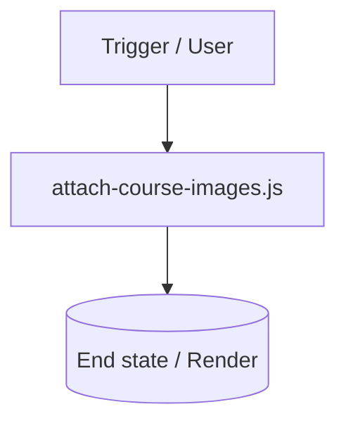

---

## `debug-course.js`

- **Loại file**: `Script / Configuration`
- **Độ quan trọng**: `Medium`

### 🎯 Chức năng
Cung cấp các hàm hoặc dữ liệu hỗ trợ cấu trúc của hệ thống.

### 🛠 Các hàm chính
_Không có export hàm cụ thể (File tĩnh hoặc khai báo thuần)._

### 🔗 Liên kết
**Dependencies (Import từ):**
- _Không import module ngoài_

**Ai gọi file này:**
- _Chưa tìm thấy caller cụ thể_

**File này gọi ai:**
- _Không gọi file nội bộ khác_

### 🌊 Luồng dữ liệu (Mẫu)
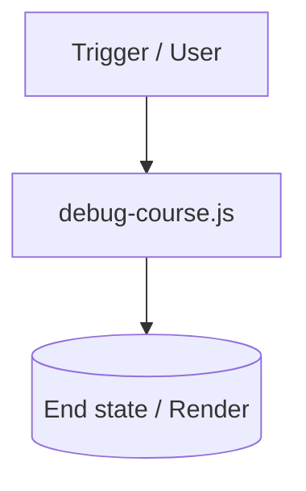

---

## `next-env.d.ts`

- **Loại file**: `Script / Configuration`
- **Độ quan trọng**: `Medium`

### 🎯 Chức năng
Cung cấp các hàm hoặc dữ liệu hỗ trợ cấu trúc của hệ thống.

### 🛠 Các hàm chính
_Không có export hàm cụ thể (File tĩnh hoặc khai báo thuần)._

### 🔗 Liên kết
**Dependencies (Import từ):**
- _Không import module ngoài_

**Ai gọi file này:**
- `next.config.ts`
- `src/app/(public)/checkout/[courseSlug]/page.tsx`
- `src/app/layout.tsx`

**File này gọi ai:**
- _Không gọi file nội bộ khác_

### 🌊 Luồng dữ liệu (Mẫu)
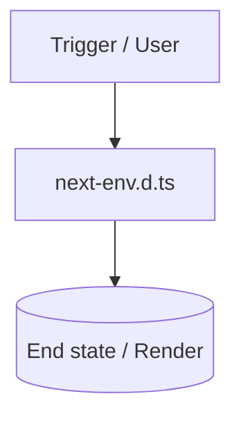

---

## `next.config.ts`

- **Loại file**: `Script / Configuration`
- **Độ quan trọng**: `Medium`

### 🎯 Chức năng
Cung cấp các hàm hoặc dữ liệu hỗ trợ cấu trúc của hệ thống.

### 🛠 Các hàm chính
_Không có export hàm cụ thể (File tĩnh hoặc khai báo thuần)._

### 🔗 Liên kết
**Dependencies (Import từ):**
- `next`

**Ai gọi file này:**
- `next.config.ts`
- `src/app/(public)/checkout/[courseSlug]/page.tsx`
- `src/app/layout.tsx`

**File này gọi ai:**
- `next-env.d.ts`
- `next.config.ts`

### 🌊 Luồng dữ liệu (Mẫu)
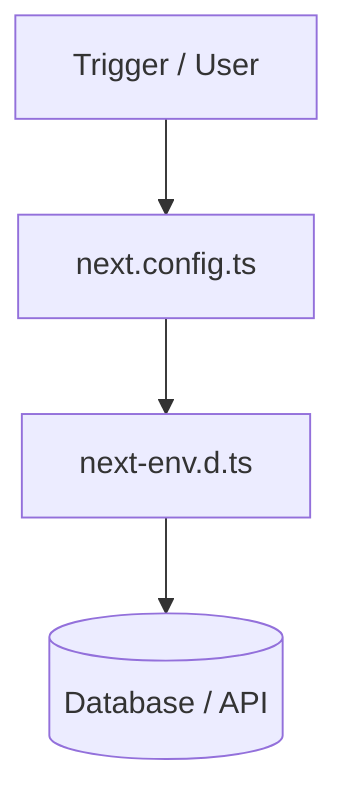

---

## `seed-50-courses.js`

- **Loại file**: `Script / Configuration`
- **Độ quan trọng**: `Medium`

### 🎯 Chức năng
Cung cấp các hàm hoặc dữ liệu hỗ trợ cấu trúc của hệ thống.

### 🛠 Các hàm chính
_Không có export hàm cụ thể (File tĩnh hoặc khai báo thuần)._

### 🔗 Liên kết
**Dependencies (Import từ):**
- _Không import module ngoài_

**Ai gọi file này:**
- _Chưa tìm thấy caller cụ thể_

**File này gọi ai:**
- _Không gọi file nội bộ khác_

### 🌊 Luồng dữ liệu (Mẫu)
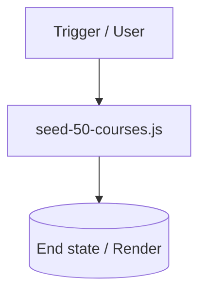

---

## `src/actions/course.actions.ts`

- **Loại file**: `Server Action`
- **Độ quan trọng**: `Critical`

### 🎯 Chức năng
Thực thi các tác vụ bảo mật trên Server (Form submission, mutations) và revalidate cache.

### 🛠 Các hàm chính
| Tên hàm | Nhiệm vụ | Input | Output |
|---|---|---|---|
| `createCourseAction` | Xử lý logic nghiệp vụ | `params/data` | `Promise / UI / State` |
| `updateCourseAction` | Xử lý logic nghiệp vụ | `params/data` | `Promise / UI / State` |
| `deleteCourseAction` | Xử lý logic nghiệp vụ | `params/data` | `Promise / UI / State` |

### 🔗 Liên kết
**Dependencies (Import từ):**
- `src/services/api/instructor.api`
- `next/cache`

**Ai gọi file này:**
- `src/app/(instructor)/instructor/courses/[id]/edit-course-client.tsx`
- `src/app/(instructor)/instructor/courses/new/page.tsx`
- `src/app/(instructor)/instructor/courses/delete-course-button.tsx`

**File này gọi ai:**
- `src/services/api/instructor.api.ts`

### 🌊 Luồng dữ liệu (Mẫu)
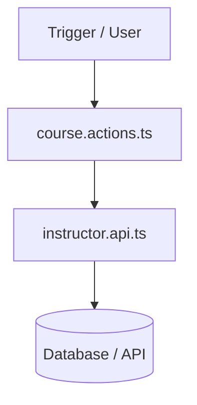

---

## `src/actions/lesson.actions.ts`

- **Loại file**: `Server Action`
- **Độ quan trọng**: `Critical`

### 🎯 Chức năng
Thực thi các tác vụ bảo mật trên Server (Form submission, mutations) và revalidate cache.

### 🛠 Các hàm chính
| Tên hàm | Nhiệm vụ | Input | Output |
|---|---|---|---|
| `createLessonAction` | Xử lý logic nghiệp vụ | `params/data` | `Promise / UI / State` |
| `updateLessonAction` | Xử lý logic nghiệp vụ | `params/data` | `Promise / UI / State` |
| `deleteLessonAction` | Xử lý logic nghiệp vụ | `params/data` | `Promise / UI / State` |

### 🔗 Liên kết
**Dependencies (Import từ):**
- `src/lib/strapi`
- `next/cache`

**Ai gọi file này:**
- `src/app/(instructor)/instructor/courses/[id]/lessons/delete-lesson-button.tsx`
- `src/app/(instructor)/instructor/courses/[id]/lessons/lesson-form-client.tsx`

**File này gọi ai:**
- `src/lib/strapi.ts`

### 🌊 Luồng dữ liệu (Mẫu)
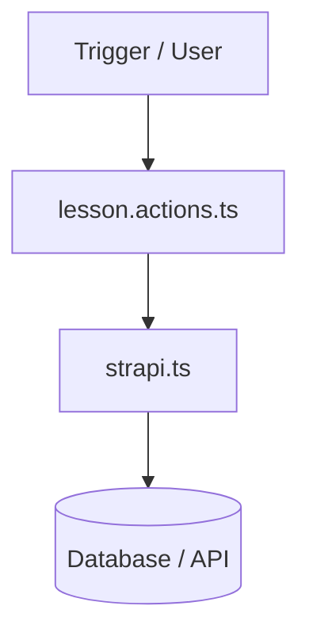

---

## `src/app/layout.tsx`

- **Loại file**: `NextJS Layout`
- **Độ quan trọng**: `High`

### 🎯 Chức năng
Hiển thị giao diện màn hình cho route tương ứng: src/app

### 🛠 Các hàm chính
| Tên hàm | Nhiệm vụ | Input | Output |
|---|---|---|---|
| `metadata` | Xử lý logic nghiệp vụ | `params/data` | `Promise / UI / State` |
| `RootLayout` | Xử lý logic nghiệp vụ | `params/data` | `Promise / UI / State` |

### 🔗 Liên kết
**Dependencies (Import từ):**
- `next`
- `next/font/google`
- `src/providers/theme-provider`
- `src/providers/query-provider`
- `src/providers/auth-provider`

**Ai gọi file này:**
- _Chưa tìm thấy caller cụ thể_

**File này gọi ai:**
- `src/providers/query-provider.tsx`
- `next.config.ts`
- `next-env.d.ts`
- `src/providers/theme-provider.tsx`
- `src/providers/auth-provider.tsx`

### 🌊 Luồng dữ liệu (Mẫu)
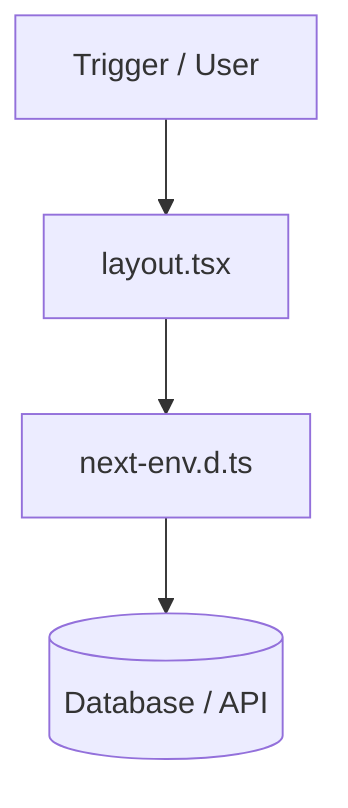

---

## `src/app/(admin)/layout.tsx`

- **Loại file**: `NextJS Layout`
- **Độ quan trọng**: `High`

### 🎯 Chức năng
Hiển thị giao diện màn hình cho route tương ứng: src/app/(admin)

### 🛠 Các hàm chính
| Tên hàm | Nhiệm vụ | Input | Output |
|---|---|---|---|
| `AdminLayout` | Xử lý logic nghiệp vụ | `params/data` | `Promise / UI / State` |

### 🔗 Liên kết
**Dependencies (Import từ):**
- `src/components/auth/admin-guard`
- `src/components/layout/admin-sidebar`
- `src/components/layout/dashboard-header`

**Ai gọi file này:**
- _Chưa tìm thấy caller cụ thể_

**File này gọi ai:**
- `src/components/layout/admin-sidebar.tsx`
- `src/components/layout/dashboard-header.tsx`
- `src/components/auth/admin-guard.tsx`

### 🌊 Luồng dữ liệu (Mẫu)
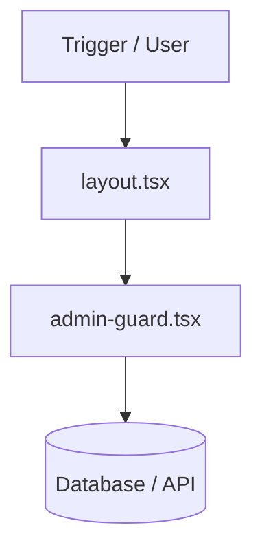

---

## `src/app/(admin)/admin/page.tsx`

- **Loại file**: `NextJS Page`
- **Độ quan trọng**: `High`

### 🎯 Chức năng
Hiển thị giao diện màn hình cho route tương ứng: src/app/(admin)/admin

### 🛠 Các hàm chính
| Tên hàm | Nhiệm vụ | Input | Output |
|---|---|---|---|
| `AdminDashboardOverview` | Xử lý logic nghiệp vụ | `params/data` | `Promise / UI / State` |

### 🔗 Liên kết
**Dependencies (Import từ):**
- `react`
- `next/navigation`
- `src/components/ui/card`
- `src/components/ui/button`
- `lucide-react`
- `src/services/firebase/firestore.service`
- `src/lib/strapi`
- `recharts`
- `src/components/shared/loading-skeleton`

**Ai gọi file này:**
- _Chưa tìm thấy caller cụ thể_

**File này gọi ai:**
- `src/lib/strapi.ts`
- `src/components/shared/loading-skeleton.tsx`
- `src/components/ui/button.tsx`
- `src/components/ui/card.tsx`
- `src/services/firebase/firestore.service.ts`

### 🌊 Luồng dữ liệu (Mẫu)
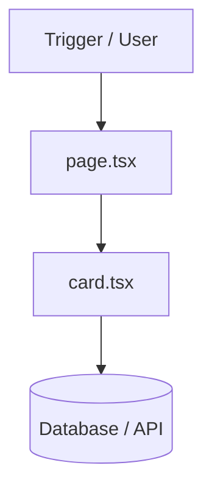

---

## `src/app/(admin)/admin/courses/page.tsx`

- **Loại file**: `NextJS Page`
- **Độ quan trọng**: `High`

### 🎯 Chức năng
Hiển thị giao diện màn hình cho route tương ứng: src/app/(admin)/admin/courses

### 🛠 Các hàm chính
| Tên hàm | Nhiệm vụ | Input | Output |
|---|---|---|---|
| `AdminCoursesPage` | Xử lý logic nghiệp vụ | `params/data` | `Promise / UI / State` |

### 🔗 Liên kết
**Dependencies (Import từ):**
- `react`
- `src/components/ui/card`
- `src/components/ui/input`
- `src/components/ui/button`
- `lucide-react`
- `src/lib/strapi`
- `src/types`

**Ai gọi file này:**
- _Chưa tìm thấy caller cụ thể_

**File này gọi ai:**
- `src/lib/strapi.ts`
- `src/components/ui/button.tsx`
- `src/types/api.types.ts`
- `src/components/ui/card.tsx`
- `src/types/index.ts`
- `src/types/course.types.ts`
- `src/types/lesson.types.ts`
- `src/components/ui/input.tsx`
- `src/types/user.types.ts`

### 🌊 Luồng dữ liệu (Mẫu)


---

## `src/app/(admin)/admin/reports/page.tsx`

- **Loại file**: `NextJS Page`
- **Độ quan trọng**: `High`

### 🎯 Chức năng
Hiển thị giao diện màn hình cho route tương ứng: src/app/(admin)/admin/reports

### 🛠 Các hàm chính
| Tên hàm | Nhiệm vụ | Input | Output |
|---|---|---|---|
| `AdminReportsPage` | Xử lý logic nghiệp vụ | `params/data` | `Promise / UI / State` |

### 🔗 Liên kết
**Dependencies (Import từ):**
- `react`
- `src/components/ui/card`
- `src/components/ui/button`
- `lucide-react`
- `src/services/firebase/firestore.service`
- `src/lib/strapi`

**Ai gọi file này:**
- _Chưa tìm thấy caller cụ thể_

**File này gọi ai:**
- `src/components/ui/card.tsx`
- `src/services/firebase/firestore.service.ts`
- `src/lib/strapi.ts`
- `src/components/ui/button.tsx`

### 🌊 Luồng dữ liệu (Mẫu)


---

## `src/app/(admin)/admin/users/page.tsx`

- **Loại file**: `NextJS Page`
- **Độ quan trọng**: `High`

### 🎯 Chức năng
Hiển thị giao diện màn hình cho route tương ứng: src/app/(admin)/admin/users

### 🛠 Các hàm chính
| Tên hàm | Nhiệm vụ | Input | Output |
|---|---|---|---|
| `AdminUsersPage` | Xử lý logic nghiệp vụ | `params/data` | `Promise / UI / State` |

### 🔗 Liên kết
**Dependencies (Import từ):**
- `react`
- `src/components/ui/card`
- `src/components/ui/input`
- `src/components/ui/button`
- `lucide-react`
- `src/services/firebase/firestore.service`
- `src/services/firebase/auth.service`
- `src/stores/auth-store`

**Ai gọi file này:**
- _Chưa tìm thấy caller cụ thể_

**File này gọi ai:**
- `src/stores/auth-store.ts`
- `src/services/firebase/auth.service.ts`
- `src/components/ui/button.tsx`
- `src/components/ui/card.tsx`
- `src/services/firebase/firestore.service.ts`
- `src/components/ui/input.tsx`

### 🌊 Luồng dữ liệu (Mẫu)


---

## `src/app/(dashboard)/layout.tsx`

- **Loại file**: `NextJS Layout`
- **Độ quan trọng**: `High`

### 🎯 Chức năng
Hiển thị giao diện màn hình cho route tương ứng: src/app/(dashboard)

### 🛠 Các hàm chính
| Tên hàm | Nhiệm vụ | Input | Output |
|---|---|---|---|
| `DashboardLayout` | Xử lý logic nghiệp vụ | `params/data` | `Promise / UI / State` |

### 🔗 Liên kết
**Dependencies (Import từ):**
- `src/components/layout/sidebar`
- `src/components/layout/dashboard-header`
- `src/components/auth/dashboard-guard`

**Ai gọi file này:**
- _Chưa tìm thấy caller cụ thể_

**File này gọi ai:**
- `src/components/layout/dashboard-header.tsx`
- `src/components/auth/dashboard-guard.tsx`
- `src/components/layout/sidebar.tsx`

### 🌊 Luồng dữ liệu (Mẫu)
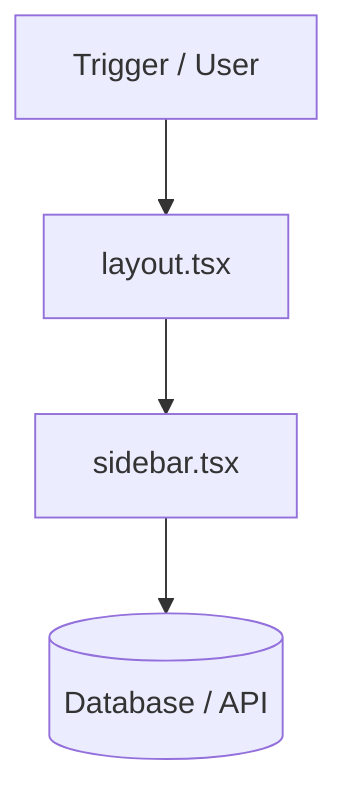

---

## `src/app/(dashboard)/certificates/page.tsx`

- **Loại file**: `NextJS Page`
- **Độ quan trọng**: `High`

### 🎯 Chức năng
Hiển thị giao diện màn hình cho route tương ứng: src/app/(dashboard)/certificates

### 🛠 Các hàm chính
| Tên hàm | Nhiệm vụ | Input | Output |
|---|---|---|---|
| `CertificatesPage` | Xử lý logic nghiệp vụ | `params/data` | `Promise / UI / State` |

### 🔗 Liên kết
**Dependencies (Import từ):**
- `react`
- `framer-motion`
- `lucide-react`
- `next/link`
- `src/components/ui/button`
- `src/components/ui/card`
- `src/components/ui/badge`
- `src/components/shared/empty-state`
- `src/hooks/use-enrollments`
- `src/lib/utils`

**Ai gọi file này:**
- _Chưa tìm thấy caller cụ thể_

**File này gọi ai:**
- `src/components/ui/badge.tsx`
- `src/hooks/use-enrollments.ts`
- `src/components/shared/empty-state.tsx`
- `src/components/ui/button.tsx`
- `src/components/ui/card.tsx`
- `src/lib/utils.ts`

### 🌊 Luồng dữ liệu (Mẫu)
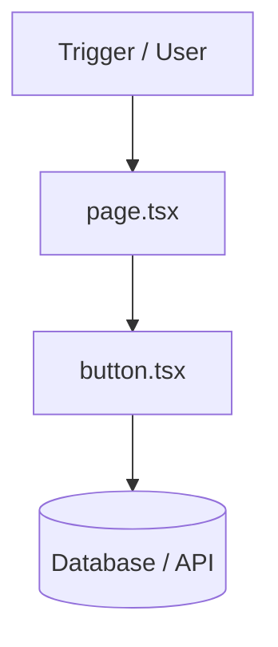

---

## `src/app/(dashboard)/certificates/[courseSlug]/page.tsx`

- **Loại file**: `NextJS Page`
- **Độ quan trọng**: `High`

### 🎯 Chức năng
Hiển thị giao diện màn hình cho route tương ứng: src/app/(dashboard)/certificates/[courseSlug]

### 🛠 Các hàm chính
| Tên hàm | Nhiệm vụ | Input | Output |
|---|---|---|---|
| `CertificateDetailPage` | Xử lý logic nghiệp vụ | `params/data` | `Promise / UI / State` |

### 🔗 Liên kết
**Dependencies (Import từ):**
- `react`
- `next/navigation`
- `framer-motion`
- `lucide-react`
- `src/components/ui/button`
- `src/stores/auth-store`
- `src/services/firebase/enrollment.service`
- `src/services/api/courses.api`
- `src/types`
- `next/link`

**Ai gọi file này:**
- _Chưa tìm thấy caller cụ thể_

**File này gọi ai:**
- `src/services/firebase/enrollment.service.ts`
- `src/services/api/courses.api.ts`
- `src/stores/auth-store.ts`
- `src/components/ui/button.tsx`
- `src/types/api.types.ts`
- `src/types/index.ts`
- `src/types/course.types.ts`
- `src/types/lesson.types.ts`
- `src/types/user.types.ts`

### 🌊 Luồng dữ liệu (Mẫu)


---

## `src/app/(dashboard)/dashboard/page.tsx`

- **Loại file**: `NextJS Page`
- **Độ quan trọng**: `High`

### 🎯 Chức năng
Hiển thị giao diện màn hình cho route tương ứng: src/app/(dashboard)/dashboard

### 🛠 Các hàm chính
| Tên hàm | Nhiệm vụ | Input | Output |
|---|---|---|---|
| `DashboardOverviewPage` | Xử lý logic nghiệp vụ | `params/data` | `Promise / UI / State` |

### 🔗 Liên kết
**Dependencies (Import từ):**
- `react`
- `next/navigation`
- `framer-motion`
- `next/link`
- `src/components/ui/card`
- `src/components/ui/badge`
- `src/components/ui/button`
- `src/stores/auth-store`
- `src/hooks/use-enrollments`
- `src/lib/utils`
- `src/stores/favorites-store`
- `src/services/api/courses.api`
- `src/components/course/course-grid`
- `react`
- `src/types`

**Ai gọi file này:**
- _Chưa tìm thấy caller cụ thể_

**File này gọi ai:**
- `src/components/ui/badge.tsx`
- `src/hooks/use-enrollments.ts`
- `src/components/course/course-grid.tsx`
- `src/services/api/courses.api.ts`
- `src/stores/auth-store.ts`
- `src/types/lesson.types.ts`
- `src/components/ui/button.tsx`
- `src/types/api.types.ts`
- `src/components/ui/card.tsx`
- `src/types/index.ts`
- `src/types/course.types.ts`
- `src/stores/favorites-store.ts`
- `src/lib/utils.ts`
- `src/types/user.types.ts`

### 🌊 Luồng dữ liệu (Mẫu)


---

## `src/app/(dashboard)/leaderboard/page.tsx`

- **Loại file**: `NextJS Page`
- **Độ quan trọng**: `High`

### 🎯 Chức năng
Hiển thị giao diện màn hình cho route tương ứng: src/app/(dashboard)/leaderboard

### 🛠 Các hàm chính
| Tên hàm | Nhiệm vụ | Input | Output |
|---|---|---|---|
| `LeaderboardPage` | Xử lý logic nghiệp vụ | `params/data` | `Promise / UI / State` |

### 🔗 Liên kết
**Dependencies (Import từ):**
- `react`
- `framer-motion`
- `lucide-react`
- `src/components/ui/card`
- `src/stores/auth-store`
- `src/services/firebase/firestore.service`
- `src/components/ui/avatar`

**Ai gọi file này:**
- _Chưa tìm thấy caller cụ thể_

**File này gọi ai:**
- `src/components/ui/card.tsx`
- `src/stores/auth-store.ts`
- `src/components/ui/avatar.tsx`
- `src/services/firebase/firestore.service.ts`

### 🌊 Luồng dữ liệu (Mẫu)


---

## `src/app/(dashboard)/my-courses/page.tsx`

- **Loại file**: `NextJS Page`
- **Độ quan trọng**: `High`

### 🎯 Chức năng
Hiển thị giao diện màn hình cho route tương ứng: src/app/(dashboard)/my-courses

### 🛠 Các hàm chính
| Tên hàm | Nhiệm vụ | Input | Output |
|---|---|---|---|
| `MyCoursesPage` | Xử lý logic nghiệp vụ | `params/data` | `Promise / UI / State` |

### 🔗 Liên kết
**Dependencies (Import từ):**
- `react`
- `framer-motion`
- `lucide-react`
- `next/link`
- `src/components/ui/input`
- `src/components/ui/button`
- `src/components/ui/badge`
- `src/components/ui/card`
- `src/components/shared/empty-state`
- `src/hooks/use-enrollments`
- `src/lib/utils`
- `src/hooks/use-enrollments`

**Ai gọi file này:**
- _Chưa tìm thấy caller cụ thể_

**File này gọi ai:**
- `src/components/ui/badge.tsx`
- `src/hooks/use-enrollments.ts`
- `src/components/shared/empty-state.tsx`
- `src/lib/utils.ts`
- `src/components/ui/button.tsx`
- `src/components/ui/card.tsx`
- `src/components/ui/input.tsx`

### 🌊 Luồng dữ liệu (Mẫu)
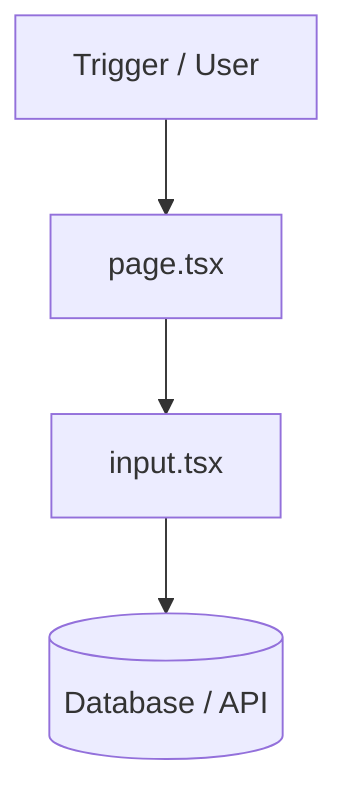

---

## `src/app/(dashboard)/profile/page.tsx`

- **Loại file**: `NextJS Page`
- **Độ quan trọng**: `High`

### 🎯 Chức năng
Hiển thị giao diện màn hình cho route tương ứng: src/app/(dashboard)/profile

### 🛠 Các hàm chính
| Tên hàm | Nhiệm vụ | Input | Output |
|---|---|---|---|
| `ProfilePage` | Xử lý logic nghiệp vụ | `params/data` | `Promise / UI / State` |

### 🔗 Liên kết
**Dependencies (Import từ):**
- `react`
- `framer-motion`
- `src/stores/auth-store`
- `src/components/ui/button`
- `src/components/ui/input`
- `src/components/ui/card`
- `src/components/shared/avatar-upload`
- `src/services/firebase/firestore.service`
- `src/lib/firebase`
- `firebase/auth`
- `src/hooks/use-enrollments`
- `src/lib/utils`
- `lucide-react`
- `src/lib/utils`
- `next/link`

**Ai gọi file này:**
- _Chưa tìm thấy caller cụ thể_

**File này gọi ai:**
- `src/components/shared/avatar-upload.tsx`
- `src/hooks/use-enrollments.ts`
- `src/stores/auth-store.ts`
- `src/services/firebase/auth.service.ts`
- `src/lib/utils.ts`
- `src/components/ui/button.tsx`
- `src/components/ui/card.tsx`
- `src/services/firebase/firestore.service.ts`
- `src/components/ui/input.tsx`
- `src/lib/firebase.ts`

### 🌊 Luồng dữ liệu (Mẫu)
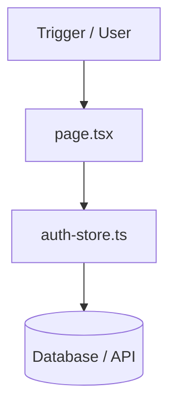

---

## `src/app/(dashboard)/quiz/[quizId]/page.tsx`

- **Loại file**: `NextJS Page`
- **Độ quan trọng**: `High`

### 🎯 Chức năng
Hiển thị giao diện màn hình cho route tương ứng: src/app/(dashboard)/quiz/[quizId]

### 🛠 Các hàm chính
_Không có export hàm cụ thể (File tĩnh hoặc khai báo thuần)._

### 🔗 Liên kết
**Dependencies (Import từ):**
- `next/navigation`
- `src/services/api/lesson.api`
- `./quiz-client`

**Ai gọi file này:**
- _Chưa tìm thấy caller cụ thể_

**File này gọi ai:**
- `src/services/api/lesson.api.ts`

### 🌊 Luồng dữ liệu (Mẫu)
```mermaid
flowchart TD
  A[Trigger / User] --> B[page.tsx]
  B --> C[lesson.api.ts]
  C --> D[(Database / API)]
```

---

## `src/app/(dashboard)/quiz/[quizId]/quiz-client.tsx`

- **Loại file**: `Script / Configuration`
- **Độ quan trọng**: `Medium`

### 🎯 Chức năng
Cung cấp các hàm hoặc dữ liệu hỗ trợ cấu trúc của hệ thống.

### 🛠 Các hàm chính
| Tên hàm | Nhiệm vụ | Input | Output |
|---|---|---|---|
| `QuizClient` | Xử lý logic nghiệp vụ | `params/data` | `Promise / UI / State` |

### 🔗 Liên kết
**Dependencies (Import từ):**
- `react`
- `next/navigation`
- `src/lib/utils`
- `lucide-react`
- `src/components/ui/button`
- `src/components/ui/progress`
- `src/components/quiz/quiz-timer`
- `src/components/quiz/question-card`
- `src/stores/auth-store`
- `src/services/firebase/enrollment.service`
- `src/lib/firebase`
- `firebase/firestore`
- `src/types`
- `next/link`

**Ai gọi file này:**
- _Chưa tìm thấy caller cụ thể_

**File này gọi ai:**
- `src/services/firebase/enrollment.service.ts`
- `src/stores/auth-store.ts`
- `src/types/lesson.types.ts`
- `src/components/ui/button.tsx`
- `src/types/api.types.ts`
- `src/components/quiz/quiz-timer.tsx`
- `src/types/index.ts`
- `src/types/user.types.ts`
- `src/types/course.types.ts`
- `src/services/firebase/firestore.service.ts`
- `src/lib/utils.ts`
- `src/components/quiz/question-card.tsx`
- `src/components/ui/progress.tsx`
- `src/lib/firebase.ts`

### 🌊 Luồng dữ liệu (Mẫu)
```mermaid
flowchart TD
  A[Trigger / User] --> B[quiz-client.tsx]
  B --> C[utils.ts]
  C --> D[(Database / API)]
```

---

## `src/app/(instructor)/layout.tsx`

- **Loại file**: `NextJS Layout`
- **Độ quan trọng**: `High`

### 🎯 Chức năng
Hiển thị giao diện màn hình cho route tương ứng: src/app/(instructor)

### 🛠 Các hàm chính
| Tên hàm | Nhiệm vụ | Input | Output |
|---|---|---|---|
| `InstructorLayout` | Xử lý logic nghiệp vụ | `params/data` | `Promise / UI / State` |

### 🔗 Liên kết
**Dependencies (Import từ):**
- `src/components/auth/instructor-guard`
- `src/components/layout/instructor-sidebar`
- `src/components/layout/dashboard-header`

**Ai gọi file này:**
- _Chưa tìm thấy caller cụ thể_

**File này gọi ai:**
- `src/components/layout/dashboard-header.tsx`
- `src/components/layout/instructor-sidebar.tsx`
- `src/components/auth/instructor-guard.tsx`

### 🌊 Luồng dữ liệu (Mẫu)
```mermaid
flowchart TD
  A[Trigger / User] --> B[layout.tsx]
  B --> C[instructor-guard.tsx]
  C --> D[(Database / API)]
```

---

## `src/app/(instructor)/instructor/page.tsx`

- **Loại file**: `NextJS Page`
- **Độ quan trọng**: `High`

### 🎯 Chức năng
Hiển thị giao diện màn hình cho route tương ứng: src/app/(instructor)/instructor

### 🛠 Các hàm chính
| Tên hàm | Nhiệm vụ | Input | Output |
|---|---|---|---|
| `InstructorDashboardOverview` | Xử lý logic nghiệp vụ | `params/data` | `Promise / UI / State` |

### 🔗 Liên kết
**Dependencies (Import từ):**
- `src/components/ui/card`
- `lucide-react`
- `src/stores/auth-store`
- `recharts`

**Ai gọi file này:**
- _Chưa tìm thấy caller cụ thể_

**File này gọi ai:**
- `src/components/ui/card.tsx`
- `src/stores/auth-store.ts`

### 🌊 Luồng dữ liệu (Mẫu)
```mermaid
flowchart TD
  A[Trigger / User] --> B[page.tsx]
  B --> C[card.tsx]
  C --> D[(Database / API)]
```

---

## `src/app/(instructor)/instructor/comments/page.tsx`

- **Loại file**: `NextJS Page`
- **Độ quan trọng**: `High`

### 🎯 Chức năng
Hiển thị giao diện màn hình cho route tương ứng: src/app/(instructor)/instructor/comments

### 🛠 Các hàm chính
| Tên hàm | Nhiệm vụ | Input | Output |
|---|---|---|---|
| `InstructorCommentsPage` | Xử lý logic nghiệp vụ | `params/data` | `Promise / UI / State` |

### 🔗 Liên kết
**Dependencies (Import từ):**
- `react`
- `src/components/ui/card`
- `src/components/ui/button`
- `src/components/ui/avatar`
- `lucide-react`
- `src/stores/auth-store`

**Ai gọi file này:**
- _Chưa tìm thấy caller cụ thể_

**File này gọi ai:**
- `src/components/ui/card.tsx`
- `src/stores/auth-store.ts`
- `src/components/ui/avatar.tsx`
- `src/components/ui/button.tsx`

### 🌊 Luồng dữ liệu (Mẫu)
```mermaid
flowchart TD
  A[Trigger / User] --> B[page.tsx]
  B --> C[card.tsx]
  C --> D[(Database / API)]
```

---

## `src/app/(instructor)/instructor/courses/delete-course-button.tsx`

- **Loại file**: `Script / Configuration`
- **Độ quan trọng**: `Medium`

### 🎯 Chức năng
Cung cấp các hàm hoặc dữ liệu hỗ trợ cấu trúc của hệ thống.

### 🛠 Các hàm chính
| Tên hàm | Nhiệm vụ | Input | Output |
|---|---|---|---|
| `DeleteCourseButton` | Xử lý logic nghiệp vụ | `params/data` | `Promise / UI / State` |

### 🔗 Liên kết
**Dependencies (Import từ):**
- `react`
- `src/components/ui/button`
- `lucide-react`
- `src/actions/course.actions`

**Ai gọi file này:**
- _Chưa tìm thấy caller cụ thể_

**File này gọi ai:**
- `src/actions/course.actions.ts`
- `src/components/ui/button.tsx`

### 🌊 Luồng dữ liệu (Mẫu)
```mermaid
flowchart TD
  A[Trigger / User] --> B[delete-course-button.tsx]
  B --> C[button.tsx]
  C --> D[(Database / API)]
```

---

## `src/app/(instructor)/instructor/courses/page.tsx`

- **Loại file**: `NextJS Page`
- **Độ quan trọng**: `High`

### 🎯 Chức năng
Hiển thị giao diện màn hình cho route tương ứng: src/app/(instructor)/instructor/courses

### 🛠 Các hàm chính
_Không có export hàm cụ thể (File tĩnh hoặc khai báo thuần)._

### 🔗 Liên kết
**Dependencies (Import từ):**
- `src/components/ui/button`
- `src/components/ui/card`
- `lucide-react`
- `src/components/shared/empty-state`
- `next/link`
- `src/services/api/instructor.api`
- `./delete-course-button`

**Ai gọi file này:**
- _Chưa tìm thấy caller cụ thể_

**File này gọi ai:**
- `src/components/shared/empty-state.tsx`
- `src/components/ui/card.tsx`
- `src/services/api/instructor.api.ts`
- `src/components/ui/button.tsx`

### 🌊 Luồng dữ liệu (Mẫu)
```mermaid
flowchart TD
  A[Trigger / User] --> B[page.tsx]
  B --> C[button.tsx]
  C --> D[(Database / API)]
```

---

## `src/app/(instructor)/instructor/courses/new/page.tsx`

- **Loại file**: `NextJS Page`
- **Độ quan trọng**: `High`

### 🎯 Chức năng
Hiển thị giao diện màn hình cho route tương ứng: src/app/(instructor)/instructor/courses/new

### 🛠 Các hàm chính
| Tên hàm | Nhiệm vụ | Input | Output |
|---|---|---|---|
| `NewCoursePage` | Xử lý logic nghiệp vụ | `params/data` | `Promise / UI / State` |

### 🔗 Liên kết
**Dependencies (Import từ):**
- `react`
- `next/navigation`
- `src/components/ui/button`
- `src/components/ui/input`
- `src/components/ui/card`
- `lucide-react`
- `src/actions/course.actions`
- `src/stores/auth-store`

**Ai gọi file này:**
- _Chưa tìm thấy caller cụ thể_

**File này gọi ai:**
- `src/stores/auth-store.ts`
- `src/components/ui/button.tsx`
- `src/components/ui/card.tsx`
- `src/components/ui/input.tsx`
- `src/actions/course.actions.ts`

### 🌊 Luồng dữ liệu (Mẫu)
```mermaid
flowchart TD
  A[Trigger / User] --> B[page.tsx]
  B --> C[button.tsx]
  C --> D[(Database / API)]
```

---

## `src/app/(instructor)/instructor/courses/[id]/edit-course-client.tsx`

- **Loại file**: `Script / Configuration`
- **Độ quan trọng**: `Medium`

### 🎯 Chức năng
Cung cấp các hàm hoặc dữ liệu hỗ trợ cấu trúc của hệ thống.

### 🛠 Các hàm chính
| Tên hàm | Nhiệm vụ | Input | Output |
|---|---|---|---|
| `EditCourseClient` | Xử lý logic nghiệp vụ | `params/data` | `Promise / UI / State` |

### 🔗 Liên kết
**Dependencies (Import từ):**
- `react`
- `next/navigation`
- `src/components/ui/button`
- `src/components/ui/input`
- `src/components/ui/card`
- `src/actions/course.actions`
- `src/types`

**Ai gọi file này:**
- _Chưa tìm thấy caller cụ thể_

**File này gọi ai:**
- `src/components/ui/button.tsx`
- `src/types/api.types.ts`
- `src/components/ui/card.tsx`
- `src/types/index.ts`
- `src/types/course.types.ts`
- `src/types/lesson.types.ts`
- `src/components/ui/input.tsx`
- `src/types/user.types.ts`
- `src/actions/course.actions.ts`

### 🌊 Luồng dữ liệu (Mẫu)
```mermaid
flowchart TD
  A[Trigger / User] --> B[edit-course-client.tsx]
  B --> C[button.tsx]
  C --> D[(Database / API)]
```

---

## `src/app/(instructor)/instructor/courses/[id]/page.tsx`

- **Loại file**: `NextJS Page`
- **Độ quan trọng**: `High`

### 🎯 Chức năng
Hiển thị giao diện màn hình cho route tương ứng: src/app/(instructor)/instructor/courses/[id]

### 🛠 Các hàm chính
_Không có export hàm cụ thể (File tĩnh hoặc khai báo thuần)._

### 🔗 Liên kết
**Dependencies (Import từ):**
- `next/navigation`
- `src/services/api/instructor.api`
- `./edit-course-client`
- `lucide-react`
- `next/link`
- `src/components/ui/button`

**Ai gọi file này:**
- _Chưa tìm thấy caller cụ thể_

**File này gọi ai:**
- `src/services/api/instructor.api.ts`
- `src/components/ui/button.tsx`

### 🌊 Luồng dữ liệu (Mẫu)
```mermaid
flowchart TD
  A[Trigger / User] --> B[page.tsx]
  B --> C[instructor.api.ts]
  C --> D[(Database / API)]
```

---

## `src/app/(instructor)/instructor/courses/[id]/lessons/delete-lesson-button.tsx`

- **Loại file**: `Script / Configuration`
- **Độ quan trọng**: `Medium`

### 🎯 Chức năng
Cung cấp các hàm hoặc dữ liệu hỗ trợ cấu trúc của hệ thống.

### 🛠 Các hàm chính
| Tên hàm | Nhiệm vụ | Input | Output |
|---|---|---|---|
| `DeleteLessonButton` | Xử lý logic nghiệp vụ | `params/data` | `Promise / UI / State` |

### 🔗 Liên kết
**Dependencies (Import từ):**
- `react`
- `src/components/ui/button`
- `lucide-react`
- `src/actions/lesson.actions`

**Ai gọi file này:**
- _Chưa tìm thấy caller cụ thể_

**File này gọi ai:**
- `src/actions/lesson.actions.ts`
- `src/components/ui/button.tsx`

### 🌊 Luồng dữ liệu (Mẫu)
```mermaid
flowchart TD
  A[Trigger / User] --> B[delete-lesson-button.tsx]
  B --> C[button.tsx]
  C --> D[(Database / API)]
```

---

## `src/app/(instructor)/instructor/courses/[id]/lessons/lesson-form-client.tsx`

- **Loại file**: `Script / Configuration`
- **Độ quan trọng**: `Medium`

### 🎯 Chức năng
Cung cấp các hàm hoặc dữ liệu hỗ trợ cấu trúc của hệ thống.

### 🛠 Các hàm chính
| Tên hàm | Nhiệm vụ | Input | Output |
|---|---|---|---|
| `LessonFormClient` | Xử lý logic nghiệp vụ | `params/data` | `Promise / UI / State` |

### 🔗 Liên kết
**Dependencies (Import từ):**
- `react`
- `next/navigation`
- `src/components/ui/button`
- `src/components/ui/input`
- `src/components/ui/card`
- `src/actions/lesson.actions`

**Ai gọi file này:**
- _Chưa tìm thấy caller cụ thể_

**File này gọi ai:**
- `src/components/ui/input.tsx`
- `src/components/ui/card.tsx`
- `src/actions/lesson.actions.ts`
- `src/components/ui/button.tsx`

### 🌊 Luồng dữ liệu (Mẫu)
```mermaid
flowchart TD
  A[Trigger / User] --> B[lesson-form-client.tsx]
  B --> C[button.tsx]
  C --> D[(Database / API)]
```

---

## `src/app/(instructor)/instructor/courses/[id]/lessons/page.tsx`

- **Loại file**: `NextJS Page`
- **Độ quan trọng**: `High`

### 🎯 Chức năng
Hiển thị giao diện màn hình cho route tương ứng: src/app/(instructor)/instructor/courses/[id]/lessons

### 🛠 Các hàm chính
_Không có export hàm cụ thể (File tĩnh hoặc khai báo thuần)._

### 🔗 Liên kết
**Dependencies (Import từ):**
- `next/navigation`
- `src/lib/strapi`
- `src/services/api/instructor.api`
- `next/link`
- `lucide-react`
- `src/components/ui/button`
- `src/components/ui/card`
- `src/types`
- `./delete-lesson-button`

**Ai gọi file này:**
- _Chưa tìm thấy caller cụ thể_

**File này gọi ai:**
- `src/lib/strapi.ts`
- `src/components/ui/button.tsx`
- `src/types/api.types.ts`
- `src/components/ui/card.tsx`
- `src/services/api/instructor.api.ts`
- `src/types/index.ts`
- `src/types/course.types.ts`
- `src/types/lesson.types.ts`
- `src/types/user.types.ts`

### 🌊 Luồng dữ liệu (Mẫu)
```mermaid
flowchart TD
  A[Trigger / User] --> B[page.tsx]
  B --> C[strapi.ts]
  C --> D[(Database / API)]
```

---

## `src/app/(instructor)/instructor/courses/[id]/lessons/new/page.tsx`

- **Loại file**: `NextJS Page`
- **Độ quan trọng**: `High`

### 🎯 Chức năng
Hiển thị giao diện màn hình cho route tương ứng: src/app/(instructor)/instructor/courses/[id]/lessons/new

### 🛠 Các hàm chính
_Không có export hàm cụ thể (File tĩnh hoặc khai báo thuần)._

### 🔗 Liên kết
**Dependencies (Import từ):**
- `lucide-react`
- `next/link`
- `src/components/ui/button`
- `../lesson-form-client`

**Ai gọi file này:**
- _Chưa tìm thấy caller cụ thể_

**File này gọi ai:**
- `src/components/ui/button.tsx`

### 🌊 Luồng dữ liệu (Mẫu)
```mermaid
flowchart TD
  A[Trigger / User] --> B[page.tsx]
  B --> C[button.tsx]
  C --> D[(Database / API)]
```

---

## `src/app/(instructor)/instructor/courses/[id]/lessons/[lessonId]/page.tsx`

- **Loại file**: `NextJS Page`
- **Độ quan trọng**: `High`

### 🎯 Chức năng
Hiển thị giao diện màn hình cho route tương ứng: src/app/(instructor)/instructor/courses/[id]/lessons/[lessonId]

### 🛠 Các hàm chính
_Không có export hàm cụ thể (File tĩnh hoặc khai báo thuần)._

### 🔗 Liên kết
**Dependencies (Import từ):**
- `next/navigation`
- `src/lib/strapi`
- `next/link`
- `lucide-react`
- `src/components/ui/button`
- `../lesson-form-client`
- `src/types`

**Ai gọi file này:**
- _Chưa tìm thấy caller cụ thể_

**File này gọi ai:**
- `src/lib/strapi.ts`
- `src/components/ui/button.tsx`
- `src/types/api.types.ts`
- `src/types/index.ts`
- `src/types/course.types.ts`
- `src/types/lesson.types.ts`
- `src/types/user.types.ts`

### 🌊 Luồng dữ liệu (Mẫu)
```mermaid
flowchart TD
  A[Trigger / User] --> B[page.tsx]
  B --> C[strapi.ts]
  C --> D[(Database / API)]
```

---

## `src/app/(instructor)/instructor/students/page.tsx`

- **Loại file**: `NextJS Page`
- **Độ quan trọng**: `High`

### 🎯 Chức năng
Hiển thị giao diện màn hình cho route tương ứng: src/app/(instructor)/instructor/students

### 🛠 Các hàm chính
| Tên hàm | Nhiệm vụ | Input | Output |
|---|---|---|---|
| `InstructorStudentsPage` | Xử lý logic nghiệp vụ | `params/data` | `Promise / UI / State` |

### 🔗 Liên kết
**Dependencies (Import từ):**
- `react`
- `src/components/ui/card`
- `src/components/ui/input`
- `lucide-react`
- `src/components/ui/avatar`
- `src/services/firebase/firestore.service`
- `src/lib/strapi`
- `src/types`

**Ai gọi file này:**
- _Chưa tìm thấy caller cụ thể_

**File này gọi ai:**
- `src/lib/strapi.ts`
- `src/types/lesson.types.ts`
- `src/types/api.types.ts`
- `src/components/ui/card.tsx`
- `src/types/index.ts`
- `src/types/course.types.ts`
- `src/services/firebase/firestore.service.ts`
- `src/components/ui/input.tsx`
- `src/components/ui/avatar.tsx`
- `src/types/user.types.ts`

### 🌊 Luồng dữ liệu (Mẫu)
```mermaid
flowchart TD
  A[Trigger / User] --> B[page.tsx]
  B --> C[card.tsx]
  C --> D[(Database / API)]
```

---

## `src/app/(public)/layout.tsx`

- **Loại file**: `NextJS Layout`
- **Độ quan trọng**: `High`

### 🎯 Chức năng
Hiển thị giao diện màn hình cho route tương ứng: src/app/(public)

### 🛠 Các hàm chính
| Tên hàm | Nhiệm vụ | Input | Output |
|---|---|---|---|
| `PublicLayout` | Xử lý logic nghiệp vụ | `params/data` | `Promise / UI / State` |

### 🔗 Liên kết
**Dependencies (Import từ):**
- `src/components/layout/navbar`
- `src/components/layout/footer`

**Ai gọi file này:**
- _Chưa tìm thấy caller cụ thể_

**File này gọi ai:**
- `src/components/layout/footer.tsx`
- `src/components/layout/navbar.tsx`

### 🌊 Luồng dữ liệu (Mẫu)
```mermaid
flowchart TD
  A[Trigger / User] --> B[layout.tsx]
  B --> C[navbar.tsx]
  C --> D[(Database / API)]
```

---

## `src/app/(public)/page.tsx`

- **Loại file**: `NextJS Page`
- **Độ quan trọng**: `High`

### 🎯 Chức năng
Hiển thị giao diện màn hình cho route tương ứng: src/app/(public)

### 🛠 Các hàm chính
| Tên hàm | Nhiệm vụ | Input | Output |
|---|---|---|---|
| `LandingPage` | Xử lý logic nghiệp vụ | `params/data` | `Promise / UI / State` |

### 🔗 Liên kết
**Dependencies (Import từ):**
- `src/components/landing/hero-section`
- `src/components/landing/featured-courses`
- `src/components/landing/categories-section`
- `src/components/landing/why-choose-us`
- `src/components/landing/testimonials`
- `src/components/landing/faq-section`
- `src/components/landing/cta-section`

**Ai gọi file này:**
- _Chưa tìm thấy caller cụ thể_

**File này gọi ai:**
- `src/components/landing/categories-section.tsx`
- `src/components/landing/testimonials.tsx`
- `src/components/landing/cta-section.tsx`
- `src/components/landing/faq-section.tsx`
- `src/components/landing/why-choose-us.tsx`
- `src/components/landing/hero-section.tsx`
- `src/components/landing/featured-courses-client.tsx`
- `src/components/landing/featured-courses.tsx`

### 🌊 Luồng dữ liệu (Mẫu)
```mermaid
flowchart TD
  A[Trigger / User] --> B[page.tsx]
  B --> C[hero-section.tsx]
  C --> D[(Database / API)]
```

---

## `src/app/(public)/about/page.tsx`

- **Loại file**: `NextJS Page`
- **Độ quan trọng**: `High`

### 🎯 Chức năng
Hiển thị giao diện màn hình cho route tương ứng: src/app/(public)/about

### 🛠 Các hàm chính
| Tên hàm | Nhiệm vụ | Input | Output |
|---|---|---|---|
| `AboutPage` | Xử lý logic nghiệp vụ | `params/data` | `Promise / UI / State` |

### 🔗 Liên kết
**Dependencies (Import từ):**
- `lucide-react`
- `src/lib/constants`

**Ai gọi file này:**
- _Chưa tìm thấy caller cụ thể_

**File này gọi ai:**
- `src/lib/constants.ts`

### 🌊 Luồng dữ liệu (Mẫu)
```mermaid
flowchart TD
  A[Trigger / User] --> B[page.tsx]
  B --> C[constants.ts]
  C --> D[(Database / API)]
```

---

## `src/app/(public)/checkout/[courseSlug]/checkout-client.tsx`

- **Loại file**: `Script / Configuration`
- **Độ quan trọng**: `Medium`

### 🎯 Chức năng
Cung cấp các hàm hoặc dữ liệu hỗ trợ cấu trúc của hệ thống.

### 🛠 Các hàm chính
| Tên hàm | Nhiệm vụ | Input | Output |
|---|---|---|---|
| `CheckoutClient` | Xử lý logic nghiệp vụ | `params/data` | `Promise / UI / State` |

### 🔗 Liên kết
**Dependencies (Import từ):**
- `react`
- `next/navigation`
- `src/components/ui/button`
- `src/stores/auth-store`
- `src/services/firebase/enrollment.service`
- `src/types`
- `lucide-react`
- `next/image`
- `next/link`

**Ai gọi file này:**
- _Chưa tìm thấy caller cụ thể_

**File này gọi ai:**
- `src/services/firebase/enrollment.service.ts`
- `src/stores/auth-store.ts`
- `src/components/ui/button.tsx`
- `src/types/api.types.ts`
- `src/types/index.ts`
- `src/types/course.types.ts`
- `src/types/lesson.types.ts`
- `src/types/user.types.ts`

### 🌊 Luồng dữ liệu (Mẫu)
```mermaid
flowchart TD
  A[Trigger / User] --> B[checkout-client.tsx]
  B --> C[button.tsx]
  C --> D[(Database / API)]
```

---

## `src/app/(public)/checkout/[courseSlug]/page.tsx`

- **Loại file**: `NextJS Page`
- **Độ quan trọng**: `High`

### 🎯 Chức năng
Hiển thị giao diện màn hình cho route tương ứng: src/app/(public)/checkout/[courseSlug]

### 🛠 Các hàm chính
| Tên hàm | Nhiệm vụ | Input | Output |
|---|---|---|---|
| `metadata` | Xử lý logic nghiệp vụ | `params/data` | `Promise / UI / State` |

### 🔗 Liên kết
**Dependencies (Import từ):**
- `next/navigation`
- `src/services/api/courses.api`
- `./checkout-client`
- `next`

**Ai gọi file này:**
- _Chưa tìm thấy caller cụ thể_

**File này gọi ai:**
- `next-env.d.ts`
- `src/services/api/courses.api.ts`
- `next.config.ts`

### 🌊 Luồng dữ liệu (Mẫu)
```mermaid
flowchart TD
  A[Trigger / User] --> B[page.tsx]
  B --> C[courses.api.ts]
  C --> D[(Database / API)]
```

---

## `src/app/(public)/contact/page.tsx`

- **Loại file**: `NextJS Page`
- **Độ quan trọng**: `High`

### 🎯 Chức năng
Hiển thị giao diện màn hình cho route tương ứng: src/app/(public)/contact

### 🛠 Các hàm chính
| Tên hàm | Nhiệm vụ | Input | Output |
|---|---|---|---|
| `ContactPage` | Xử lý logic nghiệp vụ | `params/data` | `Promise / UI / State` |

### 🔗 Liên kết
**Dependencies (Import từ):**
- `lucide-react`
- `src/components/ui/button`
- `src/lib/constants`

**Ai gọi file này:**
- _Chưa tìm thấy caller cụ thể_

**File này gọi ai:**
- `src/lib/constants.ts`
- `src/components/ui/button.tsx`

### 🌊 Luồng dữ liệu (Mẫu)
```mermaid
flowchart TD
  A[Trigger / User] --> B[page.tsx]
  B --> C[button.tsx]
  C --> D[(Database / API)]
```

---

## `src/app/(public)/courses/page.tsx`

- **Loại file**: `NextJS Page`
- **Độ quan trọng**: `High`

### 🎯 Chức năng
Hiển thị giao diện màn hình cho route tương ứng: src/app/(public)/courses

### 🛠 Các hàm chính
| Tên hàm | Nhiệm vụ | Input | Output |
|---|---|---|---|
| `CoursesPage` | Xử lý logic nghiệp vụ | `params/data` | `Promise / UI / State` |

### 🔗 Liên kết
**Dependencies (Import từ):**
- `react`
- `next/navigation`
- `src/components/course/course-filters`
- `src/components/course/course-grid`
- `src/components/shared/pagination`
- `src/stores/course-store`
- `src/hooks/use-courses`
- `framer-motion`

**Ai gọi file này:**
- _Chưa tìm thấy caller cụ thể_

**File này gọi ai:**
- `src/components/course/course-grid.tsx`
- `src/components/shared/pagination.tsx`
- `src/components/course/course-filters.tsx`
- `src/hooks/use-courses.ts`
- `src/stores/course-store.ts`

### 🌊 Luồng dữ liệu (Mẫu)
```mermaid
flowchart TD
  A[Trigger / User] --> B[page.tsx]
  B --> C[course-filters.tsx]
  C --> D[(Database / API)]
```

---

## `src/app/(public)/courses/[slug]/page.tsx`

- **Loại file**: `NextJS Page`
- **Độ quan trọng**: `High`

### 🎯 Chức năng
Hiển thị giao diện màn hình cho route tương ứng: src/app/(public)/courses/[slug]

### 🛠 Các hàm chính
_Không có export hàm cụ thể (File tĩnh hoặc khai báo thuần)._

### 🔗 Liên kết
**Dependencies (Import từ):**
- `src/components/course/course-detail-hero`
- `src/components/course/curriculum`
- `src/components/course/instructor-card`
- `src/components/course/sticky-sidebar`
- `src/components/course/review-section`
- `src/components/course/add-review-form`
- `src/services/api/courses.api`
- `next/navigation`

**Ai gọi file này:**
- _Chưa tìm thấy caller cụ thể_

**File này gọi ai:**
- `src/components/course/instructor-card.tsx`
- `src/components/course/course-detail-hero.tsx`
- `src/components/course/add-review-form.tsx`
- `src/services/api/courses.api.ts`
- `src/components/course/curriculum.tsx`
- `src/components/course/review-section.tsx`
- `src/components/course/sticky-sidebar.tsx`

### 🌊 Luồng dữ liệu (Mẫu)
```mermaid
flowchart TD
  A[Trigger / User] --> B[page.tsx]
  B --> C[course-detail-hero.tsx]
  C --> D[(Database / API)]
```

---

## `src/app/(public)/forgot-password/page.tsx`

- **Loại file**: `NextJS Page`
- **Độ quan trọng**: `High`

### 🎯 Chức năng
Hiển thị giao diện màn hình cho route tương ứng: src/app/(public)/forgot-password

### 🛠 Các hàm chính
| Tên hàm | Nhiệm vụ | Input | Output |
|---|---|---|---|
| `ForgotPasswordPage` | Xử lý logic nghiệp vụ | `params/data` | `Promise / UI / State` |

### 🔗 Liên kết
**Dependencies (Import từ):**
- `react`
- `next/link`
- `src/components/ui/button`
- `src/components/ui/input`
- `lucide-react`
- `src/lib/constants`
- `src/services/firebase/auth.service`

**Ai gọi file này:**
- _Chưa tìm thấy caller cụ thể_

**File này gọi ai:**
- `src/components/ui/input.tsx`
- `src/lib/constants.ts`
- `src/services/firebase/auth.service.ts`
- `src/components/ui/button.tsx`

### 🌊 Luồng dữ liệu (Mẫu)
```mermaid
flowchart TD
  A[Trigger / User] --> B[page.tsx]
  B --> C[button.tsx]
  C --> D[(Database / API)]
```

---

## `src/app/(public)/login/page.tsx`

- **Loại file**: `NextJS Page`
- **Độ quan trọng**: `High`

### 🎯 Chức năng
Hiển thị giao diện màn hình cho route tương ứng: src/app/(public)/login

### 🛠 Các hàm chính
| Tên hàm | Nhiệm vụ | Input | Output |
|---|---|---|---|
| `LoginPage` | Xử lý logic nghiệp vụ | `params/data` | `Promise / UI / State` |

### 🔗 Liên kết
**Dependencies (Import từ):**
- `react`
- `next/link`
- `src/components/ui/button`
- `src/components/ui/input`
- `lucide-react`
- `src/lib/constants`
- `src/services/firebase/auth.service`
- `src/hooks/use-auth-redirect`
- `src/components/auth/social-auth-buttons`

**Ai gọi file này:**
- _Chưa tìm thấy caller cụ thể_

**File này gọi ai:**
- `src/services/firebase/auth.service.ts`
- `src/hooks/use-auth-redirect.ts`
- `src/components/ui/button.tsx`
- `src/components/auth/social-auth-buttons.tsx`
- `src/lib/constants.ts`
- `src/components/ui/input.tsx`

### 🌊 Luồng dữ liệu (Mẫu)
```mermaid
flowchart TD
  A[Trigger / User] --> B[page.tsx]
  B --> C[button.tsx]
  C --> D[(Database / API)]
```

---

## `src/app/(public)/register/page.tsx`

- **Loại file**: `NextJS Page`
- **Độ quan trọng**: `High`

### 🎯 Chức năng
Hiển thị giao diện màn hình cho route tương ứng: src/app/(public)/register

### 🛠 Các hàm chính
| Tên hàm | Nhiệm vụ | Input | Output |
|---|---|---|---|
| `RegisterPage` | Xử lý logic nghiệp vụ | `params/data` | `Promise / UI / State` |

### 🔗 Liên kết
**Dependencies (Import từ):**
- `react`
- `next/link`
- `src/components/ui/button`
- `src/components/ui/input`
- `lucide-react`
- `src/lib/constants`
- `src/services/firebase/auth.service`
- `src/components/auth/social-auth-buttons`

**Ai gọi file này:**
- _Chưa tìm thấy caller cụ thể_

**File này gọi ai:**
- `src/services/firebase/auth.service.ts`
- `src/components/ui/button.tsx`
- `src/components/auth/social-auth-buttons.tsx`
- `src/lib/constants.ts`
- `src/components/ui/input.tsx`

### 🌊 Luồng dữ liệu (Mẫu)
```mermaid
flowchart TD
  A[Trigger / User] --> B[page.tsx]
  B --> C[button.tsx]
  C --> D[(Database / API)]
```

---

## `src/app/learn/layout.tsx`

- **Loại file**: `NextJS Layout`
- **Độ quan trọng**: `High`

### 🎯 Chức năng
Hiển thị giao diện màn hình cho route tương ứng: src/app/learn

### 🛠 Các hàm chính
| Tên hàm | Nhiệm vụ | Input | Output |
|---|---|---|---|
| `LearnLayout` | Xử lý logic nghiệp vụ | `params/data` | `Promise / UI / State` |

### 🔗 Liên kết
**Dependencies (Import từ):**
- `src/components/auth/dashboard-guard`

**Ai gọi file này:**
- _Chưa tìm thấy caller cụ thể_

**File này gọi ai:**
- `src/components/auth/dashboard-guard.tsx`

### 🌊 Luồng dữ liệu (Mẫu)
```mermaid
flowchart TD
  A[Trigger / User] --> B[layout.tsx]
  B --> C[dashboard-guard.tsx]
  C --> D[(Database / API)]
```

---

## `src/app/learn/[courseSlug]/page.tsx`

- **Loại file**: `NextJS Page`
- **Độ quan trọng**: `High`

### 🎯 Chức năng
Hiển thị giao diện màn hình cho route tương ứng: src/app/learn/[courseSlug]

### 🛠 Các hàm chính
_Không có export hàm cụ thể (File tĩnh hoặc khai báo thuần)._

### 🔗 Liên kết
**Dependencies (Import từ):**
- `next/navigation`
- `src/services/api/courses.api`

**Ai gọi file này:**
- _Chưa tìm thấy caller cụ thể_

**File này gọi ai:**
- `src/services/api/courses.api.ts`

### 🌊 Luồng dữ liệu (Mẫu)
```mermaid
flowchart TD
  A[Trigger / User] --> B[page.tsx]
  B --> C[courses.api.ts]
  C --> D[(Database / API)]
```

---

## `src/app/learn/[courseSlug]/[lessonSlug]/lesson-view-client.tsx`

- **Loại file**: `Script / Configuration`
- **Độ quan trọng**: `Medium`

### 🎯 Chức năng
Cung cấp các hàm hoặc dữ liệu hỗ trợ cấu trúc của hệ thống.

### 🛠 Các hàm chính
| Tên hàm | Nhiệm vụ | Input | Output |
|---|---|---|---|
| `LessonViewClient` | Xử lý logic nghiệp vụ | `params/data` | `Promise / UI / State` |

### 🔗 Liên kết
**Dependencies (Import từ):**
- `react`
- `next/link`
- `lucide-react`
- `src/components/ui/button`
- `src/stores/auth-store`
- `src/services/firebase/enrollment.service`
- `src/services/firebase/firestore.service`
- `src/components/ui/tabs`
- `src/components/learning/notes-panel`
- `src/components/learning/comments-panel`
- `src/lib/utils`
- `src/types`

**Ai gọi file này:**
- _Chưa tìm thấy caller cụ thể_

**File này gọi ai:**
- `src/services/firebase/enrollment.service.ts`
- `src/stores/auth-store.ts`
- `src/components/ui/tabs.tsx`
- `src/types/lesson.types.ts`
- `src/components/ui/button.tsx`
- `src/types/api.types.ts`
- `src/components/learning/comments-panel.tsx`
- `src/types/index.ts`
- `src/types/course.types.ts`
- `src/services/firebase/firestore.service.ts`
- `src/lib/utils.ts`
- `src/components/learning/notes-panel.tsx`
- `src/types/user.types.ts`

### 🌊 Luồng dữ liệu (Mẫu)
```mermaid
flowchart TD
  A[Trigger / User] --> B[lesson-view-client.tsx]
  B --> C[button.tsx]
  C --> D[(Database / API)]
```

---

## `src/app/learn/[courseSlug]/[lessonSlug]/page.tsx`

- **Loại file**: `NextJS Page`
- **Độ quan trọng**: `High`

### 🎯 Chức năng
Hiển thị giao diện màn hình cho route tương ứng: src/app/learn/[courseSlug]/[lessonSlug]

### 🛠 Các hàm chính
_Không có export hàm cụ thể (File tĩnh hoặc khai báo thuần)._

### 🔗 Liên kết
**Dependencies (Import từ):**
- `next/navigation`
- `src/services/api/courses.api`
- `src/services/api/lesson.api`
- `./lesson-view-client`

**Ai gọi file này:**
- _Chưa tìm thấy caller cụ thể_

**File này gọi ai:**
- `src/services/api/courses.api.ts`
- `src/services/api/lesson.api.ts`

### 🌊 Luồng dữ liệu (Mẫu)
```mermaid
flowchart TD
  A[Trigger / User] --> B[page.tsx]
  B --> C[courses.api.ts]
  C --> D[(Database / API)]
```

---

## `src/components/auth/admin-guard.tsx`

- **Loại file**: `React Component`
- **Độ quan trọng**: `Medium`

### 🎯 Chức năng
Thành phần giao diện tái sử dụng được (UI Component).

### 🛠 Các hàm chính
| Tên hàm | Nhiệm vụ | Input | Output |
|---|---|---|---|
| `AdminGuard` | Xử lý logic nghiệp vụ | `params/data` | `Promise / UI / State` |

### 🔗 Liên kết
**Dependencies (Import từ):**
- `react`
- `next/navigation`
- `src/stores/auth-store`
- `src/components/shared/loading-skeleton`

**Ai gọi file này:**
- `src/app/(admin)/layout.tsx`

**File này gọi ai:**
- `src/components/shared/loading-skeleton.tsx`
- `src/stores/auth-store.ts`

### 🌊 Luồng dữ liệu (Mẫu)
```mermaid
flowchart TD
  A[Trigger / User] --> B[admin-guard.tsx]
  B --> C[auth-store.ts]
  C --> D[(Database / API)]
```

---

## `src/components/auth/dashboard-guard.tsx`

- **Loại file**: `React Component`
- **Độ quan trọng**: `Medium`

### 🎯 Chức năng
Thành phần giao diện tái sử dụng được (UI Component).

### 🛠 Các hàm chính
| Tên hàm | Nhiệm vụ | Input | Output |
|---|---|---|---|
| `DashboardGuard` | Xử lý logic nghiệp vụ | `params/data` | `Promise / UI / State` |

### 🔗 Liên kết
**Dependencies (Import từ):**
- `react`
- `next/navigation`
- `src/stores/auth-store`
- `src/components/shared/loading-skeleton`

**Ai gọi file này:**
- `src/app/(dashboard)/layout.tsx`
- `src/app/learn/layout.tsx`

**File này gọi ai:**
- `src/components/shared/loading-skeleton.tsx`
- `src/stores/auth-store.ts`

### 🌊 Luồng dữ liệu (Mẫu)
```mermaid
flowchart TD
  A[Trigger / User] --> B[dashboard-guard.tsx]
  B --> C[auth-store.ts]
  C --> D[(Database / API)]
```

---

## `src/components/auth/instructor-guard.tsx`

- **Loại file**: `React Component`
- **Độ quan trọng**: `Medium`

### 🎯 Chức năng
Thành phần giao diện tái sử dụng được (UI Component).

### 🛠 Các hàm chính
| Tên hàm | Nhiệm vụ | Input | Output |
|---|---|---|---|
| `InstructorGuard` | Xử lý logic nghiệp vụ | `params/data` | `Promise / UI / State` |

### 🔗 Liên kết
**Dependencies (Import từ):**
- `react`
- `next/navigation`
- `src/stores/auth-store`
- `src/components/shared/loading-skeleton`

**Ai gọi file này:**
- `src/app/(instructor)/layout.tsx`

**File này gọi ai:**
- `src/components/shared/loading-skeleton.tsx`
- `src/stores/auth-store.ts`

### 🌊 Luồng dữ liệu (Mẫu)
```mermaid
flowchart TD
  A[Trigger / User] --> B[instructor-guard.tsx]
  B --> C[auth-store.ts]
  C --> D[(Database / API)]
```

---

## `src/components/auth/social-auth-buttons.tsx`

- **Loại file**: `React Component`
- **Độ quan trọng**: `Medium`

### 🎯 Chức năng
Thành phần giao diện tái sử dụng được (UI Component).

### 🛠 Các hàm chính
| Tên hàm | Nhiệm vụ | Input | Output |
|---|---|---|---|
| `SocialAuthButtons` | Xử lý logic nghiệp vụ | `params/data` | `Promise / UI / State` |

### 🔗 Liên kết
**Dependencies (Import từ):**
- `react`
- `src/components/ui/button`
- `src/services/firebase/auth.service`
- `src/hooks/use-auth-redirect`

**Ai gọi file này:**
- `src/app/(public)/register/page.tsx`
- `src/app/(public)/login/page.tsx`

**File này gọi ai:**
- `src/hooks/use-auth-redirect.ts`
- `src/services/firebase/auth.service.ts`
- `src/components/ui/button.tsx`

### 🌊 Luồng dữ liệu (Mẫu)
```mermaid
flowchart TD
  A[Trigger / User] --> B[social-auth-buttons.tsx]
  B --> C[button.tsx]
  C --> D[(Database / API)]
```

---

## `src/components/course/add-review-form.tsx`

- **Loại file**: `React Component`
- **Độ quan trọng**: `Medium`

### 🎯 Chức năng
Thành phần giao diện tái sử dụng được (UI Component).

### 🛠 Các hàm chính
| Tên hàm | Nhiệm vụ | Input | Output |
|---|---|---|---|
| `AddReviewForm` | Xử lý logic nghiệp vụ | `params/data` | `Promise / UI / State` |

### 🔗 Liên kết
**Dependencies (Import từ):**
- `react`
- `lucide-react`
- `src/components/ui/button`
- `src/stores/auth-store`
- `src/lib/strapi`

**Ai gọi file này:**
- `src/app/(public)/courses/[slug]/page.tsx`

**File này gọi ai:**
- `src/lib/strapi.ts`
- `src/stores/auth-store.ts`
- `src/components/ui/button.tsx`

### 🌊 Luồng dữ liệu (Mẫu)
```mermaid
flowchart TD
  A[Trigger / User] --> B[add-review-form.tsx]
  B --> C[button.tsx]
  C --> D[(Database / API)]
```

---

## `src/components/course/course-card.tsx`

- **Loại file**: `React Component`
- **Độ quan trọng**: `Medium`

### 🎯 Chức năng
Thành phần giao diện tái sử dụng được (UI Component).

### 🛠 Các hàm chính
| Tên hàm | Nhiệm vụ | Input | Output |
|---|---|---|---|
| `CourseCard` | Xử lý logic nghiệp vụ | `params/data` | `Promise / UI / State` |

### 🔗 Liên kết
**Dependencies (Import từ):**
- `next/link`
- `src/components/ui/card`
- `src/components/ui/badge`
- `lucide-react`
- `src/types`
- `src/lib/utils`

**Ai gọi file này:**
- _Chưa tìm thấy caller cụ thể_

**File này gọi ai:**
- `src/components/ui/badge.tsx`
- `src/types/api.types.ts`
- `src/components/ui/card.tsx`
- `src/types/index.ts`
- `src/types/course.types.ts`
- `src/types/lesson.types.ts`
- `src/lib/utils.ts`
- `src/types/user.types.ts`

### 🌊 Luồng dữ liệu (Mẫu)
```mermaid
flowchart TD
  A[Trigger / User] --> B[course-card.tsx]
  B --> C[card.tsx]
  C --> D[(Database / API)]
```

---

## `src/components/course/course-detail-hero.tsx`

- **Loại file**: `React Component`
- **Độ quan trọng**: `Medium`

### 🎯 Chức năng
Thành phần giao diện tái sử dụng được (UI Component).

### 🛠 Các hàm chính
| Tên hàm | Nhiệm vụ | Input | Output |
|---|---|---|---|
| `CourseDetailHero` | Xử lý logic nghiệp vụ | `params/data` | `Promise / UI / State` |

### 🔗 Liên kết
**Dependencies (Import từ):**
- `framer-motion`
- `src/components/ui/badge`
- `lucide-react`
- `src/types`
- `src/lib/utils`

**Ai gọi file này:**
- `src/app/(public)/courses/[slug]/page.tsx`

**File này gọi ai:**
- `src/components/ui/badge.tsx`
- `src/types/api.types.ts`
- `src/types/index.ts`
- `src/types/course.types.ts`
- `src/types/lesson.types.ts`
- `src/lib/utils.ts`
- `src/types/user.types.ts`

### 🌊 Luồng dữ liệu (Mẫu)
```mermaid
flowchart TD
  A[Trigger / User] --> B[course-detail-hero.tsx]
  B --> C[badge.tsx]
  C --> D[(Database / API)]
```

---

## `src/components/course/course-filters.tsx`

- **Loại file**: `React Component`
- **Độ quan trọng**: `Medium`

### 🎯 Chức năng
Thành phần giao diện tái sử dụng được (UI Component).

### 🛠 Các hàm chính
| Tên hàm | Nhiệm vụ | Input | Output |
|---|---|---|---|
| `CourseFilters` | Xử lý logic nghiệp vụ | `params/data` | `Promise / UI / State` |

### 🔗 Liên kết
**Dependencies (Import từ):**
- `src/components/ui/input`
- `src/components/ui/button`
- `lucide-react`
- `src/stores/course-store`
- `src/lib/constants`
- `src/types`
- `react`
- `src/hooks/use-debounce`
- `@tanstack/react-query`
- `src/services/api/courses.api`

**Ai gọi file này:**
- `src/app/(public)/courses/page.tsx`

**File này gọi ai:**
- `src/hooks/use-debounce.ts`
- `src/services/api/courses.api.ts`
- `src/components/ui/button.tsx`
- `src/types/api.types.ts`
- `src/lib/constants.ts`
- `src/stores/course-store.ts`
- `src/types/index.ts`
- `src/types/course.types.ts`
- `src/types/lesson.types.ts`
- `src/components/ui/input.tsx`
- `src/types/user.types.ts`

### 🌊 Luồng dữ liệu (Mẫu)
```mermaid
flowchart TD
  A[Trigger / User] --> B[course-filters.tsx]
  B --> C[input.tsx]
  C --> D[(Database / API)]
```

---

## `src/components/course/course-grid.tsx`

- **Loại file**: `React Component`
- **Độ quan trọng**: `Medium`

### 🎯 Chức năng
Thành phần giao diện tái sử dụng được (UI Component).

### 🛠 Các hàm chính
| Tên hàm | Nhiệm vụ | Input | Output |
|---|---|---|---|
| `CourseGrid` | Xử lý logic nghiệp vụ | `params/data` | `Promise / UI / State` |

### 🔗 Liên kết
**Dependencies (Import từ):**
- `./course-card`
- `src/components/ui/skeleton`
- `src/types`

**Ai gọi file này:**
- `src/app/(public)/courses/page.tsx`
- `src/app/(dashboard)/dashboard/page.tsx`

**File này gọi ai:**
- `src/components/ui/skeleton.tsx`
- `src/types/api.types.ts`
- `src/types/index.ts`
- `src/types/course.types.ts`
- `src/types/lesson.types.ts`
- `src/types/user.types.ts`

### 🌊 Luồng dữ liệu (Mẫu)
```mermaid
flowchart TD
  A[Trigger / User] --> B[course-grid.tsx]
  B --> C[skeleton.tsx]
  C --> D[(Database / API)]
```

---

## `src/components/course/curriculum.tsx`

- **Loại file**: `React Component`
- **Độ quan trọng**: `Medium`

### 🎯 Chức năng
Thành phần giao diện tái sử dụng được (UI Component).

### 🛠 Các hàm chính
| Tên hàm | Nhiệm vụ | Input | Output |
|---|---|---|---|
| `Curriculum` | Xử lý logic nghiệp vụ | `params/data` | `Promise / UI / State` |

### 🔗 Liên kết
**Dependencies (Import từ):**
- `src/components/ui/accordion`
- `lucide-react`
- `src/lib/utils`
- `src/components/ui/badge`

**Ai gọi file này:**
- `src/app/(public)/courses/[slug]/page.tsx`

**File này gọi ai:**
- `src/lib/utils.ts`
- `src/components/ui/accordion.tsx`
- `src/components/ui/badge.tsx`

### 🌊 Luồng dữ liệu (Mẫu)
```mermaid
flowchart TD
  A[Trigger / User] --> B[curriculum.tsx]
  B --> C[accordion.tsx]
  C --> D[(Database / API)]
```

---

## `src/components/course/instructor-card.tsx`

- **Loại file**: `React Component`
- **Độ quan trọng**: `Medium`

### 🎯 Chức năng
Thành phần giao diện tái sử dụng được (UI Component).

### 🛠 Các hàm chính
| Tên hàm | Nhiệm vụ | Input | Output |
|---|---|---|---|
| `InstructorCard` | Xử lý logic nghiệp vụ | `params/data` | `Promise / UI / State` |

### 🔗 Liên kết
**Dependencies (Import từ):**
- `src/components/ui/avatar`
- `src/components/ui/badge`
- `lucide-react`

**Ai gọi file này:**
- `src/app/(public)/courses/[slug]/page.tsx`

**File này gọi ai:**
- `src/components/ui/avatar.tsx`
- `src/components/ui/badge.tsx`

### 🌊 Luồng dữ liệu (Mẫu)
```mermaid
flowchart TD
  A[Trigger / User] --> B[instructor-card.tsx]
  B --> C[avatar.tsx]
  C --> D[(Database / API)]
```

---

## `src/components/course/review-section.tsx`

- **Loại file**: `React Component`
- **Độ quan trọng**: `Medium`

### 🎯 Chức năng
Thành phần giao diện tái sử dụng được (UI Component).

### 🛠 Các hàm chính
| Tên hàm | Nhiệm vụ | Input | Output |
|---|---|---|---|
| `ReviewSection` | Xử lý logic nghiệp vụ | `params/data` | `Promise / UI / State` |

### 🔗 Liên kết
**Dependencies (Import từ):**
- `lucide-react`
- `src/components/ui/avatar`

**Ai gọi file này:**
- `src/app/(public)/courses/[slug]/page.tsx`

**File này gọi ai:**
- `src/components/ui/avatar.tsx`

### 🌊 Luồng dữ liệu (Mẫu)
```mermaid
flowchart TD
  A[Trigger / User] --> B[review-section.tsx]
  B --> C[avatar.tsx]
  C --> D[(Database / API)]
```

---

## `src/components/course/sticky-sidebar.tsx`

- **Loại file**: `React Component`
- **Độ quan trọng**: `Medium`

### 🎯 Chức năng
Thành phần giao diện tái sử dụng được (UI Component).

### 🛠 Các hàm chính
| Tên hàm | Nhiệm vụ | Input | Output |
|---|---|---|---|
| `StickySidebar` | Xử lý logic nghiệp vụ | `params/data` | `Promise / UI / State` |

### 🔗 Liên kết
**Dependencies (Import từ):**
- `src/components/ui/button`
- `src/lib/utils`
- `lucide-react`
- `src/types`
- `next/navigation`
- `src/stores/auth-store`
- `src/services/firebase/enrollment.service`
- `react`
- `src/stores/favorites-store`

**Ai gọi file này:**
- `src/app/(public)/courses/[slug]/page.tsx`

**File này gọi ai:**
- `src/services/firebase/enrollment.service.ts`
- `src/stores/auth-store.ts`
- `src/components/ui/button.tsx`
- `src/types/api.types.ts`
- `src/types/index.ts`
- `src/types/course.types.ts`
- `src/types/lesson.types.ts`
- `src/lib/utils.ts`
- `src/types/user.types.ts`
- `src/stores/favorites-store.ts`

### 🌊 Luồng dữ liệu (Mẫu)
```mermaid
flowchart TD
  A[Trigger / User] --> B[sticky-sidebar.tsx]
  B --> C[button.tsx]
  C --> D[(Database / API)]
```

---

## `src/components/landing/categories-section.tsx`

- **Loại file**: `React Component`
- **Độ quan trọng**: `Medium`

### 🎯 Chức năng
Thành phần giao diện tái sử dụng được (UI Component).

### 🛠 Các hàm chính
| Tên hàm | Nhiệm vụ | Input | Output |
|---|---|---|---|
| `CategoriesSection` | Xử lý logic nghiệp vụ | `params/data` | `Promise / UI / State` |

### 🔗 Liên kết
**Dependencies (Import từ):**
- `framer-motion`
- `src/lib/constants`
- `next/link`

**Ai gọi file này:**
- `src/app/(public)/page.tsx`

**File này gọi ai:**
- `src/lib/constants.ts`

### 🌊 Luồng dữ liệu (Mẫu)
```mermaid
flowchart TD
  A[Trigger / User] --> B[categories-section.tsx]
  B --> C[constants.ts]
  C --> D[(Database / API)]
```

---

## `src/components/landing/cta-section.tsx`

- **Loại file**: `React Component`
- **Độ quan trọng**: `Medium`

### 🎯 Chức năng
Thành phần giao diện tái sử dụng được (UI Component).

### 🛠 Các hàm chính
| Tên hàm | Nhiệm vụ | Input | Output |
|---|---|---|---|
| `CTASection` | Xử lý logic nghiệp vụ | `params/data` | `Promise / UI / State` |

### 🔗 Liên kết
**Dependencies (Import từ):**
- `framer-motion`
- `src/components/ui/button`
- `lucide-react`
- `next/link`

**Ai gọi file này:**
- `src/app/(public)/page.tsx`

**File này gọi ai:**
- `src/components/ui/button.tsx`

### 🌊 Luồng dữ liệu (Mẫu)
```mermaid
flowchart TD
  A[Trigger / User] --> B[cta-section.tsx]
  B --> C[button.tsx]
  C --> D[(Database / API)]
```

---

## `src/components/landing/faq-section.tsx`

- **Loại file**: `React Component`
- **Độ quan trọng**: `Medium`

### 🎯 Chức năng
Thành phần giao diện tái sử dụng được (UI Component).

### 🛠 Các hàm chính
| Tên hàm | Nhiệm vụ | Input | Output |
|---|---|---|---|
| `FAQSection` | Xử lý logic nghiệp vụ | `params/data` | `Promise / UI / State` |

### 🔗 Liên kết
**Dependencies (Import từ):**
- `framer-motion`
- `src/lib/constants`

**Ai gọi file này:**
- `src/app/(public)/page.tsx`

**File này gọi ai:**
- `src/lib/constants.ts`

### 🌊 Luồng dữ liệu (Mẫu)
```mermaid
flowchart TD
  A[Trigger / User] --> B[faq-section.tsx]
  B --> C[constants.ts]
  C --> D[(Database / API)]
```

---

## `src/components/landing/featured-courses-client.tsx`

- **Loại file**: `React Component`
- **Độ quan trọng**: `Medium`

### 🎯 Chức năng
Thành phần giao diện tái sử dụng được (UI Component).

### 🛠 Các hàm chính
| Tên hàm | Nhiệm vụ | Input | Output |
|---|---|---|---|
| `FeaturedCoursesClient` | Xử lý logic nghiệp vụ | `params/data` | `Promise / UI / State` |

### 🔗 Liên kết
**Dependencies (Import từ):**
- `framer-motion`
- `src/components/ui/card`
- `src/components/ui/badge`
- `src/components/ui/button`
- `lucide-react`
- `next/link`
- `src/lib/utils`
- `src/lib/utils`
- `src/types`

**Ai gọi file này:**
- `src/app/(public)/page.tsx`

**File này gọi ai:**
- `src/components/ui/badge.tsx`
- `src/components/ui/button.tsx`
- `src/types/api.types.ts`
- `src/components/ui/card.tsx`
- `src/types/index.ts`
- `src/types/course.types.ts`
- `src/types/lesson.types.ts`
- `src/lib/utils.ts`
- `src/types/user.types.ts`

### 🌊 Luồng dữ liệu (Mẫu)
```mermaid
flowchart TD
  A[Trigger / User] --> B[featured-courses-client.tsx]
  B --> C[card.tsx]
  C --> D[(Database / API)]
```

---

## `src/components/landing/featured-courses.tsx`

- **Loại file**: `React Component`
- **Độ quan trọng**: `Medium`

### 🎯 Chức năng
Thành phần giao diện tái sử dụng được (UI Component).

### 🛠 Các hàm chính
| Tên hàm | Nhiệm vụ | Input | Output |
|---|---|---|---|
| `FeaturedCourses` | Xử lý logic nghiệp vụ | `params/data` | `Promise / UI / State` |

### 🔗 Liên kết
**Dependencies (Import từ):**
- `src/services/api/courses.api`
- `./featured-courses-client`

**Ai gọi file này:**
- `src/app/(public)/page.tsx`

**File này gọi ai:**
- `src/services/api/courses.api.ts`

### 🌊 Luồng dữ liệu (Mẫu)
```mermaid
flowchart TD
  A[Trigger / User] --> B[featured-courses.tsx]
  B --> C[courses.api.ts]
  C --> D[(Database / API)]
```

---

## `src/components/landing/hero-section.tsx`

- **Loại file**: `React Component`
- **Độ quan trọng**: `Medium`

### 🎯 Chức năng
Thành phần giao diện tái sử dụng được (UI Component).

### 🛠 Các hàm chính
| Tên hàm | Nhiệm vụ | Input | Output |
|---|---|---|---|
| `HeroSection` | Xử lý logic nghiệp vụ | `params/data` | `Promise / UI / State` |

### 🔗 Liên kết
**Dependencies (Import từ):**
- `framer-motion`
- `src/components/ui/button`
- `lucide-react`
- `next/link`
- `react`
- `src/stores/auth-store`

**Ai gọi file này:**
- `src/app/(public)/page.tsx`

**File này gọi ai:**
- `src/stores/auth-store.ts`
- `src/components/ui/button.tsx`

### 🌊 Luồng dữ liệu (Mẫu)
```mermaid
flowchart TD
  A[Trigger / User] --> B[hero-section.tsx]
  B --> C[button.tsx]
  C --> D[(Database / API)]
```

---

## `src/components/landing/testimonials.tsx`

- **Loại file**: `React Component`
- **Độ quan trọng**: `Medium`

### 🎯 Chức năng
Thành phần giao diện tái sử dụng được (UI Component).

### 🛠 Các hàm chính
| Tên hàm | Nhiệm vụ | Input | Output |
|---|---|---|---|
| `Testimonials` | Xử lý logic nghiệp vụ | `params/data` | `Promise / UI / State` |

### 🔗 Liên kết
**Dependencies (Import từ):**
- `framer-motion`
- `src/lib/constants`
- `src/components/ui/avatar`
- `lucide-react`

**Ai gọi file này:**
- `src/app/(public)/page.tsx`

**File này gọi ai:**
- `src/components/ui/avatar.tsx`
- `src/lib/constants.ts`

### 🌊 Luồng dữ liệu (Mẫu)
```mermaid
flowchart TD
  A[Trigger / User] --> B[testimonials.tsx]
  B --> C[constants.ts]
  C --> D[(Database / API)]
```

---

## `src/components/landing/why-choose-us.tsx`

- **Loại file**: `React Component`
- **Độ quan trọng**: `Medium`

### 🎯 Chức năng
Thành phần giao diện tái sử dụng được (UI Component).

### 🛠 Các hàm chính
| Tên hàm | Nhiệm vụ | Input | Output |
|---|---|---|---|
| `WhyChooseUs` | Xử lý logic nghiệp vụ | `params/data` | `Promise / UI / State` |

### 🔗 Liên kết
**Dependencies (Import từ):**
- `framer-motion`
- `src/lib/constants`

**Ai gọi file này:**
- `src/app/(public)/page.tsx`

**File này gọi ai:**
- `src/lib/constants.ts`

### 🌊 Luồng dữ liệu (Mẫu)
```mermaid
flowchart TD
  A[Trigger / User] --> B[why-choose-us.tsx]
  B --> C[constants.ts]
  C --> D[(Database / API)]
```

---

## `src/components/layout/admin-sidebar.tsx`

- **Loại file**: `React Component`
- **Độ quan trọng**: `Medium`

### 🎯 Chức năng
Thành phần giao diện tái sử dụng được (UI Component).

### 🛠 Các hàm chính
| Tên hàm | Nhiệm vụ | Input | Output |
|---|---|---|---|
| `AdminSidebar` | Xử lý logic nghiệp vụ | `params/data` | `Promise / UI / State` |

### 🔗 Liên kết
**Dependencies (Import từ):**
- `next/link`
- `next/navigation`
- `src/lib/utils`
- `src/lib/constants`
- `src/services/firebase/auth.service`
- `src/components/ui/button`

**Ai gọi file này:**
- `src/app/(admin)/layout.tsx`

**File này gọi ai:**
- `src/lib/utils.ts`
- `src/lib/constants.ts`
- `src/services/firebase/auth.service.ts`
- `src/components/ui/button.tsx`

### 🌊 Luồng dữ liệu (Mẫu)
```mermaid
flowchart TD
  A[Trigger / User] --> B[admin-sidebar.tsx]
  B --> C[utils.ts]
  C --> D[(Database / API)]
```

---

## `src/components/layout/dashboard-header.tsx`

- **Loại file**: `React Component`
- **Độ quan trọng**: `Medium`

### 🎯 Chức năng
Thành phần giao diện tái sử dụng được (UI Component).

### 🛠 Các hàm chính
| Tên hàm | Nhiệm vụ | Input | Output |
|---|---|---|---|
| `DashboardHeader` | Xử lý logic nghiệp vụ | `params/data` | `Promise / UI / State` |

### 🔗 Liên kết
**Dependencies (Import từ):**
- `react`
- `next/link`
- `next/navigation`
- `src/stores/auth-store`
- `src/components/ui/avatar`
- `lucide-react`
- `src/components/ui/button`
- `next-themes`
- `src/components/ui/sheet`
- `./sidebar`
- `src/services/firebase/auth.service`
- `src/lib/utils`

**Ai gọi file này:**
- `src/app/(dashboard)/layout.tsx`
- `src/app/(instructor)/layout.tsx`
- `src/app/(admin)/layout.tsx`

**File này gọi ai:**
- `src/components/ui/sheet.tsx`
- `src/stores/auth-store.ts`
- `src/services/firebase/auth.service.ts`
- `src/components/ui/button.tsx`
- `src/lib/utils.ts`
- `src/components/ui/avatar.tsx`

### 🌊 Luồng dữ liệu (Mẫu)
```mermaid
flowchart TD
  A[Trigger / User] --> B[dashboard-header.tsx]
  B --> C[auth-store.ts]
  C --> D[(Database / API)]
```

---

## `src/components/layout/footer.tsx`

- **Loại file**: `React Component`
- **Độ quan trọng**: `Medium`

### 🎯 Chức năng
Thành phần giao diện tái sử dụng được (UI Component).

### 🛠 Các hàm chính
| Tên hàm | Nhiệm vụ | Input | Output |
|---|---|---|---|
| `Footer` | Xử lý logic nghiệp vụ | `params/data` | `Promise / UI / State` |

### 🔗 Liên kết
**Dependencies (Import từ):**
- `next/link`
- `lucide-react`
- `src/components/ui/separator`
- `src/lib/constants`

**Ai gọi file này:**
- `src/app/(public)/layout.tsx`

**File này gọi ai:**
- `src/lib/constants.ts`
- `src/components/ui/separator.tsx`

### 🌊 Luồng dữ liệu (Mẫu)
```mermaid
flowchart TD
  A[Trigger / User] --> B[footer.tsx]
  B --> C[separator.tsx]
  C --> D[(Database / API)]
```

---

## `src/components/layout/instructor-sidebar.tsx`

- **Loại file**: `React Component`
- **Độ quan trọng**: `Medium`

### 🎯 Chức năng
Thành phần giao diện tái sử dụng được (UI Component).

### 🛠 Các hàm chính
| Tên hàm | Nhiệm vụ | Input | Output |
|---|---|---|---|
| `InstructorSidebar` | Xử lý logic nghiệp vụ | `params/data` | `Promise / UI / State` |

### 🔗 Liên kết
**Dependencies (Import từ):**
- `next/link`
- `next/navigation`
- `src/lib/utils`
- `src/lib/constants`
- `src/services/firebase/auth.service`
- `src/components/ui/button`

**Ai gọi file này:**
- `src/app/(instructor)/layout.tsx`

**File này gọi ai:**
- `src/lib/utils.ts`
- `src/lib/constants.ts`
- `src/services/firebase/auth.service.ts`
- `src/components/ui/button.tsx`

### 🌊 Luồng dữ liệu (Mẫu)
```mermaid
flowchart TD
  A[Trigger / User] --> B[instructor-sidebar.tsx]
  B --> C[utils.ts]
  C --> D[(Database / API)]
```

---

## `src/components/layout/navbar.tsx`

- **Loại file**: `React Component`
- **Độ quan trọng**: `Medium`

### 🎯 Chức năng
Thành phần giao diện tái sử dụng được (UI Component).

### 🛠 Các hàm chính
| Tên hàm | Nhiệm vụ | Input | Output |
|---|---|---|---|
| `Navbar` | Xử lý logic nghiệp vụ | `params/data` | `Promise / UI / State` |

### 🔗 Liên kết
**Dependencies (Import từ):**
- `react`
- `next/link`
- `next/navigation`
- `lucide-react`
- `src/components/ui/button`
- `src/components/ui/sheet`
- `next-themes`
- `src/lib/constants`
- `src/lib/utils`
- `src/stores/auth-store`
- `src/components/ui/avatar`

**Ai gọi file này:**
- `src/app/(public)/layout.tsx`

**File này gọi ai:**
- `src/components/ui/sheet.tsx`
- `src/stores/auth-store.ts`
- `src/components/ui/button.tsx`
- `src/lib/constants.ts`
- `src/lib/utils.ts`
- `src/components/ui/avatar.tsx`

### 🌊 Luồng dữ liệu (Mẫu)
```mermaid
flowchart TD
  A[Trigger / User] --> B[navbar.tsx]
  B --> C[button.tsx]
  C --> D[(Database / API)]
```

---

## `src/components/layout/sidebar.tsx`

- **Loại file**: `React Component`
- **Độ quan trọng**: `Medium`

### 🎯 Chức năng
Thành phần giao diện tái sử dụng được (UI Component).

### 🛠 Các hàm chính
| Tên hàm | Nhiệm vụ | Input | Output |
|---|---|---|---|
| `Sidebar` | Xử lý logic nghiệp vụ | `params/data` | `Promise / UI / State` |

### 🔗 Liên kết
**Dependencies (Import từ):**
- `next/link`
- `next/navigation`
- `src/lib/utils`
- `src/lib/constants`
- `src/services/firebase/auth.service`

**Ai gọi file này:**
- `src/app/(dashboard)/layout.tsx`

**File này gọi ai:**
- `src/lib/utils.ts`
- `src/lib/constants.ts`
- `src/services/firebase/auth.service.ts`

### 🌊 Luồng dữ liệu (Mẫu)
```mermaid
flowchart TD
  A[Trigger / User] --> B[sidebar.tsx]
  B --> C[utils.ts]
  C --> D[(Database / API)]
```

---

## `src/components/learning/comments-panel.tsx`

- **Loại file**: `React Component`
- **Độ quan trọng**: `Medium`

### 🎯 Chức năng
Thành phần giao diện tái sử dụng được (UI Component).

### 🛠 Các hàm chính
| Tên hàm | Nhiệm vụ | Input | Output |
|---|---|---|---|
| `CommentsPanel` | Xử lý logic nghiệp vụ | `params/data` | `Promise / UI / State` |

### 🔗 Liên kết
**Dependencies (Import từ):**
- `react`
- `src/components/ui/button`
- `lucide-react`
- `src/stores/auth-store`

**Ai gọi file này:**
- `src/app/learn/[courseSlug]/[lessonSlug]/lesson-view-client.tsx`

**File này gọi ai:**
- `src/stores/auth-store.ts`
- `src/components/ui/button.tsx`

### 🌊 Luồng dữ liệu (Mẫu)
```mermaid
flowchart TD
  A[Trigger / User] --> B[comments-panel.tsx]
  B --> C[button.tsx]
  C --> D[(Database / API)]
```

---

## `src/components/learning/lesson-sidebar.tsx`

- **Loại file**: `React Component`
- **Độ quan trọng**: `Medium`

### 🎯 Chức năng
Thành phần giao diện tái sử dụng được (UI Component).

### 🛠 Các hàm chính
| Tên hàm | Nhiệm vụ | Input | Output |
|---|---|---|---|
| `LessonSidebar` | Xử lý logic nghiệp vụ | `params/data` | `Promise / UI / State` |

### 🔗 Liên kết
**Dependencies (Import từ):**
- `next/link`
- `src/lib/utils`
- `lucide-react`
- `src/components/ui/scroll-area`

**Ai gọi file này:**
- _Chưa tìm thấy caller cụ thể_

**File này gọi ai:**
- `src/lib/utils.ts`
- `src/components/ui/scroll-area.tsx`

### 🌊 Luồng dữ liệu (Mẫu)
```mermaid
flowchart TD
  A[Trigger / User] --> B[lesson-sidebar.tsx]
  B --> C[utils.ts]
  C --> D[(Database / API)]
```

---

## `src/components/learning/notes-panel.tsx`

- **Loại file**: `React Component`
- **Độ quan trọng**: `Medium`

### 🎯 Chức năng
Thành phần giao diện tái sử dụng được (UI Component).

### 🛠 Các hàm chính
| Tên hàm | Nhiệm vụ | Input | Output |
|---|---|---|---|
| `NotesPanel` | Xử lý logic nghiệp vụ | `params/data` | `Promise / UI / State` |

### 🔗 Liên kết
**Dependencies (Import từ):**
- `react`
- `src/components/ui/button`
- `lucide-react`

**Ai gọi file này:**
- `src/app/learn/[courseSlug]/[lessonSlug]/lesson-view-client.tsx`

**File này gọi ai:**
- `src/components/ui/button.tsx`

### 🌊 Luồng dữ liệu (Mẫu)
```mermaid
flowchart TD
  A[Trigger / User] --> B[notes-panel.tsx]
  B --> C[button.tsx]
  C --> D[(Database / API)]
```

---

## `src/components/learning/video-player.tsx`

- **Loại file**: `React Component`
- **Độ quan trọng**: `Medium`

### 🎯 Chức năng
Thành phần giao diện tái sử dụng được (UI Component).

### 🛠 Các hàm chính
| Tên hàm | Nhiệm vụ | Input | Output |
|---|---|---|---|
| `VideoPlayer` | Xử lý logic nghiệp vụ | `params/data` | `Promise / UI / State` |

### 🔗 Liên kết
**Dependencies (Import từ):**
- `react`
- `src/components/ui/card`

**Ai gọi file này:**
- _Chưa tìm thấy caller cụ thể_

**File này gọi ai:**
- `src/components/ui/card.tsx`

### 🌊 Luồng dữ liệu (Mẫu)
```mermaid
flowchart TD
  A[Trigger / User] --> B[video-player.tsx]
  B --> C[card.tsx]
  C --> D[(Database / API)]
```

---

## `src/components/quiz/question-card.tsx`

- **Loại file**: `React Component`
- **Độ quan trọng**: `Medium`

### 🎯 Chức năng
Thành phần giao diện tái sử dụng được (UI Component).

### 🛠 Các hàm chính
| Tên hàm | Nhiệm vụ | Input | Output |
|---|---|---|---|
| `QuestionCard` | Xử lý logic nghiệp vụ | `params/data` | `Promise / UI / State` |

### 🔗 Liên kết
**Dependencies (Import từ):**
- `src/lib/utils`
- `src/components/ui/card`
- `src/components/ui/radio-group`
- `src/components/ui/label`

**Ai gọi file này:**
- `src/app/(dashboard)/quiz/[quizId]/quiz-client.tsx`

**File này gọi ai:**
- `src/lib/utils.ts`
- `src/components/ui/card.tsx`
- `src/components/ui/label.tsx`
- `src/components/ui/radio-group.tsx`

### 🌊 Luồng dữ liệu (Mẫu)
```mermaid
flowchart TD
  A[Trigger / User] --> B[question-card.tsx]
  B --> C[utils.ts]
  C --> D[(Database / API)]
```

---

## `src/components/quiz/quiz-timer.tsx`

- **Loại file**: `React Component`
- **Độ quan trọng**: `Medium`

### 🎯 Chức năng
Thành phần giao diện tái sử dụng được (UI Component).

### 🛠 Các hàm chính
| Tên hàm | Nhiệm vụ | Input | Output |
|---|---|---|---|
| `QuizTimer` | Xử lý logic nghiệp vụ | `params/data` | `Promise / UI / State` |

### 🔗 Liên kết
**Dependencies (Import từ):**
- `react`
- `lucide-react`
- `src/lib/utils`

**Ai gọi file này:**
- `src/app/(dashboard)/quiz/[quizId]/quiz-client.tsx`

**File này gọi ai:**
- `src/lib/utils.ts`

### 🌊 Luồng dữ liệu (Mẫu)
```mermaid
flowchart TD
  A[Trigger / User] --> B[quiz-timer.tsx]
  B --> C[utils.ts]
  C --> D[(Database / API)]
```

---

## `src/components/shared/avatar-upload.tsx`

- **Loại file**: `React Component`
- **Độ quan trọng**: `Medium`

### 🎯 Chức năng
Thành phần giao diện tái sử dụng được (UI Component).

### 🛠 Các hàm chính
| Tên hàm | Nhiệm vụ | Input | Output |
|---|---|---|---|
| `AvatarUpload` | Xử lý logic nghiệp vụ | `params/data` | `Promise / UI / State` |

### 🔗 Liên kết
**Dependencies (Import từ):**
- `react`
- `src/components/ui/avatar`
- `src/components/ui/button`
- `lucide-react`
- `src/services/firebase/storage.service`

**Ai gọi file này:**
- `src/app/(dashboard)/profile/page.tsx`

**File này gọi ai:**
- `src/components/ui/avatar.tsx`
- `src/services/firebase/storage.service.ts`
- `src/components/ui/button.tsx`

### 🌊 Luồng dữ liệu (Mẫu)
```mermaid
flowchart TD
  A[Trigger / User] --> B[avatar-upload.tsx]
  B --> C[avatar.tsx]
  C --> D[(Database / API)]
```

---

## `src/components/shared/empty-state.tsx`

- **Loại file**: `React Component`
- **Độ quan trọng**: `Medium`

### 🎯 Chức năng
Thành phần giao diện tái sử dụng được (UI Component).

### 🛠 Các hàm chính
| Tên hàm | Nhiệm vụ | Input | Output |
|---|---|---|---|
| `EmptyState` | Xử lý logic nghiệp vụ | `params/data` | `Promise / UI / State` |

### 🔗 Liên kết
**Dependencies (Import từ):**
- `react`
- `lucide-react`
- `src/components/ui/button`

**Ai gọi file này:**
- `src/app/(dashboard)/my-courses/page.tsx`
- `src/app/(dashboard)/certificates/page.tsx`
- `src/app/(instructor)/instructor/courses/page.tsx`

**File này gọi ai:**
- `src/components/ui/button.tsx`

### 🌊 Luồng dữ liệu (Mẫu)
```mermaid
flowchart TD
  A[Trigger / User] --> B[empty-state.tsx]
  B --> C[button.tsx]
  C --> D[(Database / API)]
```

---

## `src/components/shared/error-boundary.tsx`

- **Loại file**: `React Component`
- **Độ quan trọng**: `Medium`

### 🎯 Chức năng
Thành phần giao diện tái sử dụng được (UI Component).

### 🛠 Các hàm chính
| Tên hàm | Nhiệm vụ | Input | Output |
|---|---|---|---|
| `ErrorBoundary` | Xử lý logic nghiệp vụ | `params/data` | `Promise / UI / State` |

### 🔗 Liên kết
**Dependencies (Import từ):**
- `react`
- `src/components/ui/button`
- `lucide-react`

**Ai gọi file này:**
- _Chưa tìm thấy caller cụ thể_

**File này gọi ai:**
- `src/components/ui/button.tsx`

### 🌊 Luồng dữ liệu (Mẫu)
```mermaid
flowchart TD
  A[Trigger / User] --> B[error-boundary.tsx]
  B --> C[button.tsx]
  C --> D[(Database / API)]
```

---

## `src/components/shared/loading-skeleton.tsx`

- **Loại file**: `React Component`
- **Độ quan trọng**: `Medium`

### 🎯 Chức năng
Thành phần giao diện tái sử dụng được (UI Component).

### 🛠 Các hàm chính
| Tên hàm | Nhiệm vụ | Input | Output |
|---|---|---|---|
| `LoadingSkeleton` | Xử lý logic nghiệp vụ | `params/data` | `Promise / UI / State` |

### 🔗 Liên kết
**Dependencies (Import từ):**
- `src/components/ui/skeleton`

**Ai gọi file này:**
- `src/app/(admin)/admin/page.tsx`
- `src/components/auth/admin-guard.tsx`
- `src/components/auth/instructor-guard.tsx`
- `src/components/auth/dashboard-guard.tsx`

**File này gọi ai:**
- `src/components/ui/skeleton.tsx`

### 🌊 Luồng dữ liệu (Mẫu)
```mermaid
flowchart TD
  A[Trigger / User] --> B[loading-skeleton.tsx]
  B --> C[skeleton.tsx]
  C --> D[(Database / API)]
```

---

## `src/components/shared/pagination.tsx`

- **Loại file**: `React Component`
- **Độ quan trọng**: `Medium`

### 🎯 Chức năng
Thành phần giao diện tái sử dụng được (UI Component).

### 🛠 Các hàm chính
| Tên hàm | Nhiệm vụ | Input | Output |
|---|---|---|---|
| `Pagination` | Xử lý logic nghiệp vụ | `params/data` | `Promise / UI / State` |

### 🔗 Liên kết
**Dependencies (Import từ):**
- `src/components/ui/button`
- `lucide-react`

**Ai gọi file này:**
- `src/app/(public)/courses/page.tsx`

**File này gọi ai:**
- `src/components/ui/button.tsx`

### 🌊 Luồng dữ liệu (Mẫu)
```mermaid
flowchart TD
  A[Trigger / User] --> B[pagination.tsx]
  B --> C[button.tsx]
  C --> D[(Database / API)]
```

---

## `src/components/shared/rating-stars.tsx`

- **Loại file**: `React Component`
- **Độ quan trọng**: `Medium`

### 🎯 Chức năng
Thành phần giao diện tái sử dụng được (UI Component).

### 🛠 Các hàm chính
| Tên hàm | Nhiệm vụ | Input | Output |
|---|---|---|---|
| `RatingStars` | Xử lý logic nghiệp vụ | `params/data` | `Promise / UI / State` |

### 🔗 Liên kết
**Dependencies (Import từ):**
- `react`
- `lucide-react`
- `src/lib/utils`

**Ai gọi file này:**
- _Chưa tìm thấy caller cụ thể_

**File này gọi ai:**
- `src/lib/utils.ts`

### 🌊 Luồng dữ liệu (Mẫu)
```mermaid
flowchart TD
  A[Trigger / User] --> B[rating-stars.tsx]
  B --> C[utils.ts]
  C --> D[(Database / API)]
```

---

## `src/hooks/use-auth-redirect.ts`

- **Loại file**: `Custom Hook`
- **Độ quan trọng**: `Medium`

### 🎯 Chức năng
Đóng gói các logic React dùng lại nhiều lần ở phía Client.

### 🛠 Các hàm chính
| Tên hàm | Nhiệm vụ | Input | Output |
|---|---|---|---|
| `useAuthRedirect` | Xử lý logic nghiệp vụ | `params/data` | `Promise / UI / State` |

### 🔗 Liên kết
**Dependencies (Import từ):**
- `next/navigation`
- `src/services/firebase/firestore.service`
- `firebase/auth`

**Ai gọi file này:**
- `src/components/auth/social-auth-buttons.tsx`
- `src/app/(public)/login/page.tsx`

**File này gọi ai:**
- `src/services/firebase/auth.service.ts`
- `src/services/firebase/firestore.service.ts`

### 🌊 Luồng dữ liệu (Mẫu)
```mermaid
flowchart TD
  A[Trigger / User] --> B[use-auth-redirect.ts]
  B --> C[firestore.service.ts]
  C --> D[(Database / API)]
```

---

## `src/hooks/use-courses.ts`

- **Loại file**: `Custom Hook`
- **Độ quan trọng**: `Medium`

### 🎯 Chức năng
Đóng gói các logic React dùng lại nhiều lần ở phía Client.

### 🛠 Các hàm chính
| Tên hàm | Nhiệm vụ | Input | Output |
|---|---|---|---|
| `useCourses` | Xử lý logic nghiệp vụ | `params/data` | `Promise / UI / State` |

### 🔗 Liên kết
**Dependencies (Import từ):**
- `@tanstack/react-query`
- `src/services/api/courses.api`
- `src/types`

**Ai gọi file này:**
- `src/app/(public)/courses/page.tsx`

**File này gọi ai:**
- `src/services/api/courses.api.ts`
- `src/types/api.types.ts`
- `src/types/index.ts`
- `src/types/course.types.ts`
- `src/types/lesson.types.ts`
- `src/types/user.types.ts`

### 🌊 Luồng dữ liệu (Mẫu)
```mermaid
flowchart TD
  A[Trigger / User] --> B[use-courses.ts]
  B --> C[courses.api.ts]
  C --> D[(Database / API)]
```

---

## `src/hooks/use-debounce.ts`

- **Loại file**: `Custom Hook`
- **Độ quan trọng**: `Medium`

### 🎯 Chức năng
Đóng gói các logic React dùng lại nhiều lần ở phía Client.

### 🛠 Các hàm chính
| Tên hàm | Nhiệm vụ | Input | Output |
|---|---|---|---|
| `useDebounce` | Xử lý logic nghiệp vụ | `params/data` | `Promise / UI / State` |

### 🔗 Liên kết
**Dependencies (Import từ):**
- `react`

**Ai gọi file này:**
- `src/components/course/course-filters.tsx`

**File này gọi ai:**
- _Không gọi file nội bộ khác_

### 🌊 Luồng dữ liệu (Mẫu)
```mermaid
flowchart TD
  A[Trigger / User] --> B[use-debounce.ts]
  B --> D[(End state / Render)]
```

---

## `src/hooks/use-enrollments.ts`

- **Loại file**: `Custom Hook`
- **Độ quan trọng**: `Medium`

### 🎯 Chức năng
Đóng gói các logic React dùng lại nhiều lần ở phía Client.

### 🛠 Các hàm chính
| Tên hàm | Nhiệm vụ | Input | Output |
|---|---|---|---|
| `useEnrollments` | Xử lý logic nghiệp vụ | `params/data` | `Promise / UI / State` |

### 🔗 Liên kết
**Dependencies (Import từ):**
- `react`
- `src/services/firebase/enrollment.service`
- `src/services/api/courses.api`
- `src/types`
- `src/stores/auth-store`

**Ai gọi file này:**
- `src/app/(dashboard)/profile/page.tsx`
- `src/app/(dashboard)/my-courses/page.tsx`
- `src/app/(dashboard)/certificates/page.tsx`
- `src/app/(dashboard)/dashboard/page.tsx`

**File này gọi ai:**
- `src/services/firebase/enrollment.service.ts`
- `src/services/api/courses.api.ts`
- `src/stores/auth-store.ts`
- `src/types/api.types.ts`
- `src/types/index.ts`
- `src/types/course.types.ts`
- `src/types/lesson.types.ts`
- `src/types/user.types.ts`

### 🌊 Luồng dữ liệu (Mẫu)
```mermaid
flowchart TD
  A[Trigger / User] --> B[use-enrollments.ts]
  B --> C[enrollment.service.ts]
  C --> D[(Database / API)]
```

---

## `src/lib/constants.ts`

- **Loại file**: `Utility`
- **Độ quan trọng**: `Medium`

### 🎯 Chức năng
Cung cấp các hàm hoặc dữ liệu hỗ trợ cấu trúc của hệ thống.

### 🛠 Các hàm chính
| Tên hàm | Nhiệm vụ | Input | Output |
|---|---|---|---|
| `APP_NAME` | Xử lý logic nghiệp vụ | `params/data` | `Promise / UI / State` |
| `APP_DESCRIPTION` | Xử lý logic nghiệp vụ | `params/data` | `Promise / UI / State` |
| `APP_URL` | Xử lý logic nghiệp vụ | `params/data` | `Promise / UI / State` |
| `NAV_LINKS` | Xử lý logic nghiệp vụ | `params/data` | `Promise / UI / State` |
| `DASHBOARD_NAV` | Xử lý logic nghiệp vụ | `params/data` | `Promise / UI / State` |
| `ADMIN_NAV` | Xử lý logic nghiệp vụ | `params/data` | `Promise / UI / State` |
| `DIFFICULTY_OPTIONS` | Xử lý logic nghiệp vụ | `params/data` | `Promise / UI / State` |
| `SORT_OPTIONS` | Xử lý logic nghiệp vụ | `params/data` | `Promise / UI / State` |
| `DEFAULT_PAGE_SIZE` | Xử lý logic nghiệp vụ | `params/data` | `Promise / UI / State` |
| `PAGE_SIZE_OPTIONS` | Xử lý logic nghiệp vụ | `params/data` | `Promise / UI / State` |
| `LANDING_CATEGORIES` | Xử lý logic nghiệp vụ | `params/data` | `Promise / UI / State` |
| `TESTIMONIALS` | Xử lý logic nghiệp vụ | `params/data` | `Promise / UI / State` |
| `FAQ_ITEMS` | Xử lý logic nghiệp vụ | `params/data` | `Promise / UI / State` |
| `FEATURES` | Xử lý logic nghiệp vụ | `params/data` | `Promise / UI / State` |
| `LANDING_STATS` | Xử lý logic nghiệp vụ | `params/data` | `Promise / UI / State` |

### 🔗 Liên kết
**Dependencies (Import từ):**
- _Không import module ngoài_

**Ai gọi file này:**
- `src/components/layout/admin-sidebar.tsx`
- `src/components/layout/instructor-sidebar.tsx`
- `src/app/(public)/register/page.tsx`
- `src/components/landing/testimonials.tsx`
- `src/app/(public)/about/page.tsx`
- `src/app/(public)/forgot-password/page.tsx`
- `src/components/course/course-filters.tsx`
- `src/components/landing/faq-section.tsx`
- `src/components/landing/why-choose-us.tsx`
- `src/components/layout/footer.tsx`
- `src/components/layout/navbar.tsx`
- `src/components/layout/sidebar.tsx`
- `src/components/landing/categories-section.tsx`
- `src/app/(public)/contact/page.tsx`
- `src/app/(public)/login/page.tsx`

**File này gọi ai:**
- _Không gọi file nội bộ khác_

### 🌊 Luồng dữ liệu (Mẫu)
```mermaid
flowchart TD
  A[Trigger / User] --> B[constants.ts]
  B --> D[(End state / Render)]
```

---

## `src/lib/firebase.ts`

- **Loại file**: `Utility`
- **Độ quan trọng**: `Medium`

### 🎯 Chức năng
Cung cấp các hàm hoặc dữ liệu hỗ trợ cấu trúc của hệ thống.

### 🛠 Các hàm chính
| Tên hàm | Nhiệm vụ | Input | Output |
|---|---|---|---|
| `auth` | Xử lý logic nghiệp vụ | `params/data` | `Promise / UI / State` |
| `db` | Xử lý logic nghiệp vụ | `params/data` | `Promise / UI / State` |
| `storage` | Xử lý logic nghiệp vụ | `params/data` | `Promise / UI / State` |

### 🔗 Liên kết
**Dependencies (Import từ):**
- `firebase/app`
- `firebase/auth`
- `firebase/firestore`
- `firebase/storage`

**Ai gọi file này:**
- `src/services/firebase/enrollment.service.ts`
- `src/app/(dashboard)/profile/page.tsx`
- `src/services/firebase/storage.service.ts`
- `src/services/firebase/auth.service.ts`
- `src/services/firebase/firestore.service.ts`
- `src/app/(dashboard)/quiz/[quizId]/quiz-client.tsx`
- `src/providers/auth-provider.tsx`

**File này gọi ai:**
- `src/services/firebase/auth.service.ts`
- `src/services/firebase/storage.service.ts`
- `src/services/firebase/firestore.service.ts`

### 🌊 Luồng dữ liệu (Mẫu)
```mermaid
flowchart TD
  A[Trigger / User] --> B[firebase.ts]
  B --> C[auth.service.ts]
  C --> D[(Database / API)]
```

---

## `src/lib/strapi.ts`

- **Loại file**: `Utility`
- **Độ quan trọng**: `Medium`

### 🎯 Chức năng
Cung cấp các hàm hoặc dữ liệu hỗ trợ cấu trúc của hệ thống.

### 🛠 Các hàm chính
| Tên hàm | Nhiệm vụ | Input | Output |
|---|---|---|---|
| `strapi` | Xử lý logic nghiệp vụ | `params/data` | `Promise / UI / State` |

### 🔗 Liên kết
**Dependencies (Import từ):**
- `src/types`
- `qs`

**Ai gọi file này:**
- `src/app/(admin)/admin/courses/page.tsx`
- `src/app/(admin)/admin/page.tsx`
- `src/app/(instructor)/instructor/students/page.tsx`
- `src/app/(admin)/admin/reports/page.tsx`
- `src/components/course/add-review-form.tsx`
- `src/app/(instructor)/instructor/courses/[id]/lessons/[lessonId]/page.tsx`
- `src/services/api/courses.api.ts`
- `src/services/api/instructor.api.ts`
- `src/app/(instructor)/instructor/courses/[id]/lessons/page.tsx`
- `src/actions/lesson.actions.ts`
- `src/services/api/lesson.api.ts`

**File này gọi ai:**
- `src/types/api.types.ts`
- `src/types/index.ts`
- `src/types/course.types.ts`
- `src/types/lesson.types.ts`
- `src/types/user.types.ts`

### 🌊 Luồng dữ liệu (Mẫu)
```mermaid
flowchart TD
  A[Trigger / User] --> B[strapi.ts]
  B --> C[api.types.ts]
  C --> D[(Database / API)]
```

---

## `src/lib/utils.ts`

- **Loại file**: `Utility`
- **Độ quan trọng**: `Medium`

### 🎯 Chức năng
Cung cấp các hàm hoặc dữ liệu hỗ trợ cấu trúc của hệ thống.

### 🛠 Các hàm chính
| Tên hàm | Nhiệm vụ | Input | Output |
|---|---|---|---|
| `cn` | Xử lý logic nghiệp vụ | `params/data` | `Promise / UI / State` |
| `formatPrice` | Xử lý logic nghiệp vụ | `params/data` | `Promise / UI / State` |
| `formatDuration` | Xử lý logic nghiệp vụ | `params/data` | `Promise / UI / State` |

### 🔗 Liên kết
**Dependencies (Import từ):**
- `clsx`
- `tailwind-merge`

**Ai gọi file này:**
- `src/components/layout/instructor-sidebar.tsx`
- `src/components/learning/lesson-sidebar.tsx`
- `src/components/course/course-detail-hero.tsx`
- `src/components/shared/rating-stars.tsx`
- `src/components/ui/badge.tsx`
- `src/components/ui/tabs.tsx`
- `src/components/ui/card.tsx`
- `src/components/ui/accordion.tsx`
- `src/app/(dashboard)/my-courses/page.tsx`
- `src/components/landing/featured-courses-client.tsx`
- `src/components/ui/select.tsx`
- `src/app/(dashboard)/profile/page.tsx`
- `src/components/ui/skeleton.tsx`
- `src/components/ui/sheet.tsx`
- `src/app/learn/[courseSlug]/[lessonSlug]/lesson-view-client.tsx`
- `src/components/ui/separator.tsx`
- `src/components/ui/input.tsx`
- `src/components/ui/avatar.tsx`
- `src/components/quiz/question-card.tsx`
- `src/components/ui/progress.tsx`
- `src/components/ui/dialog.tsx`
- `src/components/layout/admin-sidebar.tsx`
- `src/components/ui/label.tsx`
- `src/components/course/course-card.tsx`
- `src/components/ui/dropdown-menu.tsx`
- `src/components/ui/button.tsx`
- `src/components/course/curriculum.tsx`
- `src/components/layout/dashboard-header.tsx`
- `src/components/quiz/quiz-timer.tsx`
- `src/components/layout/sidebar.tsx`
- `src/components/ui/scroll-area.tsx`
- `src/app/(dashboard)/dashboard/page.tsx`
- `src/components/ui/radio-group.tsx`
- `src/app/(dashboard)/certificates/page.tsx`
- `src/components/layout/navbar.tsx`
- `src/app/(dashboard)/quiz/[quizId]/quiz-client.tsx`
- `src/components/course/sticky-sidebar.tsx`

**File này gọi ai:**
- _Không gọi file nội bộ khác_

### 🌊 Luồng dữ liệu (Mẫu)
```mermaid
flowchart TD
  A[Trigger / User] --> B[utils.ts]
  B --> D[(End state / Render)]
```

---

## `src/providers/auth-provider.tsx`

- **Loại file**: `Context Provider`
- **Độ quan trọng**: `Medium`

### 🎯 Chức năng
Cung cấp các hàm hoặc dữ liệu hỗ trợ cấu trúc của hệ thống.

### 🛠 Các hàm chính
| Tên hàm | Nhiệm vụ | Input | Output |
|---|---|---|---|
| `AuthProvider` | Xử lý logic nghiệp vụ | `params/data` | `Promise / UI / State` |

### 🔗 Liên kết
**Dependencies (Import từ):**
- `react`
- `firebase/auth`
- `src/lib/firebase`
- `src/stores/auth-store`
- `src/services/firebase/firestore.service`
- `next/navigation`

**Ai gọi file này:**
- `src/app/layout.tsx`

**File này gọi ai:**
- `src/stores/auth-store.ts`
- `src/services/firebase/auth.service.ts`
- `src/lib/firebase.ts`
- `src/services/firebase/firestore.service.ts`

### 🌊 Luồng dữ liệu (Mẫu)
```mermaid
flowchart TD
  A[Trigger / User] --> B[auth-provider.tsx]
  B --> C[auth.service.ts]
  C --> D[(Database / API)]
```

---

## `src/providers/query-provider.tsx`

- **Loại file**: `Context Provider`
- **Độ quan trọng**: `Medium`

### 🎯 Chức năng
Cung cấp các hàm hoặc dữ liệu hỗ trợ cấu trúc của hệ thống.

### 🛠 Các hàm chính
| Tên hàm | Nhiệm vụ | Input | Output |
|---|---|---|---|
| `QueryProvider` | Xử lý logic nghiệp vụ | `params/data` | `Promise / UI / State` |

### 🔗 Liên kết
**Dependencies (Import từ):**
- `@tanstack/react-query`
- `@tanstack/react-query-devtools`
- `react`

**Ai gọi file này:**
- `src/app/layout.tsx`

**File này gọi ai:**
- _Không gọi file nội bộ khác_

### 🌊 Luồng dữ liệu (Mẫu)
```mermaid
flowchart TD
  A[Trigger / User] --> B[query-provider.tsx]
  B --> D[(End state / Render)]
```

---

## `src/providers/theme-provider.tsx`

- **Loại file**: `Context Provider`
- **Độ quan trọng**: `Medium`

### 🎯 Chức năng
Cung cấp các hàm hoặc dữ liệu hỗ trợ cấu trúc của hệ thống.

### 🛠 Các hàm chính
| Tên hàm | Nhiệm vụ | Input | Output |
|---|---|---|---|
| `ThemeProvider` | Xử lý logic nghiệp vụ | `params/data` | `Promise / UI / State` |

### 🔗 Liên kết
**Dependencies (Import từ):**
- `next-themes`
- `react`

**Ai gọi file này:**
- `src/app/layout.tsx`

**File này gọi ai:**
- _Không gọi file nội bộ khác_

### 🌊 Luồng dữ liệu (Mẫu)
```mermaid
flowchart TD
  A[Trigger / User] --> B[theme-provider.tsx]
  B --> D[(End state / Render)]
```

---

## `src/services/api/courses.api.ts`

- **Loại file**: `Service / API`
- **Độ quan trọng**: `Critical`

### 🎯 Chức năng
Cung cấp các hàm giao tiếp trực tiếp với Backend (Strapi/Firebase) để lấy và thao tác dữ liệu.

### 🛠 Các hàm chính
| Tên hàm | Nhiệm vụ | Input | Output |
|---|---|---|---|
| `coursesApi` | Xử lý logic nghiệp vụ | `params/data` | `Promise / UI / State` |

### 🔗 Liên kết
**Dependencies (Import từ):**
- `src/types`
- `src/types`
- `src/lib/strapi`

**Ai gọi file này:**
- `src/hooks/use-enrollments.ts`
- `src/app/(dashboard)/dashboard/page.tsx`
- `src/components/course/course-filters.tsx`
- `src/app/learn/[courseSlug]/[lessonSlug]/page.tsx`
- `src/hooks/use-courses.ts`
- `src/app/(public)/checkout/[courseSlug]/page.tsx`
- `src/components/landing/featured-courses.tsx`
- `src/app/(public)/courses/[slug]/page.tsx`
- `src/app/learn/[courseSlug]/page.tsx`
- `src/app/(dashboard)/certificates/[courseSlug]/page.tsx`

**File này gọi ai:**
- `src/lib/strapi.ts`
- `src/types/api.types.ts`
- `src/types/index.ts`
- `src/types/course.types.ts`
- `src/types/lesson.types.ts`
- `src/types/user.types.ts`

### 🌊 Luồng dữ liệu (Mẫu)
```mermaid
flowchart TD
  A[Trigger / User] --> B[courses.api.ts]
  B --> C[api.types.ts]
  C --> D[(Database / API)]
```

---

## `src/services/api/instructor.api.ts`

- **Loại file**: `Service / API`
- **Độ quan trọng**: `Critical`

### 🎯 Chức năng
Cung cấp các hàm giao tiếp trực tiếp với Backend (Strapi/Firebase) để lấy và thao tác dữ liệu.

### 🛠 Các hàm chính
| Tên hàm | Nhiệm vụ | Input | Output |
|---|---|---|---|
| `instructorApi` | Xử lý logic nghiệp vụ | `params/data` | `Promise / UI / State` |

### 🔗 Liên kết
**Dependencies (Import từ):**
- `src/lib/strapi`
- `src/types`

**Ai gọi file này:**
- `src/app/(instructor)/instructor/courses/[id]/page.tsx`
- `src/app/(instructor)/instructor/courses/[id]/lessons/page.tsx`
- `src/actions/course.actions.ts`
- `src/app/(instructor)/instructor/courses/page.tsx`

**File này gọi ai:**
- `src/lib/strapi.ts`
- `src/types/api.types.ts`
- `src/types/index.ts`
- `src/types/course.types.ts`
- `src/types/lesson.types.ts`
- `src/types/user.types.ts`

### 🌊 Luồng dữ liệu (Mẫu)
```mermaid
flowchart TD
  A[Trigger / User] --> B[instructor.api.ts]
  B --> C[strapi.ts]
  C --> D[(Database / API)]
```

---

## `src/services/api/lesson.api.ts`

- **Loại file**: `Service / API`
- **Độ quan trọng**: `Critical`

### 🎯 Chức năng
Cung cấp các hàm giao tiếp trực tiếp với Backend (Strapi/Firebase) để lấy và thao tác dữ liệu.

### 🛠 Các hàm chính
| Tên hàm | Nhiệm vụ | Input | Output |
|---|---|---|---|
| `lessonApi` | Xử lý logic nghiệp vụ | `params/data` | `Promise / UI / State` |

### 🔗 Liên kết
**Dependencies (Import từ):**
- `src/types`
- `src/lib/strapi`

**Ai gọi file này:**
- `src/app/learn/[courseSlug]/[lessonSlug]/page.tsx`
- `src/app/(dashboard)/quiz/[quizId]/page.tsx`

**File này gọi ai:**
- `src/lib/strapi.ts`
- `src/types/api.types.ts`
- `src/types/index.ts`
- `src/types/course.types.ts`
- `src/types/lesson.types.ts`
- `src/types/user.types.ts`

### 🌊 Luồng dữ liệu (Mẫu)
```mermaid
flowchart TD
  A[Trigger / User] --> B[lesson.api.ts]
  B --> C[api.types.ts]
  C --> D[(Database / API)]
```

---

## `src/services/firebase/auth.service.ts`

- **Loại file**: `Service / API`
- **Độ quan trọng**: `Critical`

### 🎯 Chức năng
Cung cấp các hàm giao tiếp trực tiếp với Backend (Strapi/Firebase) để lấy và thao tác dữ liệu.

### 🛠 Các hàm chính
| Tên hàm | Nhiệm vụ | Input | Output |
|---|---|---|---|
| `authService` | Xử lý logic nghiệp vụ | `params/data` | `Promise / UI / State` |

### 🔗 Liên kết
**Dependencies (Import từ):**
- `src/lib/firebase`
- `src/services/firebase/firestore.service`
- `src/types`

**Ai gọi file này:**
- `src/components/layout/admin-sidebar.tsx`
- `src/components/layout/instructor-sidebar.tsx`
- `src/app/(public)/register/page.tsx`
- `src/app/(dashboard)/profile/page.tsx`
- `src/app/(public)/forgot-password/page.tsx`
- `src/hooks/use-auth-redirect.ts`
- `src/components/auth/social-auth-buttons.tsx`
- `src/components/layout/dashboard-header.tsx`
- `src/app/(admin)/admin/users/page.tsx`
- `src/components/layout/sidebar.tsx`
- `src/app/(public)/login/page.tsx`
- `src/lib/firebase.ts`
- `src/providers/auth-provider.tsx`

**File này gọi ai:**
- `src/types/lesson.types.ts`
- `src/types/api.types.ts`
- `src/types/index.ts`
- `src/types/course.types.ts`
- `src/services/firebase/firestore.service.ts`
- `src/types/user.types.ts`
- `src/lib/firebase.ts`

### 🌊 Luồng dữ liệu (Mẫu)
```mermaid
flowchart TD
  A[Trigger / User] --> B[auth.service.ts]
  B --> C[firebase.ts]
  C --> D[(Database / API)]
```

---

## `src/services/firebase/enrollment.service.ts`

- **Loại file**: `Service / API`
- **Độ quan trọng**: `Critical`

### 🎯 Chức năng
Cung cấp các hàm giao tiếp trực tiếp với Backend (Strapi/Firebase) để lấy và thao tác dữ liệu.

### 🛠 Các hàm chính
| Tên hàm | Nhiệm vụ | Input | Output |
|---|---|---|---|
| `enrollmentService` | Xử lý logic nghiệp vụ | `params/data` | `Promise / UI / State` |

### 🔗 Liên kết
**Dependencies (Import từ):**
- `src/lib/firebase`
- `firebase/firestore`

**Ai gọi file này:**
- `src/hooks/use-enrollments.ts`
- `src/app/(public)/checkout/[courseSlug]/checkout-client.tsx`
- `src/app/(dashboard)/certificates/[courseSlug]/page.tsx`
- `src/app/learn/[courseSlug]/[lessonSlug]/lesson-view-client.tsx`
- `src/app/(dashboard)/quiz/[quizId]/quiz-client.tsx`
- `src/components/course/sticky-sidebar.tsx`

**File này gọi ai:**
- `src/lib/firebase.ts`
- `src/services/firebase/firestore.service.ts`

### 🌊 Luồng dữ liệu (Mẫu)
```mermaid
flowchart TD
  A[Trigger / User] --> B[enrollment.service.ts]
  B --> C[firebase.ts]
  C --> D[(Database / API)]
```

---

## `src/services/firebase/firestore.service.ts`

- **Loại file**: `Service / API`
- **Độ quan trọng**: `Critical`

### 🎯 Chức năng
Cung cấp các hàm giao tiếp trực tiếp với Backend (Strapi/Firebase) để lấy và thao tác dữ liệu.

### 🛠 Các hàm chính
| Tên hàm | Nhiệm vụ | Input | Output |
|---|---|---|---|
| `firestoreService` | Xử lý logic nghiệp vụ | `params/data` | `Promise / UI / State` |

### 🔗 Liên kết
**Dependencies (Import từ):**
- `src/lib/firebase`

**Ai gọi file này:**
- `src/services/firebase/enrollment.service.ts`
- `src/app/(dashboard)/leaderboard/page.tsx`
- `src/app/(dashboard)/profile/page.tsx`
- `src/app/(admin)/admin/page.tsx`
- `src/app/(admin)/admin/reports/page.tsx`
- `src/app/(instructor)/instructor/students/page.tsx`
- `src/services/firebase/auth.service.ts`
- `src/app/learn/[courseSlug]/[lessonSlug]/lesson-view-client.tsx`
- `src/hooks/use-auth-redirect.ts`
- `src/app/(admin)/admin/users/page.tsx`
- `src/lib/firebase.ts`
- `src/app/(dashboard)/quiz/[quizId]/quiz-client.tsx`
- `src/providers/auth-provider.tsx`

**File này gọi ai:**
- `src/lib/firebase.ts`

### 🌊 Luồng dữ liệu (Mẫu)
```mermaid
flowchart TD
  A[Trigger / User] --> B[firestore.service.ts]
  B --> C[firebase.ts]
  C --> D[(Database / API)]
```

---

## `src/services/firebase/storage.service.ts`

- **Loại file**: `Service / API`
- **Độ quan trọng**: `Critical`

### 🎯 Chức năng
Cung cấp các hàm giao tiếp trực tiếp với Backend (Strapi/Firebase) để lấy và thao tác dữ liệu.

### 🛠 Các hàm chính
| Tên hàm | Nhiệm vụ | Input | Output |
|---|---|---|---|
| `storageService` | Xử lý logic nghiệp vụ | `params/data` | `Promise / UI / State` |

### 🔗 Liên kết
**Dependencies (Import từ):**
- `src/lib/firebase`

**Ai gọi file này:**
- `src/lib/firebase.ts`
- `src/components/shared/avatar-upload.tsx`

**File này gọi ai:**
- `src/lib/firebase.ts`

### 🌊 Luồng dữ liệu (Mẫu)
```mermaid
flowchart TD
  A[Trigger / User] --> B[storage.service.ts]
  B --> C[firebase.ts]
  C --> D[(Database / API)]
```

---

## `src/stores/auth-store.ts`

- **Loại file**: `State Store`
- **Độ quan trọng**: `High`

### 🎯 Chức năng
Quản lý trạng thái toàn cục (Global State) của ứng dụng bằng Zustand.

### 🛠 Các hàm chính
| Tên hàm | Nhiệm vụ | Input | Output |
|---|---|---|---|
| `useAuthStore` | Xử lý logic nghiệp vụ | `params/data` | `Promise / UI / State` |

### 🔗 Liên kết
**Dependencies (Import từ):**
- `zustand`
- `src/types`

**Ai gọi file này:**
- `src/hooks/use-enrollments.ts`
- `src/app/(public)/checkout/[courseSlug]/checkout-client.tsx`
- `src/components/learning/comments-panel.tsx`
- `src/app/(dashboard)/profile/page.tsx`
- `src/app/(dashboard)/leaderboard/page.tsx`
- `src/components/course/add-review-form.tsx`
- `src/app/learn/[courseSlug]/[lessonSlug]/lesson-view-client.tsx`
- `src/app/(instructor)/instructor/page.tsx`
- `src/components/landing/hero-section.tsx`
- `src/components/auth/admin-guard.tsx`
- `src/components/auth/dashboard-guard.tsx`
- `src/providers/auth-provider.tsx`
- `src/components/layout/dashboard-header.tsx`
- `src/app/(instructor)/instructor/comments/page.tsx`
- `src/components/auth/instructor-guard.tsx`
- `src/app/(dashboard)/certificates/[courseSlug]/page.tsx`
- `src/app/(dashboard)/dashboard/page.tsx`
- `src/app/(admin)/admin/users/page.tsx`
- `src/components/layout/navbar.tsx`
- `src/app/(instructor)/instructor/courses/new/page.tsx`
- `src/app/(dashboard)/quiz/[quizId]/quiz-client.tsx`
- `src/components/course/sticky-sidebar.tsx`

**File này gọi ai:**
- `src/types/api.types.ts`
- `src/types/index.ts`
- `src/types/course.types.ts`
- `src/types/lesson.types.ts`
- `src/types/user.types.ts`

### 🌊 Luồng dữ liệu (Mẫu)
```mermaid
flowchart TD
  A[Trigger / User] --> B[auth-store.ts]
  B --> C[api.types.ts]
  C --> D[(Database / API)]
```

---

## `src/stores/course-store.ts`

- **Loại file**: `State Store`
- **Độ quan trọng**: `High`

### 🎯 Chức năng
Quản lý trạng thái toàn cục (Global State) của ứng dụng bằng Zustand.

### 🛠 Các hàm chính
| Tên hàm | Nhiệm vụ | Input | Output |
|---|---|---|---|
| `useCourseStore` | Xử lý logic nghiệp vụ | `params/data` | `Promise / UI / State` |

### 🔗 Liên kết
**Dependencies (Import từ):**
- `zustand`
- `src/types`

**Ai gọi file này:**
- `src/components/course/course-filters.tsx`
- `src/app/(public)/courses/page.tsx`

**File này gọi ai:**
- `src/types/api.types.ts`
- `src/types/index.ts`
- `src/types/course.types.ts`
- `src/types/lesson.types.ts`
- `src/types/user.types.ts`

### 🌊 Luồng dữ liệu (Mẫu)
```mermaid
flowchart TD
  A[Trigger / User] --> B[course-store.ts]
  B --> C[api.types.ts]
  C --> D[(Database / API)]
```

---

## `src/stores/favorites-store.ts`

- **Loại file**: `State Store`
- **Độ quan trọng**: `High`

### 🎯 Chức năng
Quản lý trạng thái toàn cục (Global State) của ứng dụng bằng Zustand.

### 🛠 Các hàm chính
| Tên hàm | Nhiệm vụ | Input | Output |
|---|---|---|---|
| `useFavoritesStore` | Xử lý logic nghiệp vụ | `params/data` | `Promise / UI / State` |

### 🔗 Liên kết
**Dependencies (Import từ):**
- `zustand`
- `zustand/middleware`

**Ai gọi file này:**
- `src/components/course/sticky-sidebar.tsx`
- `src/app/(dashboard)/dashboard/page.tsx`

**File này gọi ai:**
- _Không gọi file nội bộ khác_

### 🌊 Luồng dữ liệu (Mẫu)
```mermaid
flowchart TD
  A[Trigger / User] --> B[favorites-store.ts]
  B --> D[(End state / Render)]
```

---

## `strapi/.strapi/client/app.js`

- **Loại file**: `Script / Configuration`
- **Độ quan trọng**: `Medium`

### 🎯 Chức năng
Cung cấp các hàm hoặc dữ liệu hỗ trợ cấu trúc của hệ thống.

### 🛠 Các hàm chính
_Không có export hàm cụ thể (File tĩnh hoặc khai báo thuần)._

### 🔗 Liên kết
**Dependencies (Import từ):**
- `@strapi/plugin-cloud/strapi-admin`
- `@strapi/plugin-users-permissions/strapi-admin`
- `@strapi/strapi/admin`

**Ai gọi file này:**
- _Chưa tìm thấy caller cụ thể_

**File này gọi ai:**
- _Không gọi file nội bộ khác_

### 🌊 Luồng dữ liệu (Mẫu)
```mermaid
flowchart TD
  A[Trigger / User] --> B[app.js]
  B --> D[(End state / Render)]
```

---

## `strapi/config/admin.ts`

- **Loại file**: `Script / Configuration`
- **Độ quan trọng**: `Medium`

### 🎯 Chức năng
Cung cấp các hàm hoặc dữ liệu hỗ trợ cấu trúc của hệ thống.

### 🛠 Các hàm chính
_Không có export hàm cụ thể (File tĩnh hoặc khai báo thuần)._

### 🔗 Liên kết
**Dependencies (Import từ):**
- `@strapi/strapi`

**Ai gọi file này:**
- _Chưa tìm thấy caller cụ thể_

**File này gọi ai:**
- _Không gọi file nội bộ khác_

### 🌊 Luồng dữ liệu (Mẫu)
```mermaid
flowchart TD
  A[Trigger / User] --> B[admin.ts]
  B --> D[(End state / Render)]
```

---

## `strapi/config/api.ts`

- **Loại file**: `Script / Configuration`
- **Độ quan trọng**: `Medium`

### 🎯 Chức năng
Cung cấp các hàm hoặc dữ liệu hỗ trợ cấu trúc của hệ thống.

### 🛠 Các hàm chính
_Không có export hàm cụ thể (File tĩnh hoặc khai báo thuần)._

### 🔗 Liên kết
**Dependencies (Import từ):**
- `@strapi/strapi`

**Ai gọi file này:**
- _Chưa tìm thấy caller cụ thể_

**File này gọi ai:**
- _Không gọi file nội bộ khác_

### 🌊 Luồng dữ liệu (Mẫu)
```mermaid
flowchart TD
  A[Trigger / User] --> B[api.ts]
  B --> D[(End state / Render)]
```

---

## `strapi/config/database.ts`

- **Loại file**: `Script / Configuration`
- **Độ quan trọng**: `Medium`

### 🎯 Chức năng
Cung cấp các hàm hoặc dữ liệu hỗ trợ cấu trúc của hệ thống.

### 🛠 Các hàm chính
_Không có export hàm cụ thể (File tĩnh hoặc khai báo thuần)._

### 🔗 Liên kết
**Dependencies (Import từ):**
- `path`
- `@strapi/strapi`

**Ai gọi file này:**
- _Chưa tìm thấy caller cụ thể_

**File này gọi ai:**
- _Không gọi file nội bộ khác_

### 🌊 Luồng dữ liệu (Mẫu)
```mermaid
flowchart TD
  A[Trigger / User] --> B[database.ts]
  B --> D[(End state / Render)]
```

---

## `strapi/config/middlewares.ts`

- **Loại file**: `Script / Configuration`
- **Độ quan trọng**: `Medium`

### 🎯 Chức năng
Cung cấp các hàm hoặc dữ liệu hỗ trợ cấu trúc của hệ thống.

### 🛠 Các hàm chính
_Không có export hàm cụ thể (File tĩnh hoặc khai báo thuần)._

### 🔗 Liên kết
**Dependencies (Import từ):**
- `@strapi/strapi`

**Ai gọi file này:**
- _Chưa tìm thấy caller cụ thể_

**File này gọi ai:**
- _Không gọi file nội bộ khác_

### 🌊 Luồng dữ liệu (Mẫu)
```mermaid
flowchart TD
  A[Trigger / User] --> B[middlewares.ts]
  B --> D[(End state / Render)]
```

---

## `strapi/config/plugins.ts`

- **Loại file**: `Script / Configuration`
- **Độ quan trọng**: `Medium`

### 🎯 Chức năng
Cung cấp các hàm hoặc dữ liệu hỗ trợ cấu trúc của hệ thống.

### 🛠 Các hàm chính
_Không có export hàm cụ thể (File tĩnh hoặc khai báo thuần)._

### 🔗 Liên kết
**Dependencies (Import từ):**
- `@strapi/strapi`

**Ai gọi file này:**
- _Chưa tìm thấy caller cụ thể_

**File này gọi ai:**
- _Không gọi file nội bộ khác_

### 🌊 Luồng dữ liệu (Mẫu)
```mermaid
flowchart TD
  A[Trigger / User] --> B[plugins.ts]
  B --> D[(End state / Render)]
```

---

## `strapi/config/server.ts`

- **Loại file**: `Script / Configuration`
- **Độ quan trọng**: `Medium`

### 🎯 Chức năng
Cung cấp các hàm hoặc dữ liệu hỗ trợ cấu trúc của hệ thống.

### 🛠 Các hàm chính
_Không có export hàm cụ thể (File tĩnh hoặc khai báo thuần)._

### 🔗 Liên kết
**Dependencies (Import từ):**
- `@strapi/strapi`

**Ai gọi file này:**
- _Chưa tìm thấy caller cụ thể_

**File này gọi ai:**
- _Không gọi file nội bộ khác_

### 🌊 Luồng dữ liệu (Mẫu)
```mermaid
flowchart TD
  A[Trigger / User] --> B[server.ts]
  B --> D[(End state / Render)]
```

---

## `strapi/dist/config/admin.js`

- **Loại file**: `Script / Configuration`
- **Độ quan trọng**: `Medium`

### 🎯 Chức năng
Cung cấp các hàm hoặc dữ liệu hỗ trợ cấu trúc của hệ thống.

### 🛠 Các hàm chính
_Không có export hàm cụ thể (File tĩnh hoặc khai báo thuần)._

### 🔗 Liên kết
**Dependencies (Import từ):**
- _Không import module ngoài_

**Ai gọi file này:**
- _Chưa tìm thấy caller cụ thể_

**File này gọi ai:**
- _Không gọi file nội bộ khác_

### 🌊 Luồng dữ liệu (Mẫu)
```mermaid
flowchart TD
  A[Trigger / User] --> B[admin.js]
  B --> D[(End state / Render)]
```

---

## `strapi/dist/config/api.js`

- **Loại file**: `Script / Configuration`
- **Độ quan trọng**: `Medium`

### 🎯 Chức năng
Cung cấp các hàm hoặc dữ liệu hỗ trợ cấu trúc của hệ thống.

### 🛠 Các hàm chính
_Không có export hàm cụ thể (File tĩnh hoặc khai báo thuần)._

### 🔗 Liên kết
**Dependencies (Import từ):**
- _Không import module ngoài_

**Ai gọi file này:**
- _Chưa tìm thấy caller cụ thể_

**File này gọi ai:**
- _Không gọi file nội bộ khác_

### 🌊 Luồng dữ liệu (Mẫu)
```mermaid
flowchart TD
  A[Trigger / User] --> B[api.js]
  B --> D[(End state / Render)]
```

---

## `strapi/dist/config/database.js`

- **Loại file**: `Script / Configuration`
- **Độ quan trọng**: `Medium`

### 🎯 Chức năng
Cung cấp các hàm hoặc dữ liệu hỗ trợ cấu trúc của hệ thống.

### 🛠 Các hàm chính
_Không có export hàm cụ thể (File tĩnh hoặc khai báo thuần)._

### 🔗 Liên kết
**Dependencies (Import từ):**
- _Không import module ngoài_

**Ai gọi file này:**
- _Chưa tìm thấy caller cụ thể_

**File này gọi ai:**
- _Không gọi file nội bộ khác_

### 🌊 Luồng dữ liệu (Mẫu)
```mermaid
flowchart TD
  A[Trigger / User] --> B[database.js]
  B --> D[(End state / Render)]
```

---

## `strapi/dist/config/middlewares.js`

- **Loại file**: `Script / Configuration`
- **Độ quan trọng**: `Medium`

### 🎯 Chức năng
Cung cấp các hàm hoặc dữ liệu hỗ trợ cấu trúc của hệ thống.

### 🛠 Các hàm chính
_Không có export hàm cụ thể (File tĩnh hoặc khai báo thuần)._

### 🔗 Liên kết
**Dependencies (Import từ):**
- _Không import module ngoài_

**Ai gọi file này:**
- _Chưa tìm thấy caller cụ thể_

**File này gọi ai:**
- _Không gọi file nội bộ khác_

### 🌊 Luồng dữ liệu (Mẫu)
```mermaid
flowchart TD
  A[Trigger / User] --> B[middlewares.js]
  B --> D[(End state / Render)]
```

---

## `strapi/dist/config/plugins.js`

- **Loại file**: `Script / Configuration`
- **Độ quan trọng**: `Medium`

### 🎯 Chức năng
Cung cấp các hàm hoặc dữ liệu hỗ trợ cấu trúc của hệ thống.

### 🛠 Các hàm chính
_Không có export hàm cụ thể (File tĩnh hoặc khai báo thuần)._

### 🔗 Liên kết
**Dependencies (Import từ):**
- _Không import module ngoài_

**Ai gọi file này:**
- _Chưa tìm thấy caller cụ thể_

**File này gọi ai:**
- _Không gọi file nội bộ khác_

### 🌊 Luồng dữ liệu (Mẫu)
```mermaid
flowchart TD
  A[Trigger / User] --> B[plugins.js]
  B --> D[(End state / Render)]
```

---

## `strapi/dist/config/server.js`

- **Loại file**: `Script / Configuration`
- **Độ quan trọng**: `Medium`

### 🎯 Chức năng
Cung cấp các hàm hoặc dữ liệu hỗ trợ cấu trúc của hệ thống.

### 🛠 Các hàm chính
_Không có export hàm cụ thể (File tĩnh hoặc khai báo thuần)._

### 🔗 Liên kết
**Dependencies (Import từ):**
- _Không import module ngoài_

**Ai gọi file này:**
- _Chưa tìm thấy caller cụ thể_

**File này gọi ai:**
- _Không gọi file nội bộ khác_

### 🌊 Luồng dữ liệu (Mẫu)
```mermaid
flowchart TD
  A[Trigger / User] --> B[server.js]
  B --> D[(End state / Render)]
```

---

## `strapi/types/generated/components.d.ts`

- **Loại file**: `Script / Configuration`
- **Độ quan trọng**: `Medium`

### 🎯 Chức năng
Cung cấp các hàm hoặc dữ liệu hỗ trợ cấu trúc của hệ thống.

### 🛠 Các hàm chính
_Không có export hàm cụ thể (File tĩnh hoặc khai báo thuần)._

### 🔗 Liên kết
**Dependencies (Import từ):**
- `@strapi/strapi`

**Ai gọi file này:**
- _Chưa tìm thấy caller cụ thể_

**File này gọi ai:**
- _Không gọi file nội bộ khác_

### 🌊 Luồng dữ liệu (Mẫu)
```mermaid
flowchart TD
  A[Trigger / User] --> B[components.d.ts]
  B --> D[(End state / Render)]
```

---

## `strapi/types/generated/contentTypes.d.ts`

- **Loại file**: `Script / Configuration`
- **Độ quan trọng**: `Medium`

### 🎯 Chức năng
Cung cấp các hàm hoặc dữ liệu hỗ trợ cấu trúc của hệ thống.

### 🛠 Các hàm chính
_Không có export hàm cụ thể (File tĩnh hoặc khai báo thuần)._

### 🔗 Liên kết
**Dependencies (Import từ):**
- `@strapi/strapi`

**Ai gọi file này:**
- _Chưa tìm thấy caller cụ thể_

**File này gọi ai:**
- _Không gọi file nội bộ khác_

### 🌊 Luồng dữ liệu (Mẫu)
```mermaid
flowchart TD
  A[Trigger / User] --> B[contentTypes.d.ts]
  B --> D[(End state / Render)]
```

---

