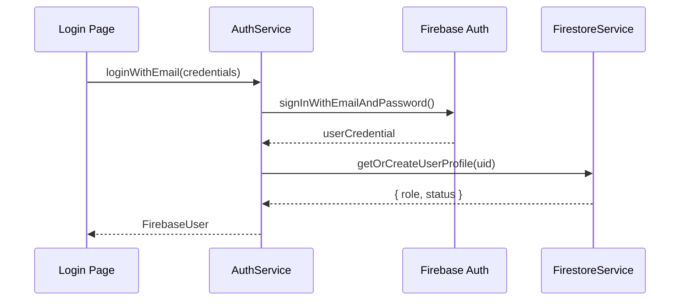

# ⚙️ 04 — Danh Sách & Phân Tích Services

## Mục lục
- [Firebase Services](#-firebase-services)
- [Strapi API Services](#-strapi-api-services)

---

## 🔥 Firebase Services

### `AuthService` — [auth.service.ts](../src/services/firebase/auth.service.ts)

**Loại:** Firebase Authentication Service  
**Độ quan trọng:** 🔴 Critical

#### Danh sách hàm

| Hàm | Nhiệm vụ | Input | Output |
|---|---|---|---|
| `loginWithEmail(credentials)` | Đăng nhập bằng email/password. Kiểm tra email verified với học viên. | `LoginCredentials` | `Promise<FirebaseUser>` |
| `registerWithEmail(credentials)` | Tạo tài khoản học viên. Gửi email xác minh. Tự sign out sau khi tạo. | `RegisterCredentials` | `Promise<FirebaseUser>` |
| `loginWithGoogle()` | Đăng nhập OAuth Google qua popup. | — | `Promise<FirebaseUser>` |
| `createInstructorAccount(...)` | (Admin only) Tạo tài khoản Giảng viên. Lưu profile với `role='instructor'` vào Firestore. Khôi phục session Admin sau khi tạo xong. | email, password, fullName, adminEmail, adminPassword | `Promise<void>` |
| `resetPassword(email)` | Gửi email đặt lại mật khẩu. | `email: string` | `Promise<void>` |
| `logout()` | Đăng xuất người dùng, xóa session Firebase. | — | `Promise<void>` |
| `getAuthErrorMessage(code)` | *(Private)* Dịch mã lỗi Firebase sang tiếng Việt. | `errorCode: string` | `string` |

#### Luồng dữ liệu

---

### `FirestoreService` — [firestore.service.ts](../src/services/firebase/firestore.service.ts)

**Loại:** Firebase Firestore Service (Generic CRUD Layer)  
**Độ quan trọng:** 🔴 Critical

#### Danh sách hàm

| Hàm | Nhiệm vụ | Input | Output |
|---|---|---|---|
| `getDocument<T>(collection, id)` | Lấy 1 document theo ID. | `collectionName`, `id` | `Promise<T \| null>` |
| `getDocuments<T>(collection, constraints)` | Lấy nhiều documents với điều kiện query. | `collectionName`, `QueryConstraint[]` | `Promise<T[]>` |
| `getCollectionGroupDocuments<T>(id, ...)` | Truy vấn collection group (truy cập qua nhiều document cha). | `collectionId`, constraints | `Promise<T[]>` |
| `setDocument(collection, id, data)` | Tạo mới hoặc ghi đè document (merge). | `collectionName`, `id`, `data` | `Promise<void>` |
| `updateDocument(collection, id, data)` | Cập nhật một phần document. | `collectionName`, `id`, `data` | `Promise<void>` |
| `deleteDocument(collection, id)` | Xóa document. | `collectionName`, `id` | `Promise<void>` |
| `getOrCreateUserProfile(uid, email, ...)` | Lấy hoặc khởi tạo profile user. Xác định role (admin/instructor/student). Kiểm tra tài khoản bị khóa. | `uid`, `email`, `displayName`, `photoURL?` | `Promise<{role, status}>` |
| `addCredits(uid, credits)` | Cộng số khóa học hoàn thành vào profile. | `uid`, `credits: number` | `Promise<void>` |
| `getLeaderboard(limitCount)` | Lấy danh sách xếp hạng học viên, sắp xếp theo `completedCourses`. | `limitCount = 100` | `Promise<any[]>` |

---

### `EnrollmentService` — [enrollment.service.ts](../src/services/firebase/enrollment.service.ts)

**Loại:** Firebase Firestore — Enrollment & Progress  
**Độ quan trọng:** 🔴 Critical

#### Danh sách hàm

| Hàm | Nhiệm vụ | Input | Output |
|---|---|---|---|
| `enrollUser(uid, courseId)` | Ghi danh học viên vào khóa học (tạo document trong subcollection `users/{uid}/enrollments`). | `uid`, `courseId` | `Promise<void>` |
| `checkEnrollment(uid, courseId)` | Kiểm tra xem học viên đã đăng ký khóa học chưa. | `uid`, `courseId` | `Promise<boolean>` |
| `getCourseProgress(uid, courseId)` | Lấy thông tin tiến độ học (% bài đã xong, lessonId hiện tại). | `uid`, `courseId` | `Promise<CourseProgress \| null>` |
| `markLessonCompleted(uid, courseId, lessonId)` | Đánh dấu bài học là đã xem, cập nhật `completedLessons` array. | `uid`, `courseId`, `lessonId` | `Promise<void>` |
| `updateProgress(uid, courseId, data)` | Cập nhật các trường khác của tiến độ (VD: điểm quiz). | `uid`, `courseId`, `Partial<CourseProgress>` | `Promise<void>` |
| `getEnrolledCourses(uid)` | Lấy danh sách tất cả khóa học học viên đã ghi danh. | `uid` | `Promise<Enrollment[]>` |
| `getAllProgress(uid)` | Lấy tiến độ của tất cả khóa học học viên đang theo học. | `uid` | `Promise<CourseProgress[]>` |

---

### `StorageService` — [storage.service.ts](../src/services/firebase/storage.service.ts)

**Loại:** Firebase Storage  
**Độ quan trọng:** 🟠 High

| Hàm | Nhiệm vụ | Input | Output |
|---|---|---|---|
| `uploadFile(file, path, onProgress?)` | Upload file lên Firebase Storage, trả về download URL. | `File`, `storagePath`, `progressCallback?` | `Promise<string>` (URL) |
| `deleteFile(pathOrUrl)` | Xóa file khỏi Firebase Storage. | `pathOrUrl: string` | `Promise<void>` |

---

## 🌐 Strapi API Services

### `CoursesApi` — [courses.api.ts](../src/services/api/courses.api.ts)

**Loại:** Strapi REST API — Dành cho người dùng cuối (Public)  
**Độ quan trọng:** 🔴 Critical

| Hàm | Nhiệm vụ | Input | Output |
|---|---|---|---|
| `getCourses(params)` | Lấy danh sách khóa học đã xuất bản, hỗ trợ phân trang, tìm kiếm, lọc. | `CourseQueryParams` | `Promise<StrapiResponse<CourseCard[]>>` |
| `getFeaturedCourses()` | Lấy tối đa 6 khóa học nổi bật (rating cao / nhiều học viên) cho Trang chủ. | — | `Promise<CourseCard[]>` |
| `getCategories()` | Lấy danh sách tất cả danh mục khóa học. | — | `Promise<Category[]>` |
| `getCourseBySlug(slug)` | Lấy đầy đủ thông tin 1 khóa học (bài giảng, giảng viên, reviews) bằng slug. | `slug: string` | `Promise<Course \| null>` |

---

### `InstructorApi` — [instructor.api.ts](../src/services/api/instructor.api.ts)

**Loại:** Strapi REST API — Dành cho Giảng viên (Protected)  
**Độ quan trọng:** 🔴 Critical

| Hàm | Nhiệm vụ | Input | Output |
|---|---|---|---|
| `createCourse(data)` | Tạo khóa học mới trên Strapi CMS. | `CreateCourseData` | `Promise<Course>` |
| `getCourses()` | Lấy danh sách khóa học do giảng viên hiện tại sở hữu. | — | `Promise<Course[]>` |
| `getCourseById(documentId)` | Lấy chi tiết 1 khóa học bằng documentId (để edit). | `documentId` | `Promise<Course>` |
| `updateCourse(documentId, data)` | Cập nhật thông tin khóa học (tên, giá, trạng thái xuất bản...). | `documentId`, `Partial<CreateCourseData>` | `Promise<Course>` |
| `deleteCourse(documentId)` | Xóa khóa học. | `documentId` | `Promise<void>` |

---

### `LessonApi` — [lesson.api.ts](../src/services/api/lesson.api.ts)

**Loại:** Strapi REST API — Bài học & Quiz  
**Độ quan trọng:** 🔴 Critical

| Hàm | Nhiệm vụ | Input | Output |
|---|---|---|---|
| `getLessonBySlug(slug)` | Lấy toàn bộ nội dung bài giảng (video URL, text, quiz) bằng slug. | `slug: string` | `Promise<Lesson \| null>` |
| `getQuizByDocumentId(documentId)` | Lấy câu hỏi trắc nghiệm của bài giảng bằng documentId. | `documentId: string` | `Promise<Quiz \| null>` |
| `getQuizById(quizId)` | Lấy bài kiểm tra theo ID Strapi. | `quizId: string` | `Promise<Quiz \| null>` |
