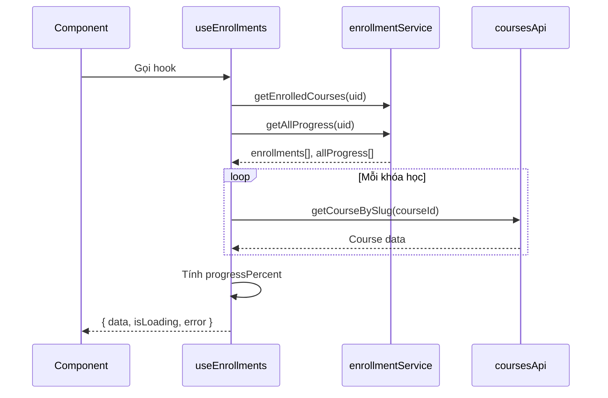

# 🪝 05 — Danh Sách & Phân Tích Custom Hooks

## Mục lục
- [useAuthRedirect](#useauthredirect)
- [useCourses](#usecourses)
- [useDebounce](#usedebounce)
- [useEnrollments](#useenrollments)

---

## `useAuthRedirect`
**File:** [use-auth-redirect.ts](../src/hooks/use-auth-redirect.ts)

### Chức năng
Cung cấp hàm `handleRedirect()` dùng sau khi đăng nhập thành công. Hook này truy vấn role của user từ Firestore rồi điều hướng đến đúng trang Dashboard dựa theo role (`admin` → `/admin`, `instructor` → `/instructor`, `student` → `/dashboard`).

### Interface

```typescript
const { handleRedirect } = useAuthRedirect();
await handleRedirect(firebaseUser);
```

### Hàm chi tiết

| Hàm | Input | Output | Mô tả |
|---|---|---|---|
| `handleRedirect(firebaseUser)` | `FirebaseUser` | `Promise<void>` | Lấy role từ Firestore → `router.push()` tới đúng dashboard |

### Dependencies
- `useRouter` (next/navigation)
- `firestoreService.getOrCreateUserProfile()`

### Được dùng bởi
- `SocialAuthButtons`
- `login/page.tsx`

### Luồng
```mermaid
flowchart TD
    Login([Đăng nhập thành công])
    Hook[useAuthRedirect]
    Firestore[(Firestore)]
    RoleCheck{Role?}
    Admin[/admin]
    Instructor[/instructor]
    Dashboard[/dashboard]

    Login --> Hook
    Hook --> Firestore
    Firestore --> RoleCheck
    RoleCheck -- admin --> Admin
    RoleCheck -- instructor --> Instructor
    RoleCheck -- student --> Dashboard
```

---

## `useCourses`
**File:** [use-courses.ts](../src/hooks/use-courses.ts)

### Chức năng
Wrapper trên `useQuery` của React Query để fetch danh sách khóa học từ Strapi API. Tự động cache kết quả trong 1 phút, không refetch khi chuyển tab, giữ lại data cũ khi filter thay đổi (tránh layout flash).

### Interface

```typescript
const { data, isLoading, isError } = useCourses(params);
```

### Hàm chi tiết

| Tên | Input | Output | Mô tả |
|---|---|---|---|
| `useCourses(params)` | `CourseQueryParams` | `UseQueryResult<StrapiResponse<CourseCard[]>>` | Gọi `coursesApi.getCourses(params)` qua React Query |

### Dependencies
- `useQuery` (TanStack React Query)
- `coursesApi.getCourses()`

### Được dùng bởi
- `courses/page.tsx`

---

## `useDebounce`
**File:** [use-debounce.ts](../src/hooks/use-debounce.ts)

### Chức năng
Generic debounce hook. Trả về giá trị đã debounce sau khoảng thời gian `delay`. Dùng chủ yếu để trì hoãn gọi API khi người dùng gõ vào ô tìm kiếm, tránh gửi quá nhiều request.

### Interface

```typescript
const debouncedSearch = useDebounce(searchText, 500);
```

### Hàm chi tiết

| Tên | Generic | Input | Output |
|---|---|---|---|
| `useDebounce<T>(value, delay)` | `T` | `value: T`, `delay: number` (ms) | `T` (giá trị debounced) |

### Được dùng bởi
- `courses/page.tsx`
- `CourseFilters`

---

## `useEnrollments`
**File:** [use-enrollments.ts](../src/hooks/use-enrollments.ts)

### Chức năng
Tải danh sách tất cả khóa học học viên đã đăng ký, kèm chi tiết khóa học (từ Strapi) và tiến độ (từ Firestore). Tự tính phần trăm `progressPercent` cho từng khóa học. Quản lý các trạng thái `isLoading`, `error`, `data`.

### Interface

```typescript
const { data, isLoading, error } = useEnrollments();
// data: EnrolledCourseWithProgress[]
```

### Kiểu dữ liệu trả về

```typescript
interface EnrolledCourseWithProgress {
  enrollment: Enrollment;
  course: Course | null;
  progress: CourseProgress | null;
  progressPercent: number; // 0-100
}
```

### Hàm chi tiết

| Tên | Input | Output |
|---|---|---|
| `useEnrollments()` | — | `{ data, isLoading, error }` |
| `fetchData()` (nội bộ) | — | Load song song `getEnrolledCourses` + `getAllProgress`, sau đó fetch thông tin từng khóa học |

### Dependencies
- `enrollmentService.getEnrolledCourses(uid)`
- `enrollmentService.getAllProgress(uid)`
- `coursesApi.getCourseBySlug(courseId)`
- `useAuthStore` (để lấy `user.uid`)

### Được dùng bởi
- `my-courses/page.tsx`
- `dashboard/page.tsx`

### Luồng


