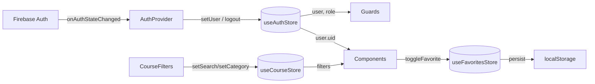

# 🗃️ 06 — State Management (Zustand Stores)

## Tổng quan
Dự án sử dụng **Zustand** làm thư viện quản lý state toàn cục. Zustand được chọn vì nhẹ, không cần Provider bao bọc, API cực kỳ đơn giản, hỗ trợ persist state xuống localStorage.

Hiện có **3 store** hoạt động song song:

| Store | File | Phạm vi quản lý |
|---|---|---|
| `useAuthStore` | [auth-store.ts](../src/stores/auth-store.ts) | Trạng thái đăng nhập của người dùng |
| `useCourseStore` | [course-store.ts](../src/stores/course-store.ts) | Bộ lọc và UI State trang danh sách khóa học |
| `useFavoritesStore` | [favorites-store.ts](../src/stores/favorites-store.ts) | Danh sách khóa học yêu thích (persisted) |

---

## `useAuthStore`
**File:** [auth-store.ts](../src/stores/auth-store.ts)  
**Độ quan trọng:** 🔴 Critical — Được dùng ở hầu hết mọi nơi trong ứng dụng.

### State

| Trường | Kiểu | Mô tả |
|---|---|---|
| `user` | `User \| null` | Thông tin người dùng đang đăng nhập (uid, role, points...) |
| `isLoading` | `boolean` | `true` trong khi đang kiểm tra trạng thái Firebase Auth |
| `initialized` | `boolean` | `true` sau khi `onAuthStateChanged` đã chạy lần đầu |
| `isAuthenticated` | `boolean` | `true` nếu `user !== null` |
| `error` | `string \| null` | Thông báo lỗi đăng nhập |

### Actions

| Action | Input | Mô tả |
|---|---|---|
| `setUser(user)` | `User \| null` | Cập nhật user, tự tính `isAuthenticated`, reset loading/error |
| `setLoading(loading)` | `boolean` | Bật/tắt trạng thái đang tải |
| `setInitialized(init)` | `boolean` | Đánh dấu Auth Provider đã khởi tạo xong |
| `setError(error)` | `string \| null` | Lưu lỗi, tắt loading |
| `logout()` | — | Reset toàn bộ state về giá trị mặc định |

### Ai sử dụng
- `AuthProvider` — set/clear user khi Firebase Auth state thay đổi
- `DashboardGuard`, `AdminGuard`, `InstructorGuard` — kiểm tra `isAuthenticated`, `user.role`
- Hầu hết Components trong Dashboard — đọc `user.uid`, `user.displayName`, `user.role`

---

## `useCourseStore`
**File:** [course-store.ts](../src/stores/course-store.ts)  
**Độ quan trọng:** 🟠 High — Điều phối bộ lọc trang khóa học.

### State

| Trường | Kiểu | Mô tả |
|---|---|---|
| `filters.search` | `string` | Từ khóa tìm kiếm |
| `filters.category` | `string` | Slug danh mục đang lọc |
| `filters.difficulty` | `CourseDifficulty \| ''` | Độ khó đang lọc |
| `filters.sort` | `string` | Tiêu chí sắp xếp (`newest`, `popular`...) |
| `filters.page` | `number` | Trang hiện tại |
| `isSidebarOpen` | `boolean` | Trạng thái mở/đóng sidebar bộ lọc (mobile) |
| `viewMode` | `'grid' \| 'list'` | Chế độ hiển thị danh sách |

### Actions

| Action | Mô tả |
|---|---|
| `setSearch(search)` | Cập nhật từ khóa, reset về trang 1 |
| `setCategory(category)` | Lọc theo danh mục, reset về trang 1 |
| `setDifficulty(difficulty)` | Lọc theo độ khó, reset về trang 1 |
| `setSort(sort)` | Đổi tiêu chí sắp xếp |
| `setPage(page)` | Chuyển trang phân trang |
| `resetFilters()` | Xóa toàn bộ bộ lọc |
| `toggleSidebar()` | Mở/đóng sidebar bộ lọc |
| `setViewMode(mode)` | Chuyển chế độ Grid/List |

### Ai sử dụng
- `CourseFilters` — ghi vào store khi người dùng chọn bộ lọc
- `courses/page.tsx` — đọc `filters` để truyền vào `useCourses(params)`
- `Pagination` component — đọc và ghi `page`

---

## `useFavoritesStore`
**File:** [favorites-store.ts](../src/stores/favorites-store.ts)  
**Độ quan trọng:** 🟡 Medium

### Đặc điểm
- **Persist:** State được lưu xuống `localStorage` với key `'eduflow-favorites'`. Dữ liệu tồn tại qua các lần tải lại trang.
- Không cần đăng nhập để dùng.

### State

| Trường | Kiểu | Mô tả |
|---|---|---|
| `favoriteSlugs` | `string[]` | Mảng slug của các khóa học yêu thích |

### Actions

| Action | Input | Mô tả |
|---|---|---|
| `addFavorite(slug)` | `string` | Thêm khóa học vào danh sách yêu thích |
| `removeFavorite(slug)` | `string` | Xóa khóa học khỏi yêu thích |
| `toggleFavorite(slug)` | `string` | Thêm nếu chưa có, xóa nếu đã có |
| `isFavorite(slug)` | `string` | Kiểm tra xem khóa học có trong danh sách không → `boolean` |

---

## Sơ đồ tổng quan Store

