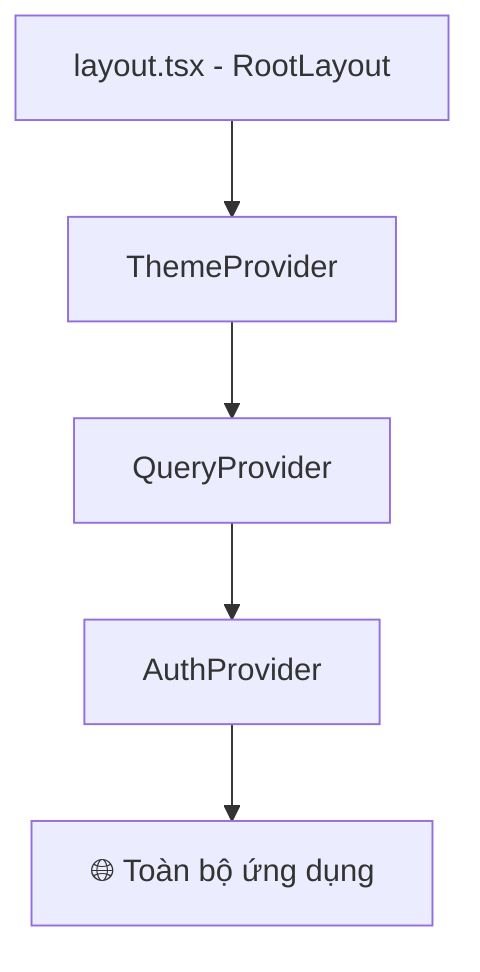
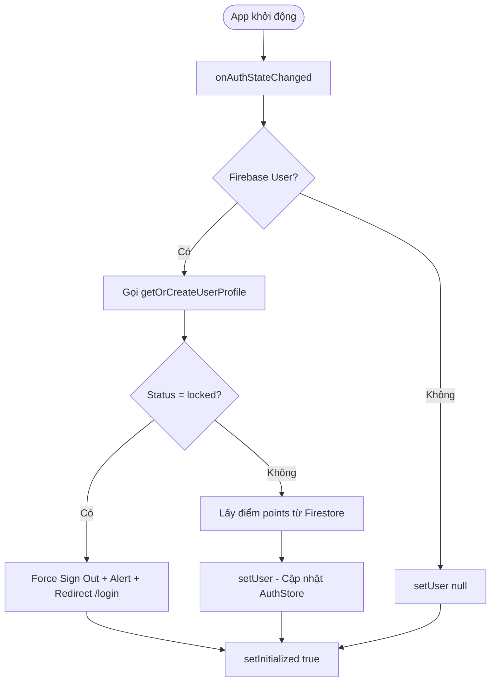

# 🌐 07 — Providers (Context Providers)

## Tổng quan
Dự án sử dụng 3 Provider bao bọc toàn bộ ứng dụng tại `src/app/layout.tsx`. Thứ tự lồng nhau là `ThemeProvider` → `QueryProvider` → `AuthProvider`.

---

## `ThemeProvider`
**File:** [theme-provider.tsx](../src/providers/theme-provider.tsx)  
**Độ quan trọng:** 🟡 Medium

### Chức năng
Bọc `NextThemesProvider` từ thư viện `next-themes`. Cung cấp khả năng chuyển đổi Light Mode / Dark Mode cho toàn bộ ứng dụng.

### Cấu hình
| Thuộc tính | Giá trị | Mô tả |
|---|---|---|
| `attribute` | `"class"` | Áp dụng theme bằng cách gắn class vào thẻ `<html>` |
| `defaultTheme` | `"light"` | Chủ đề mặc định khi người dùng chưa chọn |
| `enableSystem` | `true` | Tự động dùng theme theo OS của người dùng |
| `disableTransitionOnChange` | `true` | Tắt animation khi chuyển theme |

### Được dùng bởi
- `src/app/layout.tsx` (Root Layout)

---

## `QueryProvider`
**File:** [query-provider.tsx](../src/providers/query-provider.tsx)  
**Độ quan trọng:** 🟠 High

### Chức năng
Khởi tạo và cung cấp `QueryClient` từ **TanStack React Query** cho toàn bộ ứng dụng. Giúp quản lý cache dữ liệu API, tránh gọi API trùng lặp.

### Cấu hình QueryClient

| Option | Giá trị | Mô tả |
|---|---|---|
| `staleTime` | `60_000` (1 phút) | Data được giữ "fresh" trong 1 phút trước khi refetch |
| `refetchOnWindowFocus` | `false` | Không tự fetch lại khi người dùng quay lại tab |
| `retry` | `1` | Thử lại 1 lần nếu request lỗi |

### Hàm nội bộ
- `makeQueryClient()` — Tạo mới QueryClient với default options.
- `getQueryClient()` — Singleton: đảm bảo chỉ có 1 instance trên browser, tạo mới trên server (tránh shared state giữa các request SSR).

### Bao gồm
- `ReactQueryDevtools` — Công cụ debug React Query (chỉ hiển thị ở development, ẩn ở production).

---

## `AuthProvider`
**File:** [auth-provider.tsx](../src/providers/auth-provider.tsx)  
**Độ quan trọng:** 🔴 Critical — Trái tim của hệ thống xác thực.

### Chức năng
Lắng nghe sự kiện Firebase Authentication (`onAuthStateChanged`). Khi Firebase phát hiện user đăng nhập/đăng xuất, Provider sẽ:
1. Gọi Firestore để lấy/tạo profile người dùng (bao gồm `role` và `status`).
2. Kiểm tra tài khoản có bị khóa không → nếu có, force sign out.
3. Cập nhật `useAuthStore` với thông tin user đầy đủ.
4. Set `initialized = true` để các Guard biết việc kiểm tra đã hoàn tất.

### Xử lý race condition
Có cơ chế chống race condition: nếu trong lúc đang fetch profile mà user đã sign out (vì email chưa xác minh...), Provider sẽ không set user cũ vào store.

### Luồng hoạt động chi tiết

### Dependencies
- `onAuthStateChanged` (firebase/auth)
- `firestoreService.getOrCreateUserProfile()`
- `useAuthStore.setUser()`, `setLoading()`, `setInitialized()`
