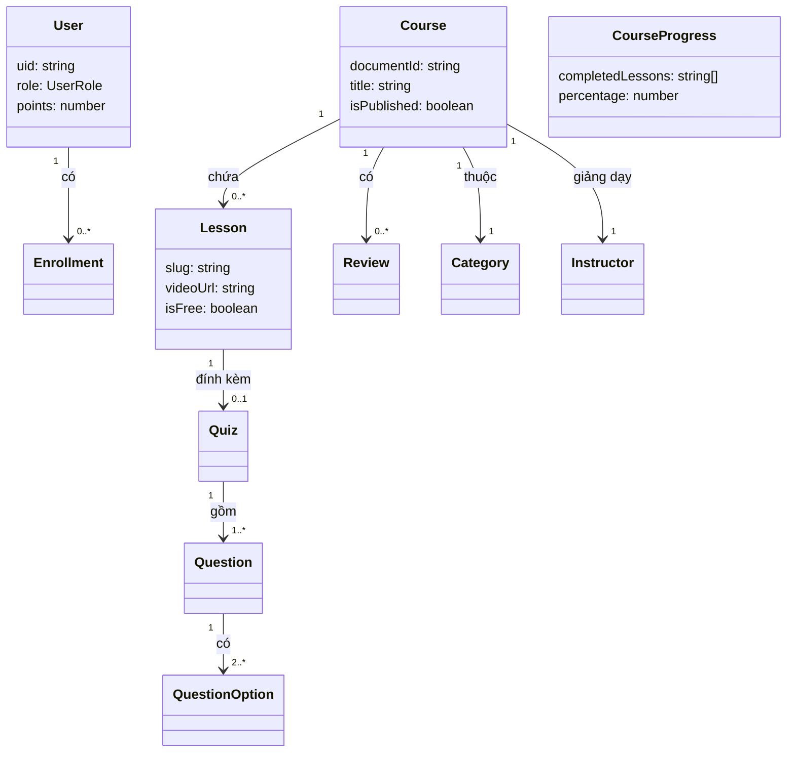

# 📐 08 — Kiểu Dữ Liệu TypeScript (Types)

## Mục lục
- [User Types](#-user-types)
- [Course Types](#-course-types)
- [Lesson Types](#-lesson-types)
- [API Types](#-api-types)

---

## 👤 User Types
**File:** [user.types.ts](../src/types/user.types.ts)

| Interface / Type | Mô tả | Các trường quan trọng |
|---|---|---|
| `UserRole` | Union type vai trò hệ thống | `'student' \| 'admin' \| 'instructor'` |
| `User` | Đối tượng user trong runtime (Zustand store) | `uid`, `role`, `points`, `emailVerified` |
| `UserProfile` | Hồ sơ chi tiết (trang Profile) | `bio`, `phone`, `totalCourses`, `completedCourses`, `certificates` |
| `UpdateProfileDTO` | Dữ liệu gửi lên để cập nhật hồ sơ | `displayName?`, `bio?`, `avatarUrl?` |
| `LoginCredentials` | Form đăng nhập | `email`, `password?` (optional với Google) |
| `RegisterCredentials` | Form đăng ký | `email`, `password?`, `displayName` |

---

## 📚 Course Types
**File:** [course.types.ts](../src/types/course.types.ts)

| Interface / Type | Mô tả | Các trường quan trọng |
|---|---|---|
| `CourseDifficulty` | Độ khó khóa học | `'beginner' \| 'intermediate' \| 'advanced'` |
| `CourseStatus` | Trạng thái xuất bản | `'draft' \| 'published' \| 'archived'` |
| `Course` | Đối tượng khóa học **đầy đủ** (dùng ở trang chi tiết) | Gồm `lessons[]`, `reviews[]`, `instructor`, `category` |
| `CourseCard` | Đối tượng khóa học **tóm tắt** (dùng ở danh sách) | Subset nhẹ hơn, không có lessons chi tiết |
| `CourseQueryParams` | Params lọc/phân trang danh sách | `page`, `search`, `category`, `difficulty`, `sort` |
| `StrapiMedia` | Cấu trúc file media từ Strapi | `url`, `width`, `height`, `formats` (thumbnail/small/medium/large) |
| `StrapiMediaFormat` | Format ảnh đã resize | `url`, `width`, `height` |

---

## 🎓 Lesson Types
**File:** [lesson.types.ts](../src/types/lesson.types.ts)

| Interface / Type | Mô tả | Các trường quan trọng |
|---|---|---|
| `Lesson` | Bài giảng đầy đủ | `videoUrl`, `content`, `duration`, `isFree`, `quiz` |
| `LessonListItem` | Bài giảng tóm tắt (dùng ở sidebar danh sách bài) | `title`, `duration`, `isFree`, `isCompleted?` |
| `Category` | Danh mục khóa học | `name`, `slug`, `icon`, `color`, `courseCount` |
| `Instructor` | Thông tin giảng viên | `name`, `bio`, `expertise[]`, `socialLinks`, `totalStudents` |
| `Quiz` | Bài kiểm tra trắc nghiệm | `timeLimit`, `passingScore`, `questions[]` |
| `Question` | Câu hỏi trong Quiz | `text`, `type` (single/multiple choice), `options[]`, `points` |
| `QuestionOption` | Đáp án câu hỏi | `text`, `isCorrect: boolean` |
| `QuizAttempt` | Kết quả lần làm bài | `answers`, `score`, `percentage`, `passed`, `timeSpent` |

---

## 🔌 API Types
**File:** [api.types.ts](../src/types/api.types.ts)

| Interface / Type | Mô tả | Các trường quan trọng |
|---|---|---|
| `Review` | Đánh giá của học viên | `rating`, `comment`, `firebaseUid`, `isApproved` |
| `CreateReviewDTO` | Dữ liệu tạo review mới | `rating`, `comment`, `firebaseUid`, `courseId` |
| `Certificate` | Chứng chỉ hoàn thành | `certificateId`, `courseTitle`, `issuedAt`, `completionPercentage` |
| `EnrollmentStatus` | Trạng thái ghi danh | `'active' \| 'completed' \| 'cancelled'` |
| `Enrollment` | Thông tin ghi danh học viên | `firebaseUid`, `enrolledAt`, `status` |
| `CourseProgress` | Tiến độ học tập trong Firestore | `completedLessons[]`, `currentLessonId`, `percentage` |
| `LessonNote` | Ghi chú cá nhân bài giảng | `lessonId`, `content`, `timestamp` (video position) |
| `LeaderboardEntry` | Mục xếp hạng | `uid`, `displayName`, `points`, `completedCourses`, `rank` |
| `StrapiResponse<T>` | Wrapper response list từ Strapi | `data: T`, `meta.pagination` |
| `StrapiMeta` | Metadata phân trang Strapi | `pagination.page`, `pageSize`, `pageCount`, `total` |
| `DashboardStats` | Thống kê Dashboard học viên | `totalCourses`, `completedCourses`, `learningHours`, `certificates` |
| `AdminStats` | Thống kê Admin | `totalUsers`, `totalRevenue`, `completionRate`, `revenueGrowth` |

---

## Sơ đồ quan hệ Types

