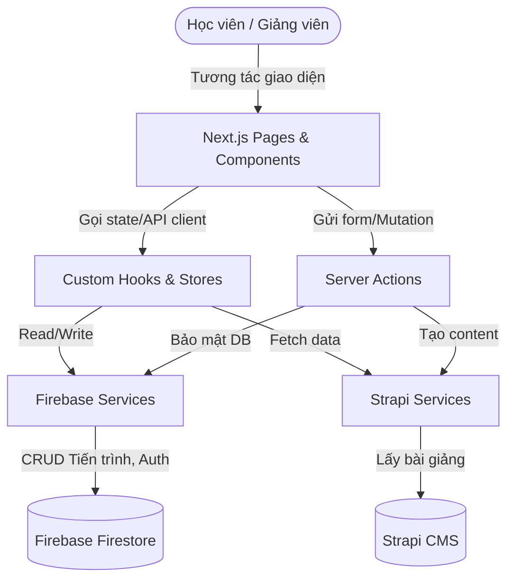

# Luồng dữ liệu tổng quát (Data Flow)

```mermaid
flowchart TD
    User([Học viên / Giảng viên])
    UI[Next.js Pages & Components]
    Actions[Server Actions]
    Hooks[Custom Hooks & Stores]
    FirebaseService[Firebase Services]
    StrapiService[Strapi Services]
    Firestore[(Firebase Firestore)]
    StrapiDB[(Strapi CMS)]

    User -- "Tương tác giao diện" --> UI
    UI -- "Gọi state/API client" --> Hooks
    UI -- "Gửi form/Mutation" --> Actions
    
    Hooks -- "Read/Write" --> FirebaseService
    Hooks -- "Fetch data" --> StrapiService
    
    Actions -- "Bảo mật DB" --> FirebaseService
    Actions -- "Tạo content" --> StrapiService
    
    FirebaseService -- "CRUD Tiến trình, Auth" --> Firestore
    StrapiService -- "Lấy bài giảng" --> StrapiDB
```
