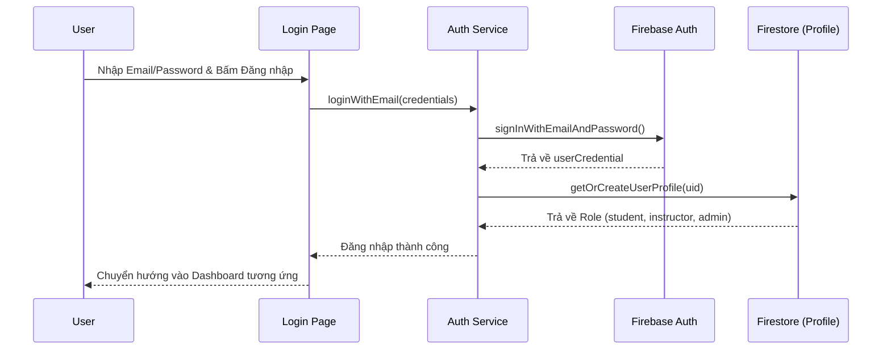

# Luồng xác thực (Authentication Flow)

```mermaid
sequenceDiagram
    participant U as User
    participant UI as Login Page
    participant AS as Auth Service
    participant FB as Firebase Auth
    participant FS as Firestore (Profile)

    U->>UI: Nhập Email/Password & Bấm Đăng nhập
    UI->>AS: loginWithEmail(credentials)
    AS->>FB: signInWithEmailAndPassword()
    FB-->>AS: Trả về userCredential
    AS->>FS: getOrCreateUserProfile(uid)
    FS-->>AS: Trả về Role (student, instructor, admin)
    AS-->>UI: Đăng nhập thành công
    UI-->>U: Chuyển hướng vào Dashboard tương ứng
```
