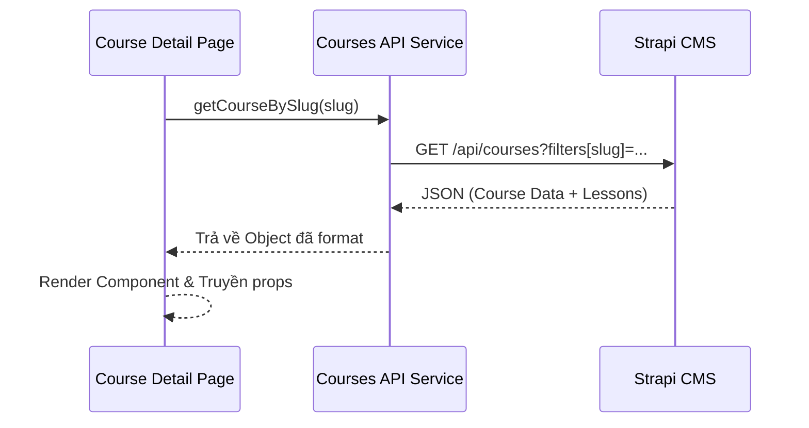

# Luồng gọi API (API Flow)

```mermaid
sequenceDiagram
    participant UI as Course Detail Page
    participant Service as Courses API Service
    participant CMS as Strapi CMS

    UI->>Service: getCourseBySlug(slug)
    Service->>CMS: GET /api/courses?filters[slug]=...
    CMS-->>Service: JSON (Course Data + Lessons)
    Service-->>UI: Trả về Object đã format
    UI-->>UI: Render Component & Truyền props
```
