# 🔗 12 — Dependency Graph (Sơ đồ phụ thuộc)

Biểu đồ thể hiện mối quan hệ phụ thuộc giữa các module chính trong hệ thống.

---

## Sơ đồ tổng thể

```mermaid
flowchart TB
    subgraph CONFIG ["⚙️ Config & Lib"]
        FIREBASE[lib/firebase.ts]
        STRAPI_LIB[lib/strapi.ts]
        UTILS[lib/utils.ts]
        CONSTANTS[lib/constants.ts]
    end

    subgraph TYPES ["📐 Types"]
        USER_T[types/user.types.ts]
        COURSE_T[types/course.types.ts]
        LESSON_T[types/lesson.types.ts]
        API_T[types/api.types.ts]
    end

    subgraph SERVICES ["⚙️ Services"]
        AUTH_SVC[firebase/auth.service.ts]
        FIRESTORE_SVC[firebase/firestore.service.ts]
        ENROLL_SVC[firebase/enrollment.service.ts]
        STORAGE_SVC[firebase/storage.service.ts]
        COURSES_API[api/courses.api.ts]
        INSTRUCTOR_API[api/instructor.api.ts]
        LESSON_API[api/lesson.api.ts]
    end

    subgraph STORES ["🗃️ Stores"]
        AUTH_STORE[stores/auth-store.ts]
        COURSE_STORE[stores/course-store.ts]
        FAV_STORE[stores/favorites-store.ts]
    end

    subgraph PROVIDERS ["🌐 Providers"]
        AUTH_PROV[providers/auth-provider.tsx]
        QUERY_PROV[providers/query-provider.tsx]
        THEME_PROV[providers/theme-provider.tsx]
    end

    subgraph HOOKS ["🪝 Hooks"]
        AUTH_REDIRECT[hooks/use-auth-redirect.ts]
        USE_COURSES[hooks/use-courses.ts]
        USE_DEBOUNCE[hooks/use-debounce.ts]
        USE_ENROLLMENTS[hooks/use-enrollments.ts]
    end

    subgraph ACTIONS ["⚡ Server Actions"]
        COURSE_ACT[actions/course.actions.ts]
        LESSON_ACT[actions/lesson.actions.ts]
    end

    %% Config dependencies
    FIREBASE --> AUTH_SVC
    FIREBASE --> FIRESTORE_SVC
    FIREBASE --> ENROLL_SVC
    FIREBASE --> STORAGE_SVC
    STRAPI_LIB --> COURSES_API
    STRAPI_LIB --> INSTRUCTOR_API
    STRAPI_LIB --> LESSON_API
    STRAPI_LIB --> LESSON_ACT

    %% Type dependencies
    USER_T --> AUTH_STORE
    USER_T --> AUTH_SVC
    COURSE_T --> COURSES_API
    LESSON_T --> LESSON_API

    %% Service dependencies
    FIRESTORE_SVC --> AUTH_PROV
    FIRESTORE_SVC --> AUTH_REDIRECT
    AUTH_SVC --> AUTH_PROV
    ENROLL_SVC --> USE_ENROLLMENTS
    COURSES_API --> USE_ENROLLMENTS
    COURSES_API --> USE_COURSES
    INSTRUCTOR_API --> COURSE_ACT

    %% Store dependencies
    AUTH_STORE --> AUTH_PROV
    AUTH_STORE --> USE_ENROLLMENTS
    COURSE_STORE --> USE_COURSES
```



---

## Dependency chi tiết theo module

### lib/firebase.ts
Được import bởi: **Tất cả Firebase Services**
```
lib/firebase.ts
  ├── services/firebase/auth.service.ts
  ├── services/firebase/firestore.service.ts
  ├── services/firebase/enrollment.service.ts
  └── services/firebase/storage.service.ts
```

### services/ → được dùng bởi

```
services/firebase/auth.service.ts
  ├── providers/auth-provider.tsx
  ├── hooks/use-auth-redirect.ts
  └── components/auth/social-auth-buttons.tsx

services/firebase/firestore.service.ts
  ├── providers/auth-provider.tsx
  ├── hooks/use-auth-redirect.ts
  └── components/learning/notes-panel.tsx

services/firebase/enrollment.service.ts
  ├── hooks/use-enrollments.ts
  ├── components/course/sticky-sidebar.tsx
  ├── components/learning/lesson-sidebar.tsx
  └── app/(dashboard)/certificates/[courseSlug]/page.tsx

services/api/courses.api.ts
  ├── hooks/use-courses.ts
  ├── hooks/use-enrollments.ts
  ├── components/landing/featured-courses.tsx
  └── app/(public)/courses/[slug]/page.tsx

services/api/instructor.api.ts
  └── actions/course.actions.ts

services/api/lesson.api.ts
  └── app/learn/[courseSlug]/[lessonSlug]/page.tsx
```

### stores/ → được dùng bởi

```
stores/auth-store.ts
  ├── providers/auth-provider.tsx (write)
  ├── components/auth/dashboard-guard.tsx (read)
  ├── components/auth/admin-guard.tsx (read)
  ├── components/auth/instructor-guard.tsx (read)
  ├── hooks/use-enrollments.ts (read uid)
  └── [hầu hết Dashboard Components] (read user)

stores/course-store.ts
  ├── components/course/course-filters.tsx (write)
  ├── app/(public)/courses/page.tsx (read)
  └── components/shared/pagination.tsx (read/write page)

stores/favorites-store.ts
  └── components/course/course-card.tsx (toggleFavorite)
```
