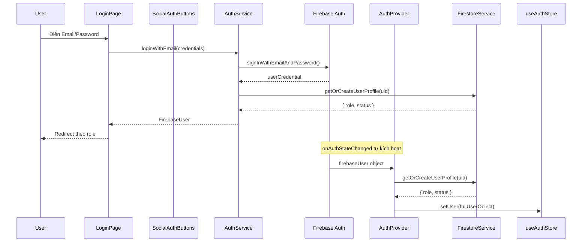
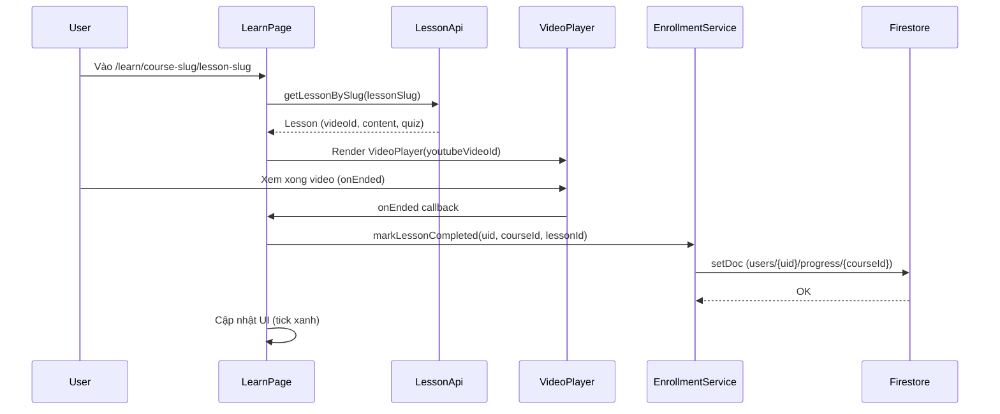
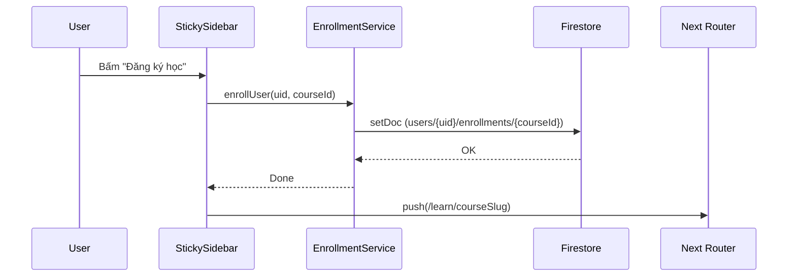
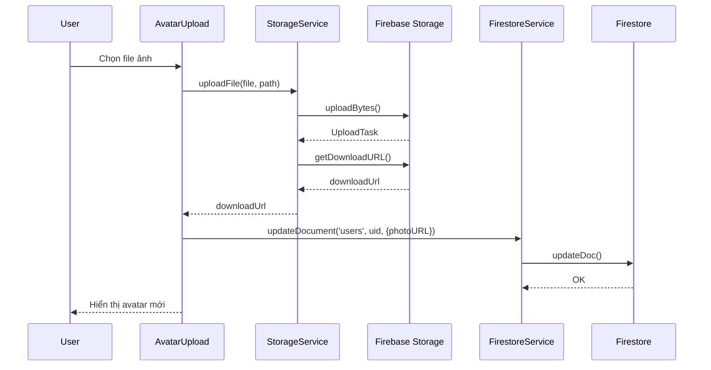

# 📞 13 — Call Graph (Sơ đồ gọi hàm)

Tài liệu này mô tả hàm nào gọi hàm nào theo từng tình huống nghiệp vụ thực tế.

---

## 1. Luồng Đăng Nhập (Login)



---

## 2. Luồng Xem Trang Khóa Học (Course Detail)

```mermaid
flowchart TD
    A([User vào /courses/slug]) --> B[courses/slug/page.tsx]
    B --> C[coursesApi.getCourseBySlug]
    C --> D[lib/strapi.ts - GET /courses?slug=...]
    D --> E[(Strapi CMS)]
    E -->> D
    D -->> C
    C -->> B
    B --> F[CourseDetailHero course]
    B --> G[Curriculum lessons]
    B --> H[StickySidebar course]
    H --> I[enrollmentService.checkEnrollment]
    I --> J[(Firestore)]
```

---

## 3. Luồng Học Bài Giảng (Watch Lesson)



---

## 4. Luồng Tạo Khóa Học (Instructor)

```mermaid
flowchart TD
    A([Giảng viên bấm Tạo khóa học]) --> B[NewCoursePage Form]
    B --> C[createCourseAction data]
    C --> D[instructorApi.createCourse data]
    D --> E[lib/strapi.ts - POST /courses]
    E --> F[(Strapi CMS)]
    F -->> E
    E -->> D
    D -->> C
    C --> G[revalidatePath /instructor/courses]
    G --> H[Next.js xóa cache, re-render danh sách]
    C -->> B
    B -->> A
```

---

## 5. Luồng Ghi Danh Khóa Học (Enroll)



---

## 6. Luồng Làm Bài Trắc Nghiệm (Quiz)

```mermaid
flowchart TD
    A([User bấm Làm bài]) --> B[Quiz Component]
    B --> C[lessonApi.getQuizByDocumentId]
    C --> D[Strapi CMS]
    D -->> C
    C -->> B
    B --> E[QuizTimer - đếm ngược]
    B --> F[QuestionCard - hiển thị câu hỏi]
    F --> G[User chọn đáp án]
    G --> B
    B --> H{Hết giờ hoặc Submit?}
    H --> I[Tính điểm]
    I --> J[enrollmentService.updateProgress - lưu điểm]
    J --> K[(Firestore)]
```

---

## 7. Luồng Upload Avatar


