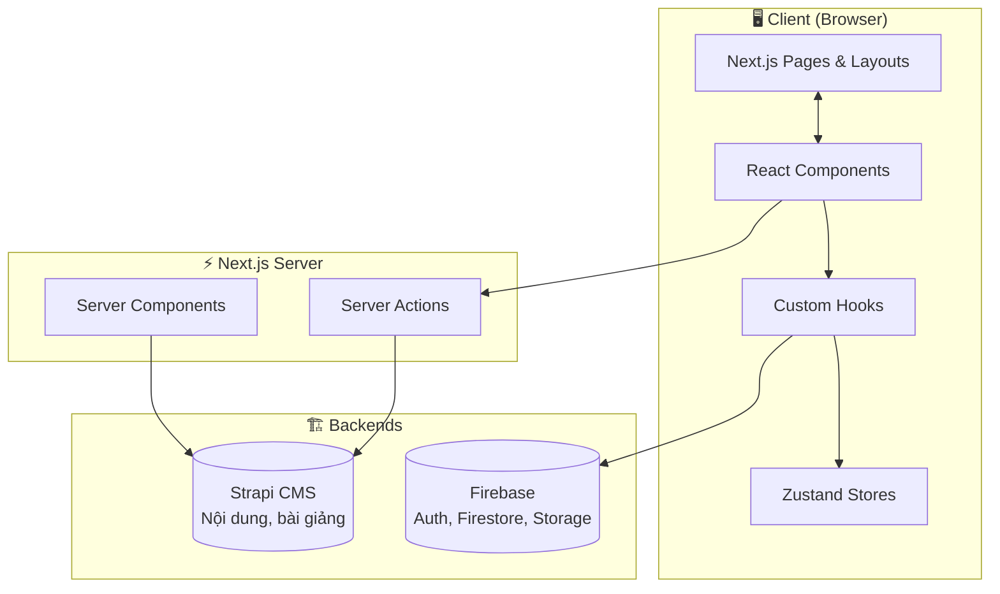

# 📖 Mục Lục Tài Liệu Kiến Trúc Dự Án

> **Dự án:** EduFlow — E-Learning Platform  
> **Tech Stack:** Next.js 15 (App Router) + Firebase + Strapi CMS + Zustand

---

## 📁 Danh sách tài liệu

| File | Nội dung |
|---|---|
| [00_PROJECT_OVERVIEW.md](00_PROJECT_OVERVIEW.md) | 🗺️ Tổng quan hệ thống, tech stack, kiến trúc |
| [01_FOLDER_STRUCTURE.md](01_FOLDER_STRUCTURE.md) | 📂 Cây thư mục chi tiết có giải thích |
| [02_FILE_DOCUMENTATION.md](02_FILE_DOCUMENTATION.md) | 📄 Phân tích tự động từng file (Dependencies, Exports, Call graph cơ bản) |
| [03_COMPONENTS.md](03_COMPONENTS.md) | 🧩 Phân tích chi tiết tất cả 37 React Components |
| [04_SERVICES.md](04_SERVICES.md) | ⚙️ Phân tích tất cả Services (Firebase + Strapi API) + bảng hàm |
| [05_HOOKS.md](05_HOOKS.md) | 🪝 Phân tích 4 Custom React Hooks + sequence diagram |
| [06_STORES.md](06_STORES.md) | 🗃️ Phân tích 3 Zustand Stores (AuthStore, CourseStore, FavoritesStore) |
| [07_PROVIDERS.md](07_PROVIDERS.md) | 🌐 Phân tích 3 Context Providers + Auth flow diagram |
| [08_TYPES.md](08_TYPES.md) | 📐 Toàn bộ TypeScript types + class diagram |
| [09_DATA_FLOW.md](09_DATA_FLOW.md) | 🌊 Sơ đồ luồng dữ liệu tổng quát (Mermaid) |
| [10_AUTH_FLOW.md](10_AUTH_FLOW.md) | 🔐 Sơ đồ luồng đăng nhập Firebase |
| [11_API_FLOW.md](11_API_FLOW.md) | 🌐 Sơ đồ luồng gọi API Strapi |
| [12_DEPENDENCY_GRAPH.md](12_DEPENDENCY_GRAPH.md) | 🔗 Sơ đồ phụ thuộc giữa các module |
| [13_CALL_GRAPH.md](13_CALL_GRAPH.md) | 📞 Sơ đồ gọi hàm theo 7 tình huống nghiệp vụ |
| [14_PROJECT_SUMMARY.md](14_PROJECT_SUMMARY.md) | 📊 Bảng thống kê tổng hợp tất cả file |
| [15_LIB_CONFIG_SCRIPTS.md](15_LIB_CONFIG_SCRIPTS.md) | 🛠️ Thư viện, tiện ích, cấu hình, scripts |

---

## 🗺️ Kiến trúc tổng quát

---

## 🚀 Cách đọc tài liệu này

1. **Mới tham gia dự án?** → Đọc [00](00_PROJECT_OVERVIEW.md), [01](01_FOLDER_STRUCTURE.md), [09](09_DATA_FLOW.md)
2. **Cần fix bug Auth?** → Đọc [10](10_AUTH_FLOW.md), [07](07_PROVIDERS.md), [06](06_STORES.md)
3. **Cần thêm feature mới?** → Đọc [03](03_COMPONENTS.md), [04](04_SERVICES.md), [08](08_TYPES.md)
4. **Cần hiểu luồng gọi hàm?** → Đọc [13](13_CALL_GRAPH.md), [12](12_DEPENDENCY_GRAPH.md)
5. **Cần xem toàn bộ file?** → Xem [02](02_FILE_DOCUMENTATION.md), [14](14_PROJECT_SUMMARY.md)
